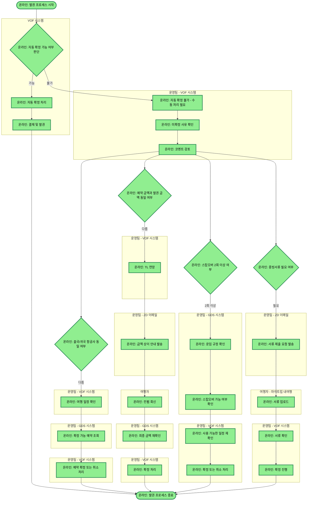

# 2026 발권 프로세스

## 프로세스 개요

VOF 시스템에서 자동 확정 가능 여부를 판단한 뒤, 자동 확정이 가능하면 자동 처리하고, 불가하면 운영팀이 수동으로 4가지 케이스(항공사 상이, 금액 상이, 스탑오버 2회 이상, 증빙서류 필요)를 병렬로 확인하여 처리하는 발권 프로세스입니다.

## 프로세스 플로우차트

## 프로세스 상세 설명

### 1. 자동 확정 경로
- VOF 시스템에서 자동 확정 가능 여부를 판단
- 가능한 경우: 자동 확정 처리 → 결제 및 발권 → 종료
- 불가한 경우: 수동 처리 필요

### 2. 수동 처리 시작
- 운영팀이 VOF에서 미확정 사유 확인
- 코멘트 검토 후 4가지 케이스를 병렬로 확인

### 3. 케이스별 처리

**케이스 1: 항공사 상이**
- 출국/귀국 항공사가 다른 경우
- VOF에서 여행 일정 확인 → GDS에서 확정 가능 예약 조회 → VOF에서 예약 확정/취소

**케이스 2: 금액 상이**
- 예약 금액과 발권 금액이 다른 경우
- VOF에서 TL 연장 → ZD이메일로 금액 상이 안내 → 여행자 컨펌 회신 → GDS에서 최종 금액 재확인 → VOF에서 확정

**케이스 3: 스탑오버 2회 이상**
- 스탑오버가 2회 이상인 경우
- GDS에서 운임 규정/스탑오버 가능 여부 확인 → VOF에서 일정 재확인(필요시) → VOF에서 확정/취소

**케이스 4: 증빙서류 필요**
- 증빙서류가 필요한 경우
- ZD이메일로 서류 제출 요청 → 마이트립 내여행에 서류 업로드 → VOF에서 서류 확인 → 확정 진행

