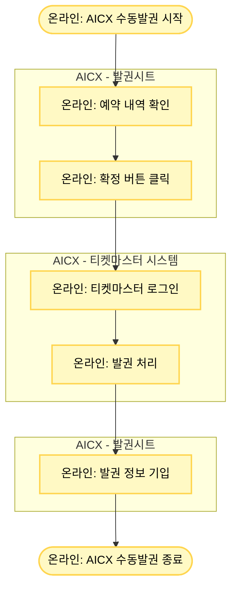

# AICX_수동발권

## 프로세스 개요

AICX 수동발권매니저가 발권시트에서 예약을 확인하고 티켓마스터에서 수동 발권을 진행하는 프로세스입니다.

## 프로세스 플로우차트

## 프로세스 상세 설명

### 1. 예약 확인 단계
- 수동발권매니저가 발권시트에서 예약 내역을 확인합니다
- 확정 버튼을 클릭합니다

### 2. 발권 처리 단계
- LAFC 티켓마스터에 로그인합니다
- 발권 처리를 진행합니다

### 3. 정보 기입 단계
- 발권 완료 후 발권시트에 발권 정보를 기입합니다
