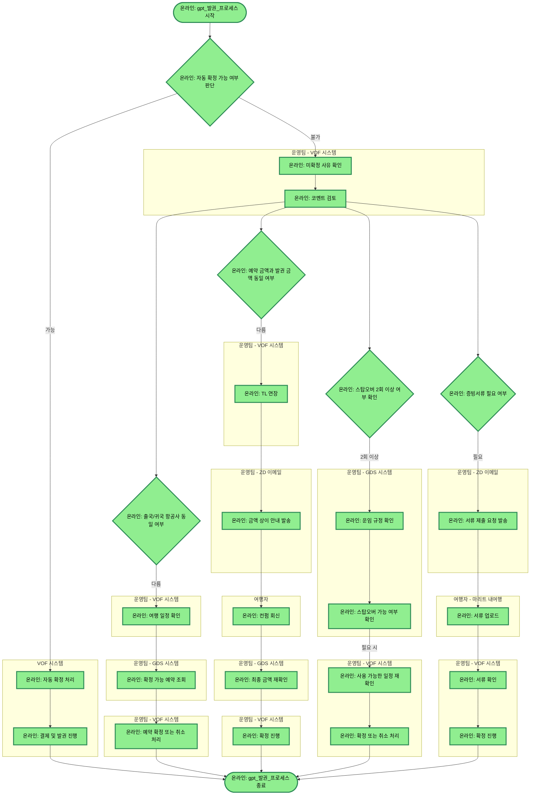

# gpt_발권_프로세스

## 프로세스 개요

VOF에서 자동 확정 가능 여부를 우선 판단하고, 불가 시 운영팀이 VOF/GDS/ZD 이메일 및 여행자 응대를 통해 조건별 검토(항공사, 금액, 스탑오버, 증빙서류)를 병렬로 확인하여 해당 케이스만 처리하는 프로세스입니다.

## 프로세스 플로우차트

## 프로세스 상세 설명

- **자동 확정 판단(VOF)**: 자동 확정 가능 시 VOF가 자동으로 확정 처리 후 결제 및 발권까지 진행하고 종료합니다.
- **수동 처리(운영팀)**: 자동 확정 불가 시 운영팀이 VOF에서 미확정 사유 및 코멘트를 확인한 뒤, 항공사/금액/스탑오버/증빙서류를 병렬로 확인하여 해당 케이스만 처리합니다.
- **항공사 상이(해당 시)**: 운영팀이 VOF에서 일정 확인 → GDS에서 예약 조회 → VOF에서 확정 또는 취소 처리합니다.
- **금액 상이(해당 시)**: VOF에서 TL 연장 → ZD 이메일로 금액 상이 안내 → 여행자 컨펌 회신 → GDS 최종 금액 재확인 → VOF 확정 진행합니다.
- **스탑오버 2회 이상(해당 시)**: GDS에서 운임 규정/스탑오버 가능 여부 확인 후, 필요 시 VOF에서 사용 가능한 일정 재확인 → VOF 확정 또는 취소 처리합니다.
- **증빙서류 필요(해당 시)**: ZD 이메일로 제출 요청 → 여행자가 마리트 내여행에 서류 업로드 → VOF에서 서류 확인 및 확정 진행합니다.

