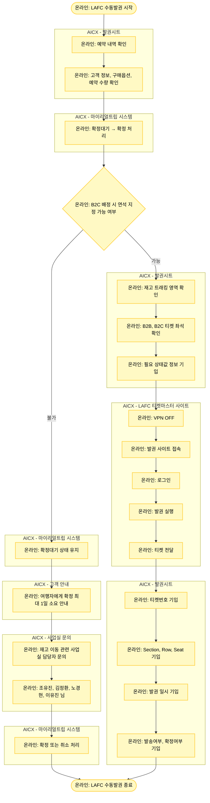

# LAFC_수동발권_v2

## 프로세스 개요

AICX 수동발권매니저가 시트에서 예약 확인 후 마이리얼트립 확정, LAFC 사이트 발권, 좌석 정보 기입까지의 전체 프로세스입니다.

## 프로세스 플로우차트

## 프로세스 상세 설명

### 1. 예약 내역 확인
- 발권시트에서 예약 내역을 확인합니다
- 고객 정보, 구매옵션, 예약 수량을 상세히 확인합니다

### 2. 마이리얼트립 확정 처리
- 확정대기 상태에서 확정 상태로 변경합니다
- **확정을 먼저 눌러주는 이유**: 확정대기 상태에서 여행자가 취소하면 수동 발권 도중일 수 있으므로 먼저 확정합니다
- 티켓마스터에 존재하는 재고만큼 상품에 재고가 업로드됩니다
- **주의**: 티켓마스터 사이트 접속 시 VPN OFF가 필요하므로 매니저 페이지 확정 후 처리합니다

### 3. 연석 지정 가능 여부 판단

#### 3-1. 연석 지정 불가능한 경우
- 확정대기 상태를 유지합니다
- 여행자에게 확정까지 최대 ~1일 소요될 수 있음을 안내합니다
- 재고 이동 관련하여 사업실 담당자(조유진, 김정환, 노경현, 이유진 님)에게 문의합니다
- 최종적으로 확정 또는 취소 처리합니다

#### 3-2. 연석 지정 가능한 경우 (발권 진행)

### 4. 발권 전 준비
- 발권시트의 재고 트래킹 영역을 확인합니다
- B2B, B2C 티켓 좌석 확인이 필요한 상태값 정보를 기입합니다

### 5. LAFC 사이트 발권
- VPN을 OFF로 설정합니다
- 발권 사이트에 접속합니다
- 로그인합니다
- 발권을 실행합니다
- 티켓을 전달합니다

### 6. 좌석 정보 기입
- 발권시트에 다음 정보를 기록합니다:
  - 티켓번호
  - Section, Row, Seat
  - 발권 일시
  - 발송여부
  - 확정여부
