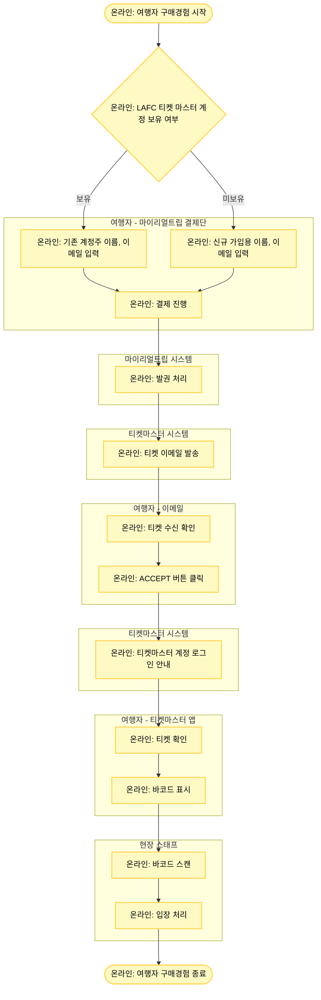

# LAFC_여행자_구매경험

## 프로세스 개요

LAFC 티켓 구매부터 현장 입장까지의 여행자 구매 경험 프로세스입니다.

## 프로세스 플로우차트

## 프로세스 상세 설명

### 1. 결제 단계
- 여행자가 마이리얼트립 결제단에서 LAFC 티켓 마스터 계정 보유 여부를 확인합니다
- **기존 계정 보유**: 계정주 이름과 이메일을 입력합니다
- **계정 미보유**: 앞으로 가입할 이름과 이메일 주소를 입력합니다
- 입력 완료 후 결제를 진행합니다

### 2. 발권 및 티켓 발송
- 마이리얼트립에서 발권 처리를 진행합니다
- 티켓마스터 시스템에서 입력된 이메일로 티켓을 발송합니다

### 3. 티켓 승인 및 확인
- 여행자가 이메일로 티켓을 수신합니다
- ACCEPT 버튼을 클릭합니다
- 티켓마스터 계정 로그인 안내를 받습니다
- 티켓마스터 앱에서 로그인 후 티켓을 확인합니다

### 4. 현장 입장
- 여행자가 티켓 바코드를 표시합니다
- 현장 스태프가 바코드를 스캔합니다
- 입장 처리가 완료됩니다
