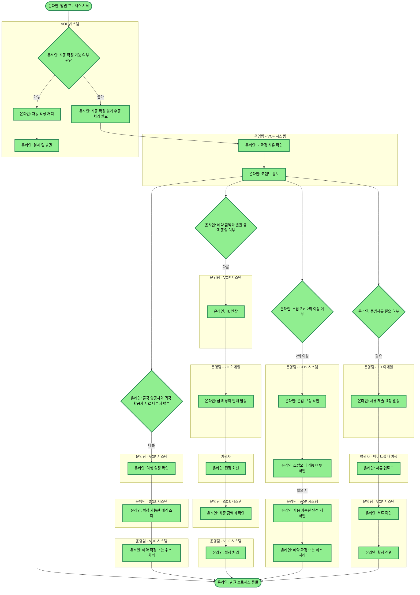

# auto_발권_프로세스

## 프로세스 개요

발권 프로세스는 VOF 시스템에서 자동 확정 가능 여부를 먼저 판단하고, 자동 확정이 불가능한 경우 운영팀이 수동으로 여러 조건을 검토하여 발권을 진행하는 프로세스입니다.

## 프로세스 플로우차트

## 프로세스 상세 설명

### 1. 자동 확정 단계
- VOF 시스템에서 자동 확정 가능 여부를 판단합니다.
- 자동 확정이 가능한 경우, 자동으로 확정 처리하고 결제 및 발권까지 진행한 후 프로세스가 종료됩니다.
- 자동 확정이 불가능한 경우, 수동 처리 단계로 진행합니다.

### 2. 수동 처리 단계
- 운영팀이 VOF에서 미확정 사유를 확인하고 코멘트를 검토합니다.
- 검토 후 4가지 조건을 병렬로 확인합니다.

### 3. 케이스별 처리

#### 케이스1: 항공사 상이 처리
- 출국 항공사와 귀국 항공사가 서로 다른 경우
- 운영팀이 VOF에서 여행 일정을 확인하고, GDS에서 확정 가능한 예약을 조회한 후, VOF에서 예약을 확정하거나 취소 처리합니다.

#### 케이스2: 금액 상이 처리
- 예약 금액과 발권 금액이 다른 경우
- 운영팀이 VOF에서 TL을 연장하고, ZD이메일로 여행자에게 금액 상이 안내를 발송합니다.
- 여행자의 컨펌 회신을 받은 후, 운영팀이 GDS에서 최종 금액을 재확인하고 VOF에서 확정을 진행합니다.

#### 케이스3: 스탑오버 처리
- 스탑오버가 2회 이상인 경우
- 운영팀이 GDS에서 운임 규정과 스탑오버 가능 여부를 확인합니다.
- 필요한 경우 운영팀이 VOF에서 사용 가능한 일정을 재확인합니다.
- 조건이 충족되면 운영팀이 VOF에서 확정 또는 취소 처리합니다.

#### 케이스4: 증빙서류 처리
- 증빙서류가 필요한 경우
- 운영팀이 ZD이메일로 여행자에게 서류 제출 요청을 발송합니다.
- 여행자가 마이트립 내여행에 서류를 업로드하면, 운영팀이 VOF에서 서류를 확인하고 확정을 진행합니다.

### 4. 프로세스 종료
- 모든 과정이 문제 없이 완료되면 발권 프로세스가 종료됩니다.

