# 국내 직계약 호텔 등록 프로세스

## 프로세스 개요

Stay실 국내사업팀에서 국내 직계약 호텔을 등록하여 판매시작까지의 전체 프로세스

## 프로세스 플로우차트

```mermaid
flowchart TD
    Start([시작: 직계약 호텔 등록])
    
    %% 1-3. 국내사업팀 초기 작업
    A1[Stay실 국내사업팀<br/>숙소 정보 시트 작성<br/>기술서]
    A2[Stay실 국내사업팀<br/>파트너 계정 생성]
    A3[Stay실 국내사업팀<br/>젠데스크 티켓 AICX 전달]
    
    %% 4-6. AICX 1차 등록
    B1[AICX<br/>파트너 페이지 접속]
    B2[AICX<br/>숙소 정보 입력<br/>객실/기간/재고/요금<br/>투숙인원/컷오프/스탑세일<br/>취소환불규정]
    B3[AICX<br/>젠데스크 1차 등록 완료 회신]
    
    %% 7-9. CMS 연동
    C1[Stay실 국내사업팀<br/>호텔에 CMS 연동 안내<br/>TL, 산하 등]
    C2[호텔<br/>국내사업팀에 CMS 연동 완료 응답]
    C3[Stay실 국내사업팀<br/>AICX에 CMS 연동 완료 전달]
    
    %% 10-12. AICX 호텔 매핑
    D1[AICX<br/>MRT 매니저에서 호텔 검색<br/>타 플랫폼 연동 정보 존재]
    D2[AICX<br/>호텔 복제]
    D3[AICX<br/>수동 매핑 수행]
    
    %% 13. 정산 확인
    E1[AICX<br/>정산 시트에서<br/>정산 시스템 개발 완료 확인<br/>정산팀 완료 표시]
    
    %% 14-16. 판매시작
    F1[AICX<br/>파트너 페이지에서<br/>판매시작 처리 온세일]
    F2[AICX<br/>호텔에 판매시작 안내 메일 발송]
    F3[AICX<br/>테스트 부킹 수행]
    
    End([완료: 판매 시작])
    
    %% 흐름 연결
    Start --> A1
    A1 --> A2
    A2 --> A3
    A3 --> B1
    B1 --> B2
    B2 --> B3
    B3 --> C1
    C1 --> C2
    C2 --> C3
    C3 --> D1
    D1 --> D2
    D2 --> D3
    D3 --> E1
    E1 --> F1
    F1 --> F2
    F2 --> F3
    F3 --> End
    
    %% 스타일 정의
    classDef default fill:#FFF9C4,stroke:#FFD54F,stroke-width:2px,color:#000
```



## 주요 단계

### 1. Stay실 국내사업팀 - 초기 준비 (1-3단계)
- **숙소 정보 시트 작성**: 기술서 작성
- **파트너 계정 생성**: 해당 숙소의 파트너 계정 생성
- **젠데스크 티켓 전달**: AICX에 작업 요청

### 2. AICX - 1차 등록 작업 (4-6단계)
- **파트너 페이지 접속**
- **숙소 정보 입력**:
  - 옵션별 객실
  - 기간
  - 재고
  - 요금
  - 투숙인원규정
  - 컷오프 기간
  - 스탑세일 기간
  - 취소환불규정
- **젠데스크 1차 등록 완료 회신**: 국내사업팀에 회신

### 3. CMS 연동 (7-9단계)
- **국내사업팀 → 호텔**: CMS 연동 안내 (TL, 산하 등)
- **호텔 → 국내사업팀**: CMS 연동 완료 응답
- **국내사업팀 → AICX**: CMS 연동 완료 전달

### 4. AICX - 호텔 매핑 (10-12단계)
- **MRT 매니저에서 호텔 검색**: Agoda 등 타 플랫폼이 연동되어 있어 대부분의 호텔 정보가 이미 MRT 시스템에 존재
- **호텔 복제**: 기존 호텔 정보 복제
- **수동 매핑 수행**: MRT 매니저 페이지에서 수동 매핑

### 5. 정산 확인 (13단계)
- **정산 시트 확인**: 해당 호텔의 정산 시스템 개발 완료 여부 확인
- 정산팀에서 정산 개발 완료 후 완료 표시함

### 6. AICX - 판매시작 및 테스트 (14-16단계)
- **MRT 파트너 페이지에서 판매시작 처리**: 온세일 상태로 변경
- **호텔에 판매시작 안내 메일 발송**
- **테스트 부킹 수행**: 최종 검증

## 주요 시스템

- **숙소 정보 시트 (기술서)**: 호텔 정보 및 요금 정보
- **젠데스크**: 티켓 관리 시스템
- **CMS**: 채널 매니저 시스템 (TL, 산하 등)
- **MRT 매니저 페이지**: 호텔 관리 시스템
- **파트너 페이지**: 파트너용 상품 관리 페이지
- **정산 시트**: 정산 시스템 개발 완료 여부 추적

## 프로세스 흐름

```
숙소정보작성 → 계정생성 → 티켓전달 → 파트너페이지접속 → 정보입력 → 1차완료회신 → 
CMS연동안내 → CMS연동완료응답 → CMS연동완료전달 → 호텔검색 → 호텔복제 → 수동매핑 → 
정산확인 → 판매시작 → 안내메일발송 → 테스트부킹 → 판매시작
```
