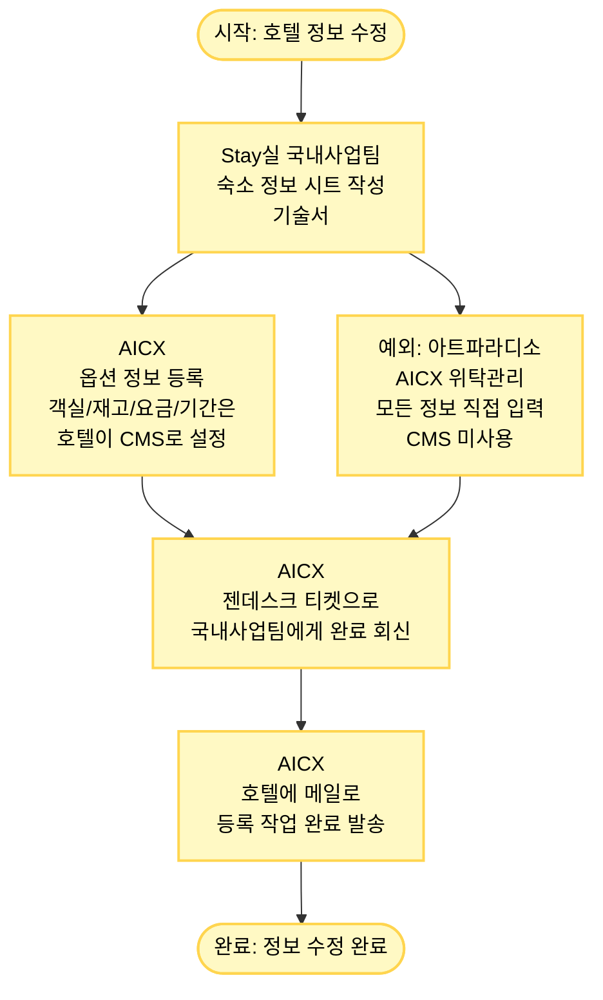

# 국내 호텔 정보 수정 프로세스

## 프로세스 개요

Stay실 국내사업팀에서 국내 호텔의 정보를 수정하는 프로세스

## 프로세스 플로우차트



## 주요 단계

### 1. Stay실 국내사업팀 - 기술서 작성 (1단계)
- **숙소 정보 시트 작성**: 기술서 작성

### 2. AICX - 정보 등록 (2단계)
- **옵션 정보 등록**: 숙소 정보 시트에 적힌 옵션 정보 등록
- **나머지 정보는 호텔이 CMS로 설정**:
  - 객실
  - 재고
  - 요금
  - 기간
  
#### 예외: 아트파라디소 호텔
- **AICX가 위탁관리하는 호텔**
- **모든 정보를 AICX가 직접 입력**
- **CMS 사용 안 함**

### 3. AICX - 작업 완료 회신 (3단계)
- **젠데스크 티켓으로 국내사업팀에게 완료 회신**

### 4. AICX - 호텔 메일 발송 (4단계)
- **호텔에 메일로 등록 작업 완료 발송**

## 주요 시스템

- **숙소 정보 시트 (기술서)**: 호텔 정보 및 옵션 정보
- **젠데스크**: 티켓 관리 시스템
- **CMS**: 채널 매니저 시스템 (호텔이 객실/재고/요금/기간 설정)
- **파트너 페이지**: 파트너용 상품 관리 페이지

## 일반 호텔 vs 아트파라디소

| 구분 | 일반 호텔 | 아트파라디소 |
|------|----------|-------------|
| 옵션 정보 | AICX 등록 | AICX 등록 |
| 객실/재고/요금/기간 | 호텔이 CMS로 설정 | AICX가 직접 입력 |
| CMS 사용 여부 | 사용 | 미사용 |
| 관리 주체 | 호텔 자체 관리 | AICX 위탁관리 |

## 프로세스 흐름

```
숙소정보작성 → 옵션정보등록 → 작업완료회신 → 호텔메일발송 → 완료
```
