# 국내 연동 신규 상품 등록 (2.0) 플로우차트

## 프로세스 플로우차트

```mermaid
flowchart TD
    %% 시작
    Start([시작:<br/>국내 연동<br/>신규 상품 등록]):::online

    %% 공급사 선택
    Cond1{공급사<br/>선택}:::online

    %% ========== 엘에스 컴퍼니 ==========
    subgraph LS1["📱 슬랙 - LS 요청"]
        direction TB
        A1[슬랙 요청 확인]:::online
    end

    Cond2{기존 딜<br/>존재?}:::online

    %% 맵핑 변경
    subgraph LSMapping["🔄 LS - 맵핑 변경"]
        direction TB
        B1[MRT ID<br/>2.0 페이지 진입]:::online
        B2[판매 정지<br/>REJECT 처리]:::online
        B3[생텀 해제 버튼<br/>클릭]:::online
        B4[신규 원본 ID<br/>불러오기]:::online
        B5[기존 MRT ID<br/>입력 및 변경]:::online
        B6[전체 적용]:::online
    end

    %% 신규 등록
    subgraph LSNew["✨ LS - 신규 등록"]
        direction TB
        C1[원본 ID<br/>불러오기]:::online
        C2[MRT ID 생성<br/>전체 적용]:::online
    end

    %% 2.0 매니저 페이지
    subgraph Manager1["📝 2.0 매니저"]
        direction TB
        D1[도시 선택<br/>정보 수정]:::online
        D2[알림 방법<br/>노출 옵션 설정]:::online
        D3[상품 상세<br/>페이지 수정]:::online
    end

    %% 판매 시작
    subgraph Sale1["🎉 판매 시작"]
        direction TB
        E1[판매 시작<br/>클릭]:::online
        E2[시트 기재<br/>A-F열]:::online
    end

    %% ========== 코어웍스 외 ==========
    subgraph Core1["📱 슬랙 - 코어웍스 외"]
        direction TB
        F1[슬랙 요청 확인<br/>정보 확인]:::online
        F2[상품명/판매기간<br/>이용기간/수수료<br/>옵션/이미지]:::online
    end

    Cond3{기존 딜<br/>존재?}:::online

    %% 신규 상품 생성
    subgraph CoreNew["✨ 코어웍스 - 신규"]
        direction TB
        G1[신규 상품 생성<br/>상품명 기재]:::online
        G2[MRT ID 생성]:::online
        G3[옵션 정보 등록<br/>옵션명/설명<br/>연동코드/가격]:::online
        G4[수정 사항 반영<br/>클릭]:::online
    end

    %% 2.0 매니저 페이지
    subgraph Manager2["📝 2.0 매니저"]
        direction TB
        H1[기본 정보 등록<br/>도시/정보수정]:::online
        H2[알림방법 설정<br/>노출옵션 설정]:::online
        H3[상세 페이지 등록<br/>한줄요약/여행소개]:::online
        H4[여행 사진 업로드<br/>썸네일]:::online
    end

    %% 상세 이미지
    subgraph Image1["🖼️ 이미지 관리"]
        direction TB
        I1[상세 이미지 관리<br/>클릭]:::online
        I2[새 이미지 업로드<br/>순서 확인]:::online
        I3[일괄 저장하기]:::online
    end

    %% 판매 시작
    subgraph Sale2["🎉 판매 시작"]
        direction TB
        J1[판매 시작<br/>클릭]:::online
        J2[시트 기재<br/>A-F열]:::online
    end

    %% ========== 야놀자 ==========
    subgraph Yanolja1["📧 메일 - 야놀자"]
        direction TB
        K1[메일 확인<br/>global@aicx.kr]:::online
        K2[시트 기재<br/>메일요청건 처리]:::online
        K3[롯데/특가<br/>표기 확인]:::online
    end

    Cond4{기존 딜<br/>존재?}:::online

    %% 야놀자 신규
    subgraph YanoljaNew["✨ 야놀자 - 신규"]
        direction TB
        L1[LS 신규 등록과<br/>동일 진행]:::online
        L2[수수료 확인<br/>시트 기재]:::online
    end

    %% 야놀자 2.0
    subgraph Manager3["📝 2.0 매니저"]
        direction TB
        M1[기본 정보 등록<br/>알림방법/노출옵션]:::online
        M2[PRODUCT TYPE<br/>확인]:::online
        M3[기본형: 옵션노출<br/>캘린더형: 캘린더노출]:::online
    end

    %% 판매 시작
    subgraph Sale3["🎉 판매 시작"]
        direction TB
        N1[판매 시작<br/>클릭]:::online
        N2[시트 기재<br/>A-F열]:::online
    end

    %% 완료
    End([완료]):::online

    %% ========== 연결 흐름 ==========
    Start --> Cond1

    %% LS 컴퍼니
    Cond1 -->|LS 컴퍼니| A1
    A1 --> Cond2

    Cond2 -->|있음| B1
    B1 --> B2
    B2 --> B3
    B3 --> B4
    B4 --> B5
    B5 --> B6
    B6 --> D1

    Cond2 -->|없음| C1
    C1 --> C2
    C2 --> D1

    D1 --> D2
    D2 --> D3
    D3 --> E1
    E1 --> E2
    E2 --> End

    %% 코어웍스 외
    Cond1 -->|코어웍스<br/>테이블엔조이<br/>플레이스토리<br/>플레이스엠<br/>플러스앤<br/>브이패스<br/>스마트인피니| F1
    F1 --> F2
    F2 --> Cond3

    Cond3 -->|있음| B1
    Cond3 -->|없음| G1

    G1 --> G2
    G2 --> G3
    G3 --> G4
    G4 --> H1

    H1 --> H2
    H2 --> H3
    H3 --> H4
    H4 --> I1

    I1 --> I2
    I2 --> I3
    I3 --> J1
    J1 --> J2
    J2 --> End

    %% 야놀자
    Cond1 -->|야놀자| K1
    K1 --> K2
    K2 --> K3
    K3 --> Cond4

    Cond4 -->|있음| B1
    Cond4 -->|없음| L1

    L1 --> L2
    L2 --> M1

    M1 --> M2
    M2 --> M3
    M3 --> N1
    N1 --> N2
    N2 --> End

    %% 스타일
    classDef online fill:#FFF9C4,stroke:#FFD54F,stroke-width:3px,color:#000,font-size:16px
    classDef offline fill:#FFE0B2,stroke:#FFB74D,stroke-width:3px,color:#000,font-size:16px
```

## 참고 자료

- **원본 페이지**: [국내 연동 신규 상품 등록 (2.0)](https://mrtcx.atlassian.net/wiki/spaces/aoh/pages/893648955/2.0)
- **국내 연동 상품 등록 메뉴얼**: [PPT 링크](https://docs.google.com/presentation/d/1lRTouJGjLPRBeIMoaHAbUfnssJs_qCmP/edit) (야놀자 제외)
- **국내 연동 상품 수정 메뉴얼**: [PPT 링크](https://docs.google.com/presentation/d/1j95SDS7Gc2Gn2W7Wm4RrijP6e_QIiA7-/edit) (야놀자 제외)
- **[국내T&A] 맵핑변경, 신규 상품 등록 시트**: [구글 시트](https://docs.google.com/spreadsheets/d/1NDP7oB6MPhX60uy7UGngsx4WePLWzkvHlDQEy0_Azno/edit)
- **마이리얼트립-야놀자 특가 현황 시트**: [구글 시트](https://docs.google.com/spreadsheets/d/1Okqu0FvA2iieAXhd3bMx5hEj18-_wCitk6O3w3ZUn9k/edit)
