# 한인민박 파트너 검수 플로우차트

## 프로세스 플로우차트

```mermaid
flowchart TD
    %% 시작
    Start([시작:<br/>한인민박<br/>파트너 검수]):::online

    %% 1단계: 검수 건 확인
    subgraph Step1["📋 검수 건 확인"]
        direction TB
        A1[3.0 매니저 페이지<br/>파트너 탭 진입]:::online
        A2[가입 승인 요청<br/>입점 파트너<br/>카테고리 분류]:::online
    end

    %% 2단계: 한인민박 분류
    subgraph Step2["🔍 한인민박 분류"]
        direction TB
        B1[리스팅된<br/>파트너 검수 요청 건<br/>확인]:::online
        B2[소개 정보 확인]:::online
        B3[판매 카테고리 확인]:::online
        B4[한인민박 파트너<br/>검수 건 분류]:::online
    end

    %% 3단계: 파트너 검수 진행
    subgraph Step3["✅ 검수 진행"]
        direction TB
        C1[기본 정보<br/>정산 정보<br/>서류 정보 확인]:::online
        C2[파트너 검수<br/>가이드라인 참조]:::online
        C3[미기재 정보<br/>서류 확인하여 기재]:::online
        C4[공란 없도록<br/>모두 기재]:::online
    end

    %% 4단계: 정산 정보 설정
    subgraph Step4["💰 정산 정보 설정"]
        direction TB
        D1[정산 정보 탭<br/>진입]:::online
        D2[회계 정보 설정]:::online
        D3[세금계산서 정보<br/>설정]:::online
        D4[프로젝트 코드: LOD<br/>계산서 발행: 미발행]:::online
    end

    %% 5단계: 승인/반려 판단
    Cond1{검수<br/>결과}:::online

    %% 승인 처리
    subgraph Approve["✅ 승인 처리"]
        direction TB
        E1[사업실에<br/>젠데스크 티켓 생성]:::online
        E2[수수료 10% 설정<br/>가입 승인 처리 요청]:::online
        E3[사업실 승인 처리<br/>완료 대기]:::online
    end

    %% 승인 안내
    subgraph Notice["📧 승인 안내"]
        direction TB
        F1[가입 승인 안내<br/>메일 발송]:::online
        F2[채널톡 인입 요청<br/>매크로 사용]:::online
    end

    %% 반려 처리
    subgraph Reject["❌ 반려 처리"]
        direction TB
        G1[가입 반려<br/>클릭]:::online
        G2[유형별 반려 사유<br/>기재]:::online
        G3[저장 클릭<br/>반려 처리]:::online
    end

    %% 완료
    End([완료]):::online

    %% ========== 연결 흐름 ==========
    Start --> A1
    A1 --> A2
    A2 --> B1

    B1 --> B2
    B2 --> B3
    B3 --> B4
    B4 --> C1

    C1 --> C2
    C2 --> C3
    C3 --> C4
    C4 --> D1

    D1 --> D2
    D2 --> D3
    D3 --> D4
    D4 --> Cond1

    Cond1 -->|승인| E1
    E1 --> E2
    E2 --> E3
    E3 --> F1
    F1 --> F2
    F2 --> End

    Cond1 -->|반려| G1
    G1 --> G2
    G2 --> G3
    G3 --> End

    %% 스타일
    classDef online fill:#FFF9C4,stroke:#FFD54F,stroke-width:3px,color:#000,font-size:16px
    classDef offline fill:#FFE0B2,stroke:#FFB74D,stroke-width:3px,color:#000,font-size:16px
```

## 참고 자료

- **원본 페이지**: [한인민박 파트너 검수](https://mrtcx.atlassian.net/wiki/spaces/aoh/pages/1100316692)
- **파트너 검수 가이드라인**: [구글 시트](https://docs.google.com/spreadsheets/d/1NuT98a8fFif-OgzzAesJ0jNC-Z4JtCOQu51589quKIA/edit?gid=467620599#gid=467620599)
