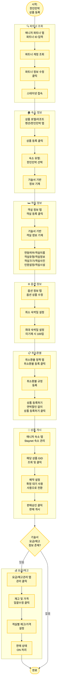

# 한인민박 상품 등록 플로우차트

## 프로세스 플로우차트

```mermaid
flowchart TD
    %% 시작
    Start([시작:<br/>한인민박<br/>상품 등록]):::online

    %% 1-2: 파트너 조회
    subgraph Step1["🔍 파트너 조회"]
        direction TB
        A1[매니저 파트너 탭<br/>파트너 ID 입력]:::online
        A2[파트너 계정 조회]:::online
        A3[파트너 정보 수정<br/>클릭]:::online
        A4[스테이넷 접속]:::online
    end

    %% 3-4: 숙소 정보 등록
    subgraph Step2["🏠 숙소 정보"]
        direction TB
        B1[상품 호텔/리조트<br/>펜션/한인민박 탭]:::online
        B2[상품 등록 클릭]:::online
        B3[숙소 유형:<br/>한인민박 선택]:::online
        B4[기술서 기반<br/>정보 기재]:::online
    end

    %% 5-6: 객실 정보 등록
    subgraph Step3["🛏️ 객실 정보"]
        direction TB
        C1[객실 정보 탭<br/>객실 등록 클릭]:::online
        C2[기술서 기반<br/>객실 정보 기재]:::online
        C3[연동여부/객실이름<br/>객실유형/객실정보<br/>객실크기/객실사진<br/>인원설정/객실시설]:::online
    end

    %% 7: 옵션 정보
    subgraph Step4["⚙️ 옵션 정보"]
        direction TB
        D1[옵션 정보 탭<br/>옵션 상품 수정]:::online
        D2[최소 숙박일 설정]:::online
        D3[최대 숙박일 설정<br/>미기재 시 100일]:::online
    end

    %% 8-9: 취소환불 정책
    subgraph Step5["📋 취소환불"]
        direction TB
        E1[취소환불 정책 탭<br/>취소환불 등록 클릭]:::online
        E2[취소환불 규정<br/>등록]:::online
        E3[상품 등록하기<br/>연박할인 없이<br/>상품 등록하기 클릭]:::online
    end

    %% 10-11: 상품 개시
    subgraph Step6["🚀 상품 개시"]
        direction TB
        F1[매니저 숙소 탭<br/>Staynet 숙소 관리]:::online
        F2[해당 상품 GID<br/>조회 및 클릭]:::online
        F3[예약 설정<br/>확정 대기 사용<br/>사용으로 전환]:::online
        F4[판매승인 클릭<br/>판매 개시]:::online
    end

    %% 12: 요금/재고
    Cond1{기술서<br/>요금/재고<br/>정보 존재?}:::online

    subgraph Step7["💰 요금/재고"]
        direction TB
        G1[요금/재고관리 탭<br/>관리 클릭]:::online
        G2[재고 및 가격<br/>일괄수정 클릭]:::online
        G3[객실별 재고/가격<br/>설정]:::online
        G4[판매 상태<br/>ON 처리]:::online
    end

    %% 완료
    End([완료]):::online

    %% ========== 연결 흐름 ==========
    Start --> A1
    A1 --> A2
    A2 --> A3
    A3 --> A4
    A4 --> B1

    B1 --> B2
    B2 --> B3
    B3 --> B4
    B4 --> C1

    C1 --> C2
    C2 --> C3
    C3 --> D1

    D1 --> D2
    D2 --> D3
    D3 --> E1

    E1 --> E2
    E2 --> E3
    E3 --> F1

    F1 --> F2
    F2 --> F3
    F3 --> F4
    F4 --> Cond1

    Cond1 -->|있음| G1
    G1 --> G2
    G2 --> G3
    G3 --> G4
    G4 --> End

    Cond1 -->|없음| End

    %% 스타일
    classDef online fill:#FFF9C4,stroke:#FFD54F,stroke-width:3px,color:#000,font-size:16px
    classDef offline fill:#FFE0B2,stroke:#FFB74D,stroke-width:3px,color:#000,font-size:16px
```

## 참고 자료

- **원본 페이지**: [한인민박 상품 등록](https://mrtcx.atlassian.net/wiki/spaces/aoh/pages/1050378392)
