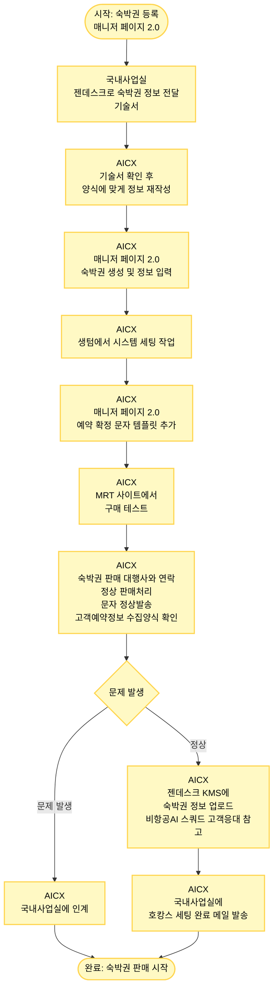

# 호캉스 숙박권 등록 프로세스

## 프로세스 개요

국내사업실에서 호캉스 숙박권을 등록하여 판매시작까지의 전체 프로세스

## 프로세스 플로우차트



## 주요 단계

### 1. 국내사업실 - 정보 전달 (1-2단계)
- **매니저 페이지 2.0으로만 진행**
- **젠데스크로 숙박권 정보 전달**: 기술서

### 2. AICX - 정보 재작성 (3단계)
- **기술서 확인 후 양식에 맞게 정보 재작성**

### 3. AICX - 숙박권 생성 (4단계)
- **매니저 페이지 2.0에서 숙박권 생성 및 정보 입력**

### 4. AICX - 시스템 세팅 (5단계)
- **생텀에서 시스템 세팅 작업**

### 5. AICX - 문자 템플릿 추가 (6단계)
- **매니저 페이지 2.0에서 예약 확정 문자 템플릿 추가**

### 6. AICX - 구매 테스트 (7단계)
- **MRT 사이트에서 구매 테스트**

### 7. AICX - 대행사 확인 (8단계)
- **숙박권 판매 대행사와 연락하여 확인**:
  - 정상 판매처리 여부
  - 문자 정상발송 여부
  - 고객예약정보 수집양식이 같은지 확인
- **문제 발생 시**: 국내사업실에 인계

### 8. AICX - KMS 업로드 (9단계)
- **젠데스크 KMS에 숙박권 정보 업로드**
- 비항공AI 스쿼드에서 고객응대 시 참고할 수 있게

### 9. AICX - 완료 메일 발송 (10단계)
- **국내사업실에 호캉스 세팅 완료 메일 발송**

## 주요 시스템

- **매니저 페이지 2.0**: 숙박권 생성 및 관리 (필수)
- **젠데스크**: 기술서 전달, KMS 정보 업로드
- **생텀**: 시스템 세팅 작업
- **MRT 사이트**: 구매 테스트
- **젠데스크 KMS**: 비항공AI 스쿼드 고객응대 참고 자료

## 확인 사항

### 대행사 확인 항목
1. ✅ 정상 판매처리 여부
2. ✅ 문자 정상발송 여부
3. ✅ 고객예약정보 수집양식 일치 여부

**문제 발생 시**: 국내사업실에 인계

## 프로세스 흐름

```
정보전달 → 정보재작성 → 숙박권생성 → 시스템세팅 → 문자템플릿 → 
구매테스트 → 대행사확인 → KMS업로드 → 완료메일 → 판매시작
```
