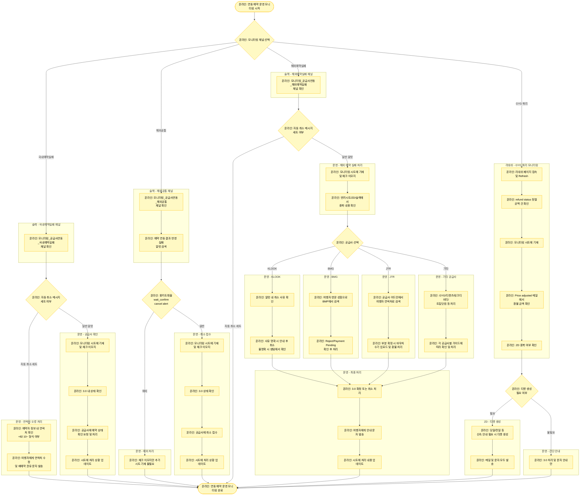

# 연동 예약 운영 모니터링 플로우차트

## 프로세스 플로우차트

## 참고 자료

- **업무 시트**: [연동 모니터링 시트](https://docs.google.com/spreadsheets/d/1BUPeouUqtWm_ZrQZGIX3yf8fKtx25zj1kl6dlXtMx14/edit?gid=511658573#gid=511658573)
- **모니터링 알럿 정리**: [모니터링 알럿 정리 시트](https://docs.google.com/spreadsheets/d/1oJfPrbFKQf2TxqjunJAR4pQcUuBdQiE6dE1ZGY7zDoo/edit?gid=866584764#gid=866584764)
- **공급사 정보**: [공급사 어드민 및 이메일 계정 정보](https://docs.google.com/spreadsheets/d/1aRMZdr7tLbCqptVe8f5XRGUViRoUriXoPIgrBbNzlCI/edit?pli=1&gid=802671048#gid=802671048)
- **GYG 쿼리**: [리대쉬 페이지](https://redash.myrealtrip.net/queries/14902?p_type=ALL)

## 주요 채널

1. **#모니터링_공급사연동_국내예약실패**
2. **#모니터링_공급사연동_해외공통**
3. **#모니터링_공급사연동_해외예약실패**

## 모니터링 목적

- **예약 실패 건 자동 환불 불가**: 여러 사유로 예약이 실패되는데, 시스템적으로 자동 환불되고 있지 않아 수기로 환불 처리 필요
