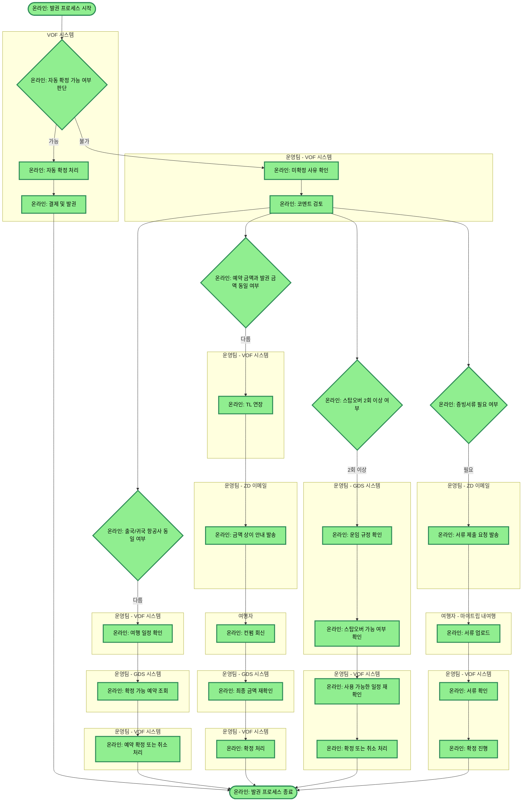

# opus4.5_발권_프로세스

## 프로세스 개요

VOF 시스템에서 자동 확정 여부를 판단하여 자동 처리하거나, 운영팀이 수동으로 각종 조건(항공사 동일 여부, 금액 동일 여부, 스탑오버 횟수, 증빙서류 필요 여부)을 확인하며 발권을 진행하는 프로세스입니다.

## 프로세스 플로우차트

## 프로세스 상세 설명

### 1. 자동 확정 판단 단계
- VOF 시스템에서 자동 확정이 가능한지 판단
- 가능하면 자동으로 확정 처리 후 결제 및 발권까지 진행하고 종료
- 불가하면 운영팀의 수동 처리로 전환

### 2. 초기 검토 단계
- 운영팀이 VOF에서 미확정 사유를 확인
- 코멘트를 검토하여 다음 단계 진행

### 3. 병렬 조건 확인 (4개 조건 동시 분기)

#### 조건 1: 항공사 상이 시
- VOF에서 여행 일정 확인
- GDS에서 확정 가능한 예약인지 조회
- VOF에서 예약 확정 또는 취소 처리

#### 조건 2: 금액 상이 시
- VOF에서 TL 연장
- ZD 이메일로 여행자에게 금액 상이 안내 발송
- 여행자 컨펌 회신 대기
- GDS에서 최종 금액 재확인
- VOF에서 확정 처리

#### 조건 3: 스탑오버 2회 이상 시
- GDS에서 운임 규정 확인
- GDS에서 스탑오버 가능 여부 확인
- VOF에서 사용 가능한 일정 재확인
- VOF에서 확정 또는 취소 처리

#### 조건 4: 증빙서류 필요 시
- ZD 이메일로 여행자에게 서류 제출 요청 발송
- 여행자가 마이트립 내여행에 서류 업로드
- VOF에서 서류 확인 후 확정 진행

### 4. 프로세스 종료
- 해당 조건의 처리가 완료되면 발권 프로세스 종료
