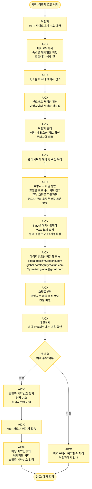

# 해외 호텔 예약 확정 프로세스

## 프로세스 개요

여행자가 MRT 사이트에서 해외 호텔을 예약한 후, AICX에서 호텔 측과 예약을 확정하여 여행자에게 확정 정보를 전달하는 전체 프로세스

## 프로세스 플로우차트



## 주요 단계

### 1. 여행자 예약 (1단계)
- **여행자가 MRT 사이트에서 숙소 예약**

### 2. AICX 예약 확인 (2-3단계)
- **대시보드에서 숙소별 예약현황 확인**: '확정대기' 상태인 건들이 새로 들어온 예약
- **숙소별 파트너 페이지 접속**

### 3. 여행자 응대 (4-5단계)
- **센드버드 채팅방 확인**: 여행자가 숙소 예약하면 여행자와의 채팅방이 자동 생성됨
- **여행자 응대**: 예약 시 필요한 정보 확인 및 문의사항 해결

### 4. 예약 정보 관리 (6단계)
- **관리시트에 예약 정보 옮겨적기**

### 5. 호텔 측 예약 요청 (7-8단계)
- **부킹시트 메일 발송**:
  - 호텔별로 프로세스가 달라 호텔별 프로세스 시트 보고 진행
  - 몇 가지 호텔들은 예약이 들어온 즉시 부킹시트 메일이 자동 발송됨 (Stay실 자동화)
  - 랜드사가 관리하는 호텔은 핫라인으로 네이트온도 병용
- **Stay실 해외사업팀에 VCC 결제 요청**:
  - Stay실이 관리시트를 함께 보며 VCC 필요 상태인 것들은 알아서 진행
  - 몇 가지 호텔들은 VCC 결제 자동화됨

### 6. 호텔 측 회신 확인 (9-11단계)
- **마이리얼트립 메일함 접속**:
  - `global.ops@myrealtrip.com`
  - `global.hotels@myrealtrip.com`
  - `Myrealtrip.global@gmail.com`
- **호텔로부터 부킹시트 메일 회신 확인** (='컨펌 메일')
- **메일에서 예약 완료되었다는 내용 확인하기**

### 7. 예약 확정 처리 (11-13단계)

**호텔 측이 예약 수락한 경우:**
- **호텔측 예약번호 확인**: 메일에서 '컨펌 번호' (MRT측 예약번호 아님) 찾아 관리시트에 기입
- **MRT 파트너 페이지 접속**
- **예약확정 처리**: 해당 예약건을 찾아 '예약확정' 처리 및 호텔측 예약번호(='컨펌 번호') 입력

**호텔 측이 예약 거절한 경우:**
- **예약취소 처리**: 마리트에서 '예약취소' 처리
- **여행자에게 안내**

## 주요 시스템 및 도구

### 시스템
- **MRT 사이트**: 여행자 예약
- **대시보드**: 예약현황 확인 ('확정대기' 상태)
- **파트너 페이지**: 예약 관리 및 확정 처리
- **센드버드**: 여행자와의 채팅
- **관리시트**: 예약 정보 기록

### 이메일
- `global.ops@myrealtrip.com`
- `global.hotels@myrealtrip.com`
- `Myrealtrip.global@gmail.com`

### 커뮤니케이션
- **부킹시트 메일**: 호텔에 예약 정보 전달
- **네이트온**: 랜드사 관리 호텔 핫라인
- **VCC 결제**: Stay실 해외사업팀 협업

## 자동화 항목

### Stay실 자동화
1. **부킹시트 메일 자동 발송**: 일부 호텔은 예약 즉시 자동 발송
2. **VCC 결제 자동화**: 일부 호텔은 자동 결제 처리

### 관리 방식
- **호텔별 프로세스 시트**: 호텔마다 다른 프로세스 문서화
- **관리시트**: Stay실과 AICX가 공동으로 확인하며 VCC 필요 상태 관리

## 주요 용어

- **확정대기**: 여행자가 예약했지만 호텔 측 확정이 안 된 상태
- **컨펌 메일**: 호텔로부터 받는 예약 확정 회신 메일
- **컨펌 번호**: 호텔 측에서 발급하는 예약번호 (MRT 예약번호와 별개)
- **부킹시트**: 호텔에 보내는 예약 정보 시트
- **VCC**: Virtual Credit Card (가상 신용카드)

## 확인 사항

### 호텔 회신 확인
- ✅ 예약 완료 여부
- ✅ 호텔측 예약번호 (컨펌 번호)
- ❌ 예약 거절 시 → 취소 처리 및 여행자 안내

### 프로세스 차이
- 호텔별로 프로세스가 다름 → **호텔별 프로세스 시트 필수 확인**
- 랜드사 관리 호텔 → **네이트온 핫라인 병용**

## 프로세스 흐름

```
예약 → 확인 → 파트너페이지 → 채팅 → 여행자응대 → 관리시트 → 
부킹시트발송 → VCC요청 → 메일확인 → 컨펌메일 → 
수락(확정처리) / 거절(취소처리) → 완료
```
