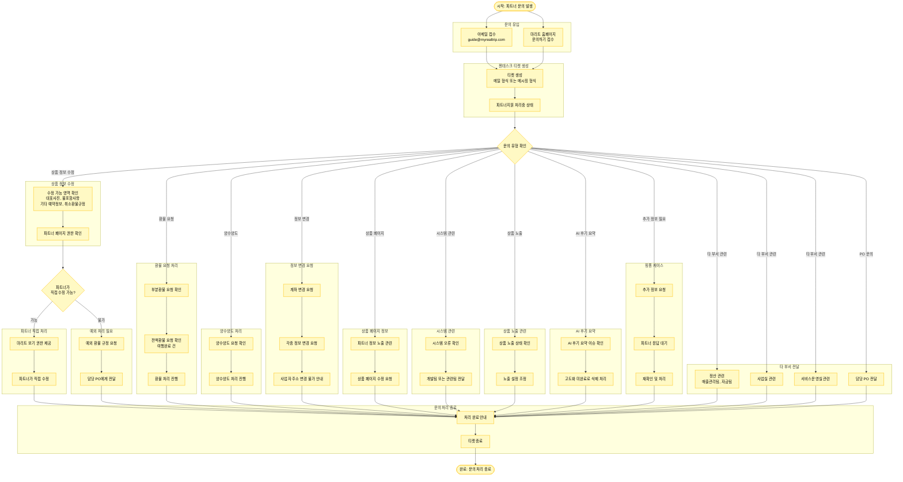

# 파트너 문의 처리 프로세스

## 프로세스 개요

파트너의 문의가 젠데스크로 유입되어 처리 완료까지의 전체 프로세스

## 프로세스 플로우차트



## 주요 문의 유형

### 1. 상품 정보 수정
- **파트너 직접 수정 가능**: 대표사진, 불포함사항, 기타 예약정보, 취소환불규정
- **예외 처리 필요**: 예외 환불 규정 희망 시 PO 전달

### 2. 환불 요청
- 부분환불 요청
- 전액환불 요청 (여행완료 건)

### 3. 양수양도
- 파트너 간 권리 이전 처리

### 4. 정보 변경
- 계좌 변경 요청
- 각종 정보 변경 요청
- **주의**: 사업자 주소 변경 불가

### 5. 상품 페이지
- 파트너 정보 노출 관련
- 상품 페이지 수정 요청

### 6. 시스템 관련
- 시스템 오류 확인
- 개발팀 또는 관련팀 전달

### 7. 상품 노출 관련
- 상품 노출 상태 확인
- 노출 설정 조정

### 8. AI 후기 요약
- AI 후기 요약 이슈
- **현재**: 고도화 미완료로 삭제 처리

### 9. 핑퐁 케이스
- 추가 정보 요청
- 파트너 응답 대기
- 재확인 및 처리

### 10. 타 부서 전달
- **정산 관련**: 매출관리팀, 자금팀
- **사업실**
- **서비스운영실**
- **담당 PO**

## 문의 유입 경로

### 이메일
- guide@myrealtrip.com 으로 접수
- 젠데스크 티켓 자동 생성

### 홈페이지
- 마리트 홈페이지 문의하기
- 젠데스크 티켓 자동 생성

## 티켓 형식

- **메일 형식**: 일반 이메일 스레드
- **메시징 형식**: 채팅 형태의 대화

## 처리 흐름

```
문의 유입 → 젠데스크 티켓 생성 → 파트너지원 처리중 → 유형 분류 → 처리 → 완료
```
