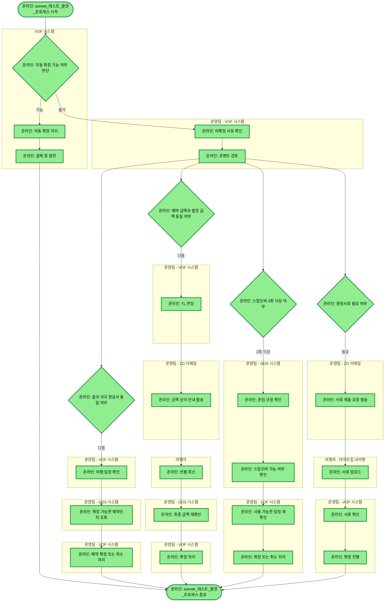

# sonnet_테스트_발권_프로세스

## 프로세스 개요

VOF 시스템에서 자동 확정 가능 여부를 판단한 후, 불가능한 경우 운영팀이 항공사 일치 여부, 금액 일치 여부, 스탑오버 횟수, 증빙서류 필요 여부를 각각 확인하여 처리하는 발권 프로세스입니다.

## 프로세스 플로우차트

## 프로세스 상세 설명

### 1. 자동 확정 판단 단계
- VOF 시스템에서 자동 확정 가능 여부를 판단합니다
- 가능한 경우: 자동 확정 처리 후 결제 및 발권까지 진행하고 프로세스 종료
- 불가능한 경우: 운영팀의 수동 처리로 진행

### 2. 수동 처리 초기 검토
- 운영팀이 VOF에서 미확정 사유를 확인합니다
- 코멘트를 검토한 후 4가지 조건을 병렬로 확인합니다

### 3. 병렬 조건 확인 및 처리

#### 3.1 항공사 일치 여부
- 출국 항공사와 귀국 항공사가 다른 경우
- 운영팀이 여행 일정 확인 → GDS에서 예약 조회 → 확정/취소 처리

#### 3.2 금액 일치 여부
- 예약 금액과 발권 금액이 다른 경우
- TL 연장 → 여행자에게 안내 → 컨펌 회신 → 최종 금액 재확인 → 확정 처리

#### 3.3 스탑오버 횟수
- 스탑오버가 2회 이상인 경우
- GDS에서 운임 규정 및 가능 여부 확인 → VOF에서 일정 재확인 → 확정/취소 처리

#### 3.4 증빙서류 필요 여부
- 서류 제출이 필요한 경우
- 여행자에게 요청 발송 → 여행자 업로드 → 운영팀 확인 → 확정 진행

### 4. 프로세스 종료
모든 처리가 완료되면 발권 프로세스가 종료됩니다.

