# 스테이넷 직계약 호텔 등록 프로세스

## 프로세스 개요

Stay실 해외사업팀에서 스테이넷 직계약 호텔을 등록하여 판매시작까지의 전체 프로세스

## 프로세스 플로우차트

```mermaid
flowchart TD
    Start([시작: 직계약 호텔 등록])
    
    %% 1. 요금표 작성
    subgraph Stay["Stay실 해외사업팀"]
        direction TB
        A1[요금표 시트 작성]
    end
    
    %% 2. 계정 생성
    subgraph Account["Stay실 해외사업팀"]
        direction TB
        B1[파트너 계정 생성]
    end
    
    %% 3. 티켓 전달
    subgraph Zendesk1["Stay실 해외사업팀"]
        direction TB
        C1[젠데스크 티켓 AICX 전달]
    end
    
    %% 4-6. AICX 호텔 검색 및 복제
    subgraph AICX_Search["AICX"]
        direction TB
        D1[MRT 매니저 페이지에서<br/>호텔 검색]
        D2[호텔 복제]
        D3[GPID 매핑]
    end
    
    %% 7-8. 파트너 페이지 입력
    subgraph AICX_Input["AICX"]
        direction TB
        E1[파트너 페이지 접속]
        E2[요금표 정보 입력<br/>객실/기간/재고/요금<br/>투숙인원/컷오프/스탑세일<br/>취소환불규정]
    end
    
    %% 9. 작업 완료 회신
    subgraph AICX_Reply["AICX"]
        direction TB
        F1[젠데스크 티켓으로<br/>작업 완료 회신]
    end
    
    %% 10. 담당자 지정 요청
    subgraph Stay_Request["Stay실 해외사업팀"]
        direction TB
        G1[예약운영 담당자<br/>지정 요청]
    end
    
    %% 11. 담당자 지정
    subgraph AICX_Assign["AICX"]
        direction TB
        H1[예약운영 담당자 지정]
    end
    
    %% 12. 담당자 전달
    subgraph AICX_Notify["AICX"]
        direction TB
        I1[담당자 정보 전달]
    end
    
    %% 13. 판매시작 요청
    subgraph Stay_Sale["Stay실 해외사업팀"]
        direction TB
        J1[판매시작 요청]
    end
    
    %% 14. 온세일
    subgraph AICX_OnSale["AICX"]
        direction TB
        K1[파트너 페이지 접속]
        K2[판매시작 처리<br/>온세일]
    end
    
    End([완료: 판매 시작])
    
    %% 흐름 연결
    Start --> A1
    A1 --> B1
    B1 --> C1
    C1 --> D1
    D1 --> D2
    D2 --> D3
    D3 --> E1
    E1 --> E2
    E2 --> F1
    F1 --> G1
    G1 --> H1
    H1 --> I1
    I1 --> J1
    J1 --> K1
    K1 --> K2
    K2 --> End
    
    %% 스타일 정의
    classDef default fill:#FFF9C4,stroke:#FFD54F,stroke-width:2px,color:#000
```



## 주요 단계

### 1. Stay실 해외사업팀 - 초기 준비
- **요금표 시트 작성**: [요금표 시트](https://docs.google.com/spreadsheets/d/1Eo5cJ24NO-h_vmvtTm-GoGq5QiozX7c4jCCP6azarEU/edit?pli=1&gid=1275841478#gid=1275841478)
- **파트너 계정 생성**: 해당 숙소의 파트너 계정 생성
- **젠데스크 티켓 전달**: [젠데스크 필터](https://myrealtrip.zendesk.com/agent/filters/39513764382733) (슬랙 채널 알림)

### 2. AICX - 호텔 등록
- **호텔 검색**: MRT 매니저 페이지에서 호텔 검색
  - Agoda 등 타 플랫폼이 연동되어 있어 대부분의 호텔 정보가 이미 시스템에 존재
- **호텔 복제**: 기존 호텔 정보 복제
- **GPID 매핑**: 고유 식별자 매핑

### 3. AICX - 요금 정보 입력
- **파트너 페이지 접속**
- **요금표 정보 입력**:
  - 옵션별 객실
  - 기간
  - 재고
  - 요금
  - 투숙인원규정
  - 컷오프 기간
  - 스탑세일 기간
  - 취소환불규정

### 4. AICX - 작업 완료
- **젠데스크 티켓 회신**: 작업 완료 통보

### 5. Stay실 해외사업팀 - 담당자 지정 요청
- **예약운영 담당자 지정 요청**

### 6. AICX - 담당자 지정 및 전달
- **예약운영 담당자 지정**
- **담당자 정보 전달**: Stay실 해외사업팀에 담당자 정보 전달

### 7. Stay실 해외사업팀 - 판매시작 요청
- **판매시작 요청**

### 8. AICX - 온세일 처리
- **파트너 페이지 접속**
- **판매시작 처리**: 온세일 상태로 변경

## 참고 자료

- [요금표 시트](https://docs.google.com/spreadsheets/d/1Eo5cJ24NO-h_vmvtTm-GoGq5QiozX7c4jCCP6azarEU/edit?pli=1&gid=1275841478#gid=1275841478)
- [젠데스크 티켓 필터](https://myrealtrip.zendesk.com/agent/filters/39513764382733)

## 주요 시스템

- **요금표 시트**: Google Sheets
- **젠데스크**: 티켓 관리 시스템
- **MRT 매니저 페이지**: 호텔 관리 시스템
- **파트너 페이지**: 파트너용 상품 관리 페이지

## 프로세스 흐름

```
요금표 작성 → 계정 생성 → 티켓 전달 → 호텔 검색/복제/매핑 → 요금 입력 → 
작업 완료 회신 → 담당자 지정 요청 → 담당자 지정 → 담당자 전달 → 
판매시작 요청 → 온세일 처리 → 판매 시작
```
