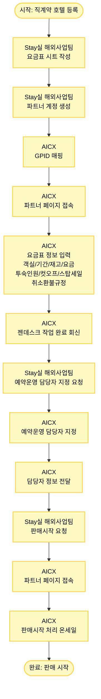

# 스테이넷 직계약 호텔 등록 프로세스

## 프로세스 개요

Stay실 해외사업팀에서 스테이넷 직계약 호텔을 등록하여 판매시작까지의 전체 프로세스

## 프로세스 플로우차트



## 주요 단계

### 1. Stay실 해외사업팀 - 초기 준비
- **요금표 시트 작성**: [요금표 시트](https://docs.google.com/spreadsheets/d/1Eo5cJ24NO-h_vmvtTm-GoGq5QiozX7c4jCCP6azarEU/edit?pli=1&gid=1275841478#gid=1275841478)
- **파트너 계정 생성**: 해당 숙소의 파트너 계정 생성

### 2. AICX - GPID 매핑
- **GPID 매핑**: 고유 식별자 매핑

### 3. AICX - 파트너 페이지 접속
- **파트너 페이지 접속**

### 4. AICX - 요금 정보 입력
- **요금표 정보 입력**:
  - 옵션별 객실
  - 기간
  - 재고
  - 요금
  - 투숙인원규정
  - 컷오프 기간
  - 스탑세일 기간
  - 취소환불규정

### 5. AICX - 작업 완료
- **젠데스크 티켓 회신**: 작업 완료 통보

### 6. Stay실 해외사업팀 - 담당자 지정 요청
- **예약운영 담당자 지정 요청**

### 7. AICX - 담당자 지정 및 전달
- **예약운영 담당자 지정**
- **담당자 정보 전달**: Stay실 해외사업팀에 담당자 정보 전달

### 8. Stay실 해외사업팀 - 판매시작 요청
- **판매시작 요청**

### 9. AICX - 온세일 처리
- **파트너 페이지 접속**
- **판매시작 처리**: 온세일 상태로 변경

## 참고 자료

- [요금표 시트](https://docs.google.com/spreadsheets/d/1Eo5cJ24NO-h_vmvtTm-GoGq5QiozX7c4jCCP6azarEU/edit?pli=1&gid=1275841478#gid=1275841478)

## 프로세스 흐름

```
요금표 작성 → 계정 생성 → GPID 매핑 → 파트너 페이지 접속 → 요금 입력 → 
작업 완료 회신 → 담당자 지정 요청 → 담당자 지정 → 담당자 전달 → 
판매시작 요청 → 온세일 처리 → 판매 시작
```
