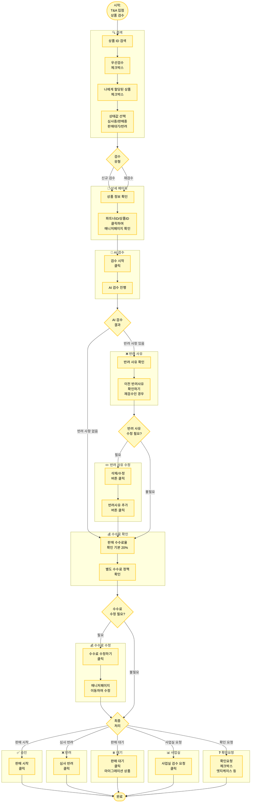

# T&A 입점 상품 검수 플로우차트

## 프로세스 플로우차트

## 참고 자료

- **원본 페이지**: [T&A 입점 상품 검수](https://mrtcx.atlassian.net/wiki/spaces/aoh/pages/791707659/T+A)
- **자동화툴 다운로드**:
  - [AICX MANAGER v0.3.3 (macOS)](https://aicx-partner-app-release.s3.ap-northeast-2.amazonaws.com/AICX+MANAGER-0.3.3-universal.dmg)
  - [AICX MANAGER v0.3.3 (Windows x64)](https://aicx-partner-app-release.s3.ap-northeast-2.amazonaws.com/AICX+MANAGER+Setup+0.3.3.exe)
- **매뉴얼 슬라이드**: [구글 프레젠테이션](https://docs.google.com/presentation/d/1MaIVoXtc2Mrd-HL6kEzoyBTqMdNRrXgnkIFMIHMrzso/edit)
- **검수 가이드라인 시트**: [구글 시트](https://docs.google.com/spreadsheets/d/1FjqymMxV8VPM5EWvUX9HkQZuFVkt-Ecz66vT9YJfxec/edit)
- **동의서 응답시트**: [구글 시트](https://docs.google.com/spreadsheets/d/1Aq1Wiotw7PFHgIkE6QBwWU4EnyzHuXbaFTwORZ7Syz8/edit)
