# T&A 파트너 검수 매뉴얼

## 프로세스 플로우차트

```mermaid
flowchart TD
    %% 시작
    Start([시작: T&A 파트너 검수]):::online

    %% 1단계: 검수 앱 진입
    subgraph Step1["검수 앱 진입"]
        direction TB
        A1[AICX MANAGER 앱 클릭]:::online
        A2[새 버전 업데이트 시<br/>설치 진행]:::online
        A3[다시 시작 예 클릭]:::online
        A4[전용 사용자 선택<br/>다음 클릭]:::online
    end

    %% 2단계: 매니저 로그인
    subgraph Step2["매니저 로그인"]
        direction TB
        B1[매니저 로그인 버튼 클릭]:::online
        B2[Manager 시스템 로그인 창<br/>매니저 로그인하기 클릭]:::online
    end

    %% 3단계: 파트너 검수 시작
    subgraph Step3["파트너 검수 시작"]
        direction TB
        C1[입점 파트너 검수<br/>버튼 클릭]:::online
        C2[심사 중인 파트너<br/>리스트 확인]:::online
        C3[TNA 파트너<br/>선택 및 클릭]:::online
    end

    %% 4단계: 검수 유형 확인
    Cond1{재검수 건<br/>여부}:::online

    subgraph Step4_Re["재검수 확인"]
        direction TB
        D1[재검수 표시 확인]:::online
        D2[이전 반려 사유<br/>확인하기 클릭]:::online
        D3[이전 반려 사유<br/>검토]:::online
    end

    %% 5단계: 검수 진행
    subgraph Step5["검수 진행"]
        direction TB
        E1[검수 시작 버튼 클릭]:::online
        E2[전체 검수 결과 값<br/>상단 좌측 확인]:::online
        E3[하단 세부 반려 사항<br/>확인]:::online
    end

    %% 6단계: 반려 사항 수정
    Cond2{반려 사항<br/>수정 필요?}:::online

    subgraph Step6["반려 사항 수정"]
        direction TB
        F1[반려 사항 삭제<br/>또는 수정]:::online
        F2[반려 사항 추가]:::online
    end

    %% 7단계: 최종 처리
    Cond3{최종 처리<br/>선택}:::online

    subgraph Final_Approve["승인 처리"]
        direction TB
        G1[승인 버튼 클릭]:::online
        G2[승인 완료]:::online
    end

    subgraph Final_Reject["반려 처리"]
        direction TB
        H1[반려 버튼 클릭]:::online
        H2[반려 완료]:::online
    end

    %% 종료
    End([완료]):::online

    %% ========== 연결 흐름 ==========
    Start --> A1
    A1 --> A2
    A2 --> A3
    A3 --> A4
    A4 --> B1

    B1 --> B2
    B2 --> C1

    C1 --> C2
    C2 --> C3
    C3 --> Cond1

    Cond1 -->|재검수| D1
    D1 --> D2
    D2 --> D3
    D3 --> E1

    Cond1 -->|신규| E1

    E1 --> E2
    E2 --> E3
    E3 --> Cond2

    Cond2 -->|필요| F1
    F1 --> F2
    F2 --> Cond3

    Cond2 -->|불필요| Cond3

    Cond3 -->|승인| G1
    G1 --> G2
    G2 --> End

    Cond3 -->|반려| H1
    H1 --> H2
    H2 --> End

    %% 스타일 정의
    classDef online fill:#FFF9C4,stroke:#FFD54F,stroke-width:3px,color:#000,font-size:16px
    classDef offline fill:#FFE0B2,stroke:#FFB74D,stroke-width:3px,color:#000,font-size:16px
```

## 참고 자료

- [파트너 도움말/문의](https://mrtpartners.zendesk.com/hc/ko)
- [파트너 검수 가이드라인](https://docs.google.com/spreadsheets/d/1FjqymMxV8VPM5EWvUX9HkQZuFVkt-Ecz66vT9YJfxec/edit?gid=978040870#gid=978040870)
