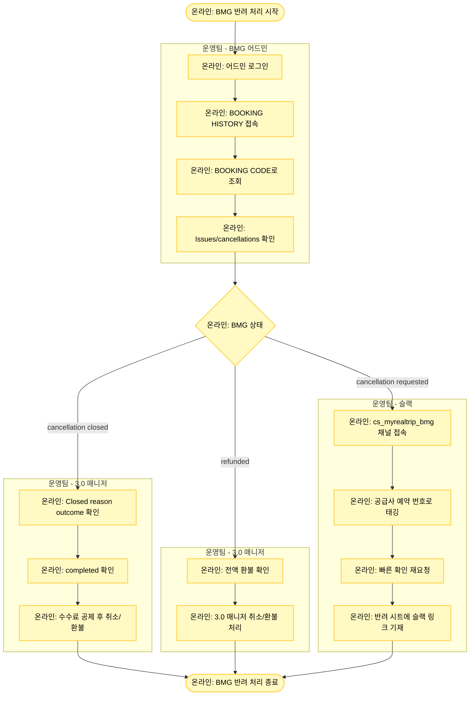

# BMG 반려 처리

## 기본 정보

- **확인 수단**: 어드민
- **소통 수단**: 슬랙
- **3.0 매니저 페이지 상태**: 취소 요청
- **주요 반려 사유**: 수수료 공제 필요 예약건

## 프로세스 플로우차트



## 상세 처리 방법

### 1단계: BMG 어드민 확인

**어드민 로그인**
- BMG 어드민에 로그인합니다.

**예약 조회**
1. **BOOKING HISTORY** 메뉴 접속
2. **BOOKING CODE**에 공급사 예약 번호 입력하여 조회

**상태 확인**
- **Issues/cancellations** 항목의 상태 확인

### 2단계: 상태별 처리

#### 상태 1: cancellation closed (취소 완료 - 수수료 공제)

**확인 사항**
- Issues/cancellations 상태: **cancellation closed**
- 의미: 수수료 공제 후 취소 완료

**처리 방법**
1. **cancellation closed** 클릭하여 상세 내역 확인
2. **Closed reason outcome**: "completed" 확인
3. 수수료 금액 확인
4. 3.0 매니저에서 취소/환불 규정에 따라 수수료 공제 후 취소/환불 진행

**어드민 화면 예시**
```
Issues/cancellations: cancellation closed
Closed reason outcome: completed
Cancellation Fee: $XX.XX
```

**3.0 매니저 처리**
- 공급사 어드민에서 확인한 수수료 금액을 공제하고 환불
- 수수료는 USD 기준이므로 원화 환산 필요 (당일 환율 적용)

#### 상태 2: refunded (전액 환불 완료)

**확인 사항**
- Issues/cancellations 상태: **refunded**
- 의미: 전액 환불 완료

**처리 방법**
1. 전액 환불 확인
2. 3.0 매니저에서 취소/환불 처리 (수수료 공제 없음)

**어드민 화면 예시**
```
Issues/cancellations: refunded
Refund Amount: $XXX.XX (전액)
```

#### 상태 3: cancellation requested (취소 신청 중)

**확인 사항**
- Issues/cancellations 상태: **cancellation requested**
- 의미: 취소 신청 중, 공급사 회신 대기

**처리 방법**
1. 일정 시간 대기 후 재확인 (보통 24-48시간)
2. 지속적으로 "cancellation requested" 상태에 머물러 있으면:
   - 슬랙 채널로 공급사에 빠른 확인 재요청

**슬랙 요청 방법**
1. **cs_myrealtrip_bmg** 채널 접속
   - 슬랙 채널: https://aicx-kr.slack.com/archives/CESNHDN90
2. 공급사 예약 번호로 공급사 태깅
3. 빠른 확인 재요청 메시지 전송
4. 반려 시트 비고란에 슬랙 메시지 링크 기재 (팔로업용)

**슬랙 메시지 템플릿**
```
@BMG
예약 번호: [BOOKING CODE]
MRT 예약 번호: TNA-YYYYMMDD-XXXXXXXX
취소 신청이 오래 대기 중입니다. 빠른 확인 부탁드립니다.
```

## BMG 상태 처리 요약

| Issues/cancellations 상태 | 의미 | 처리 방법 |
|--------------------------|------|----------|
| **cancellation closed** | 수수료 공제 취소 완료 | completed 확인 → 수수료 공제 환불 |
| **refunded** | 전액 환불 완료 | 3.0 매니저 전액 환불 |
| **cancellation requested** | 취소 신청 중 | 24-48시간 대기 → 장기 지속 시 슬랙 재요청 |

## 주의사항

⚠️ **cancellation closed vs refunded 구분**
- **cancellation closed**: 수수료 공제 후 환불 (부분 환불)
- **refunded**: 전액 환불 (수수료 없음)
- 반드시 상태를 정확히 확인해야 합니다.

⚠️ **Closed reason outcome 확인 필수**
- "cancellation closed" 클릭 시 반드시 "Closed reason outcome"이 "completed"인지 확인
- "completed"가 아닌 경우 다른 처리가 필요할 수 있음

⚠️ **수수료 환율 계산**
- BMG 수수료는 USD 기준
- 당일 환율을 적용하여 원화로 환산
- 구글 환율 표 기준 사용 (일관성 유지)

⚠️ **cancellation requested 팔로업**
- 24-48시간 경과 후에도 상태 변화가 없으면 슬랙으로 재요청
- 반려 시트에 슬랙 메시지 링크를 꼭 기재하여 팔로업 가능하도록 함

⚠️ **슬랙 채널 활용**
- BMG는 슬랙으로 소통이 가능한 공급사
- 이메일보다 슬랙이 응답이 빠르므로 적극 활용

## 수수료 환율 계산 예시

### 예시: $25 수수료

```
BMG 어드민 수수료: $25
환율 (당일 기준): 1 USD = 1,300원
수수료 원화: $25 × 1,300원 = 32,500원

판매 금액: 150,000원
환불 금액: 150,000원 - 32,500원 = 117,500원
```

## 트러블슈팅

### 문제 1: cancellation requested가 일주일 이상 지속

**해결 방법**
1. 슬랙 cs_myrealtrip_bmg 채널에서 재요청
2. 여전히 응답 없으면 사업실에 에스컬레이션
3. 필요 시 이메일로도 추가 문의

### 문제 2: 수수료 금액이 명확하지 않음

**해결 방법**
1. 3.0 매니저의 취소/환불 규정 확인
2. BMG 상품 페이지에서 취소 수수료 규정 확인
3. 불명확한 경우 사업실에 문의

### 문제 3: completed가 아닌 다른 상태

**해결 방법**
1. Closed reason outcome의 다른 상태 메시지 확인
2. 사업실에 케이스 공유하여 처리 방법 확인

## 관련 링크

- [BMG 어드민](https://admin.bmgtours.com/) (실제 URL은 계정 정보 시트 참조)
- [cs_myrealtrip_bmg 슬랙 채널](https://aicx-kr.slack.com/archives/CESNHDN90)
- [반려 처리 시트](https://docs.google.com/spreadsheets/d/16c0vj5gC7gkYyi8bU_qfdBwqQxmqfMwe1wiGGCC78zw/edit#gid=0)
- [공급사 어드민 계정 정보](https://docs.google.com/spreadsheets/d/1aRMZdr7tLbCqptVe8f5XRGUViRoUriXoPIgrBbNzlCI/edit?pli=1&gid=802671048#gid=802671048)
