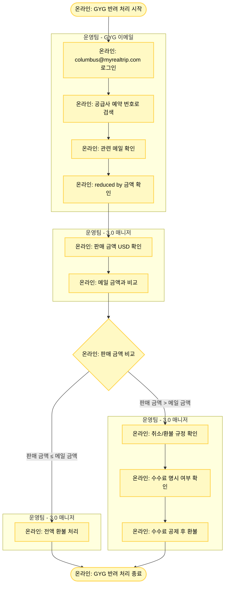

# GYG (GetYourGuide) 반려 처리

## 기본 정보

- **확인 수단**: 이메일
- **소통 수단**: WHATSAPP
- **3.0 매니저 페이지 상태**: 취소 요청
- **주요 반려 사유**: 공급사 발 취소건 연동 실패

## 프로세스 플로우차트



## 상세 처리 방법

### 1단계: GYG 이메일 확인

**이메일 계정 로그인**
- GYG 공급사 소통 메일: **columbus@myrealtrip.com**

**예약 검색**
- 공급사 예약 번호로 메일 검색
- 취소 관련 메일 찾기

**메일 내용 확인**
- 환불 금액 확인: "**reduced by $XXX.X**" 표현 찾기
- 의미: 해당 금액(USD)으로 환불되었다는 내용

### 2단계: 판매 금액과 비교

**3.0 매니저에서 판매 금액 확인**
1. 3.0 매니저 페이지에서 예약 상세 확인
2. 판매 금액을 USD로 확인 (또는 원화를 USD로 환산)

**환율 환산 (필요 시)**
```
예시:
판매 금액: 150,000원
예약일 환율: 1 USD = 1,300원
판매 금액 USD: 150,000원 ÷ 1,300원 = $115.38
```

**메일 금액과 비교**
- 메일에 표시된 "reduced by $XXX.X" 금액과 판매 금액 USD 비교

### 3단계: 금액 비교 결과에 따른 처리

#### Case 1: 판매 금액 USD ≤ 메일 금액 → 전액 환불

**판단 기준**
```
예시:
3.0 판매 금액 USD: $100
메일 금액 (reduced by): $120
→ 판매 금액이 적음 → 전액 환불 가능
```

**처리 방법**
- 3.0 매니저에서 전액 환불 처리

#### Case 2: 판매 금액 USD > 메일 금액 → 수수료 확인 필요

**판단 기준**
```
예시:
3.0 판매 금액 USD: $150
메일 금액 (reduced by): $130
→ 판매 금액이 더 큼 → 차액 발생
```

**처리 방법**

**Step 1: 취소/환불 규정 확인**
- 3.0 매니저에서 해당 예약의 취소/환불 규정 확인
- 수수료가 명시되어 있는지 확인

**Step 2-A: 수수료 명시된 경우**
- 규정상 수수료를 공제하고 환불
- 예: "취소 시 $20 수수료 공제"

**Step 2-B: 수수료 명시 안 된 경우**
- 메일 금액을 기준으로 환불
- 차액은 공급사 환불 금액 기준으로 처리

**환불 금액 계산 예시**
```
3.0 판매 금액: 195,000원 ($150)
메일 환불 금액 (reduced by): $130
당일 환율: 1 USD = 1,300원

환불 금액: $130 × 1,300원 = 169,000원
```

## GYG 금액 비교 요약

| 비교 결과 | 처리 방법 |
|----------|----------|
| **판매 금액 USD ≤ 메일 금액** | 전액 환불 |
| **판매 금액 USD > 메일 금액** | 취소/환불 규정 확인 → 수수료 공제 또는 메일 금액 기준 환불 |

## 메일 예시

### 환불 완료 메일 예시

```
Subject: Booking Cancellation - [예약번호]

Dear Partner,

Your booking [예약번호] has been cancelled.

The refund amount has been reduced by $130.0

Best regards,
GetYourGuide Team
```

**해석**
- "reduced by $130.0" → $130 환불되었음

## 주의사항

⚠️ **reduced by의 의미**
- "reduced by $130" = "$130으로 환불" (환불 금액)
- "reduced by $20" (차감) ≠ 이 표현과 혼동 주의
- GYG 메일에서는 **환불 금액**을 의미합니다.

⚠️ **USD 환산 기준**
- 판매 금액 USD 환산 시: 예약일 기준 환율 사용
- 환불 금액 원화 환산 시: 당일 환율 사용
- 구글 환율 표 기준 일관성 유지

⚠️ **차액 발생 시 처리**
- 판매 금액 > 메일 금액인 경우:
  1. 먼저 취소/환불 규정에 수수료가 명시되어 있는지 확인
  2. 수수료 명시 시: 규정대로 수수료 공제
  3. 수수료 미명시 시: 메일 금액 기준으로 환불

⚠️ **메일 미확인 시**
- 공급사 예약 번호로 검색했는데 메일이 없는 경우:
  1. MRT 예약 번호로도 검색
  2. 날짜 범위를 넓혀서 검색
  3. 스팸 메일함 확인
  4. 메일이 정말 없으면 WHATSAPP으로 공급사 문의

## WHATSAPP 소통 방법

**연락이 필요한 경우**
- 메일 확인이 안 되는 경우
- 환불 금액이 불명확한 경우
- 추가 확인이 필요한 경우

**WHATSAPP 연락 절차**
1. GYG 담당자 WHATSAPP 번호 확인 (계정 정보 시트)
2. 공급사 예약 번호와 상황 설명
3. 환불 금액 확인 요청
4. 응답 확인 후 3.0 매니저 처리

**메시지 템플릿**
```
Hello,

Booking Reference: [공급사 예약 번호]
MRT Booking: TNA-YYYYMMDD-XXXXXXXX

Could you please confirm the refund amount for this cancelled booking?

Thank you.
```

## 환율 환산 예시

### 예시 1: 전액 환불

```
3.0 판매 금액: 130,000원
예약일 환율: 1 USD = 1,300원
판매 금액 USD: 130,000 ÷ 1,300 = $100

메일 환불 금액 (reduced by): $120

판단: $100 < $120 → 전액 환불
처리: 130,000원 전액 환불
```

### 예시 2: 수수료 공제 환불

```
3.0 판매 금액: 195,000원
예약일 환율: 1 USD = 1,300원
판매 금액 USD: 195,000 ÷ 1,300 = $150

메일 환불 금액 (reduced by): $130

판단: $150 > $130 → 차액 $20
취소/환불 규정: "취소 시 $20 수수료 공제"

처리: 
당일 환율: 1 USD = 1,320원
수수료 원화: $20 × 1,320 = 26,400원
환불 금액: 195,000 - 26,400 = 168,600원
```

## 관련 링크

- [GYG 이메일 (columbus@myrealtrip.com)](mailto:columbus@myrealtrip.com)
- [반려 처리 시트](https://docs.google.com/spreadsheets/d/16c0vj5gC7gkYyi8bU_qfdBwqQxmqfMwe1wiGGCC78zw/edit#gid=0)
- [공급사 어드민 계정 정보](https://docs.google.com/spreadsheets/d/1aRMZdr7tLbCqptVe8f5XRGUViRoUriXoPIgrBbNzlCI/edit?pli=1&gid=802671048#gid=802671048)
