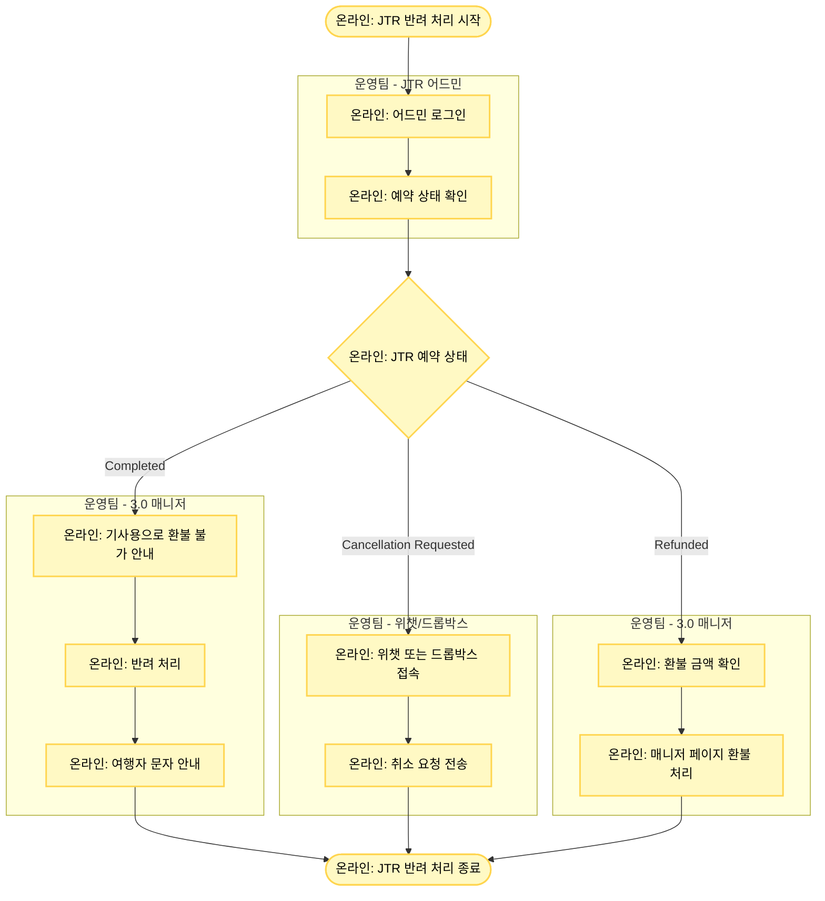

# JTR 반려 처리

## 기본 정보

- **확인 수단**: 어드민
- **소통 수단**: 위챗
- **3.0 매니저 페이지 상태**: 취소 요청 또는 P 점유됨
- **주요 반려 사유**: 
  1. 공급사 발 취소 건 자동 연동 불가
  2. 유효기간 확인 필요
  3. 예약 취소 대기 (즉시취소가 되지 않는 상품)

## 프로세스 플로우차트



## 상세 처리 방법

### 1단계: 어드민 확인

**어드민 로그인**
- JTR 어드민에 로그인합니다.

**예약 상태 확인**
- 공급사 예약 번호로 조회하여 예약 상태를 확인합니다.

### 2단계: 상태별 처리

#### 상태 1: Completed (기사용)

**확인 사항**
- 어드민 상태: "Completed"
- 의미: 이미 사용 완료된 예약

**처리 방법**
1. 3.0 매니저에서 기사용으로 환불 불가 안내
2. 반려 처리 진행
3. 여행자에게 기사용으로 환불 불가 문자 안내 발송

**3.0 매니저 페이지 예시**
- 상태: P 점유됨
- 예약 번호 예시: TNA-20250710-00005382

**반려 알럿 예시**
```
JTR 예약 취소에 실패하였습니다. 
订单已经全部验证！
```

#### 상태 2: Cancellation Requested (취소 대기)

**확인 사항**
- 어드민 상태: "Cancellation Requested"
- 의미: 즉시 취소가 되지 않아 공급사 확인이 필요한 상품

**처리 방법**
1. 위챗 또는 드롭박스를 통해 공급사에 취소 요청 전송
   - **위챗**: JTR 담당자에게 직접 메시지
   - **드롭박스**: https://www.dropbox.com/request/j3A5adqufggQJoPcummV
2. 공급사 응답 대기
3. 취소 완료 응답 수신 후 3.0 매니저 처리

**취소 요청 템플릿**
```
예약 번호: [공급사 예약 번호]
MRT 예약 번호: [TNA-YYYYMMDD-XXXXXXXX]
요청 사항: 취소 및 환불 처리 요청
```

#### 상태 3: Refunded (환불 완료)

**확인 사항**
- 어드민 상태: "Refunded"
- 의미: 공급사에서 이미 환불 처리 완료

**처리 방법**
1. 어드민에서 환불 금액 확인
2. 3.0 매니저 페이지에서 해당 금액으로 환불 처리

## JTR 어드민 상태 요약

| 어드민 상태 | 의미 | 처리 방법 |
|------------|------|----------|
| **Completed** | 기사용 | 반려 + 여행자 안내 |
| **Cancellation Requested** | 취소 대기 | 위챗/드롭박스로 취소 요청 |
| **Refunded** | 환불 완료 | 3.0 매니저 환불 처리 |

## 주의사항

⚠️ **Completed 상태 주의**
- "Completed"는 이미 사용 완료된 예약이므로 환불이 불가능합니다.
- 반드시 여행자에게 기사용 안내를 해야 합니다.

⚠️ **Cancellation Requested 팔로업**
- 위챗/드롭박스로 취소 요청 후 반드시 반려 시트에 요청 날짜를 기록합니다.
- 공급사 응답이 없으면 2-3일 후 재요청이 필요합니다.

⚠️ **P 점유됨 상태**
- 3.0 매니저에서 "P 점유됨" 상태로 표시되는 경우는 대부분 기사용입니다.
- 어드민에서 반드시 Completed 상태인지 확인해야 합니다.

## 관련 링크

- [JTR 어드민](https://admin.jtrchina.com/) (실제 URL은 계정 정보 시트 참조)
- [JTR 취소 요청 드롭박스](https://www.dropbox.com/request/j3A5adqufggQJoPcummV)
- [반려 처리 시트](https://docs.google.com/spreadsheets/d/16c0vj5gC7gkYyi8bU_qfdBwqQxmqfMwe1wiGGCC78zw/edit#gid=0)
- [모니터링_공급사연동_예약취소반려 슬랙](https://aicx-kr.slack.com/archives/C02D5KZLM1Q)
