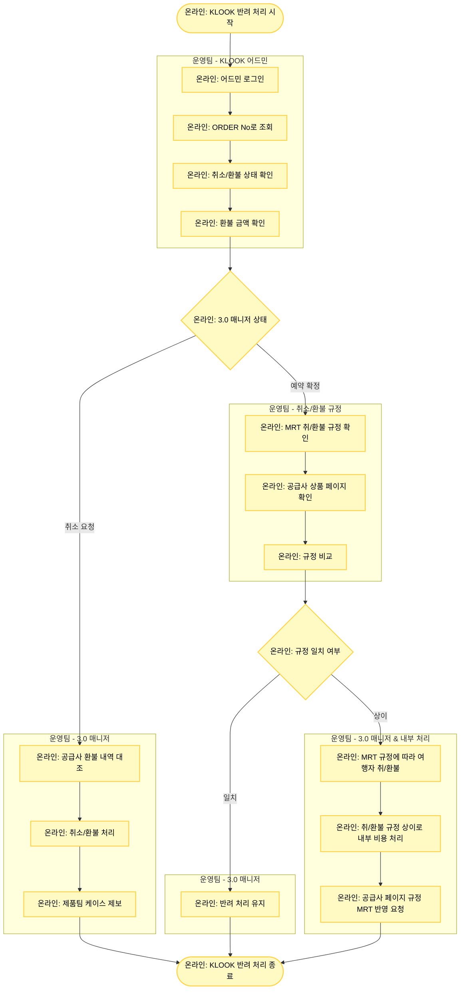

# KLOOK 반려 처리

## 기본 정보

- **확인 수단**: 어드민
- **소통 수단**: 이메일
- **3.0 매니저 페이지 상태**: 예약 취소 또는 취소 요청
- **주요 반려 사유**: 취소 환불 자동 연동

## 프로세스 플로우차트



## 상세 처리 방법

### 1단계: KLOOK 어드민 확인

**어드민 로그인**
- KLOOK 어드민: https://klook.klktech.com/bookings

**예약 조회**
- ORDER No에 공급사 예약 번호를 입력하여 조회

**취소/환불 상태 확인**
- 예약 상태: 취소 완료, 환불 완료, 진행 중 등
- 환불 금액 확인 (중요)

### 2단계: 3.0 매니저 페이지 상태별 처리

#### 상태 1: 취소 요청 (연동 실패)

**확인 사항**
- 3.0 매니저: "취소 요청" 상태로 남아 있음
- KLOOK 어드민: 취소/환불 완료 확인됨
- 의미: 공급사에서는 처리되었으나 3.0으로 연동 실패

**처리 방법**
1. KLOOK 어드민에서 확인한 환불 금액과 3.0 매니저 판매 금액 대조
2. 금액이 일치하면 3.0 매니저에서 취소/환불 처리
3. 처리 후 반드시 제품팀에 해당 케이스 제보
   - 이유: 3.0 연동 상품은 "예약 확정/취소/완료" 상태만 가능해야 함

**제품팀 제보 내용**
```
예약 번호: [TNA-YYYYMMDD-XXXXXXXX]
공급사: KLOOK
이슈: 취소 요청 상태 장기간 유지 (연동 실패)
KLOOK 어드민 상태: 취소 완료
처리 내용: 수동으로 3.0 매니저 취소/환불 완료
```

#### 상태 2: 예약 확정 (자동 반려 처리)

**확인 사항**
- 3.0 매니저: "예약 확정"으로 되돌아가 있음
- 의미: 시스템이 취소/환불 불가 판단하여 자동으로 예약 확정으로 변경

**처리 방법**

**Step 1: MRT 규정 확인**
- 3.0 매니저에서 해당 예약의 취소/환불 규정 확인
- 예약 일자, 사용 일자 기준으로 규정상 취소 가능한지 판단

**Step 2: 공급사 상품 페이지 확인**
- KLOOK 상품 페이지에서 취소/환불 규정 확인
- MRT 페이지 규정과 비교

**Step 3: 규정 일치 여부 판단**

##### Case A: 규정 일치 - 정상 반려
- MRT 규정과 공급사 규정이 일치
- 규정상 취소 불가가 맞음
- **처리**: 반려 유지, 여행자 안내

##### Case B: 규정 상이 - 내부 비용 처리
- MRT 규정상으로는 취소/환불 가능
- 공급사 규정은 취소 불가
- **처리**:
  1. MRT 취/환불 규정에 따라 여행자에게 취소/환불 진행
  2. "취소/환불 규정 상이"로 내부 비용 처리 진행
  3. 공급사 상품 페이지 규정을 MRT 페이지에 반영 요청

## KLOOK 상태 처리 요약

| 3.0 매니저 상태 | KLOOK 어드민 상태 | 처리 방법 |
|----------------|------------------|----------|
| **취소 요청** | 취소 완료 | 수동 취소/환불 + 제품팀 제보 |
| **예약 확정** | - | MRT 규정 확인 → 규정 일치 시 반려 / 규정 상이 시 내부 비용 처리 |

## 주의사항

⚠️ **취소 요청 상태 장기 유지**
- "취소 요청" 상태가 24시간 이상 지속되면 연동 실패 가능성이 높습니다.
- 반드시 KLOOK 어드민에서 실제 상태를 확인해야 합니다.

⚠️ **제품팀 제보 필수**
- 연동 실패 케이스는 반드시 제품팀에 제보하여 시스템 개선에 반영되도록 합니다.

⚠️ **규정 상이 케이스 처리**
- 규정 상이로 내부 비용 처리하는 경우:
  1. 반드시 승인 프로세스를 거쳐야 합니다
  2. 공급사 페이지 규정 업데이트를 요청해야 합니다
  3. 재발 방지를 위해 규정을 동기화해야 합니다

⚠️ **환불 금액 확인**
- KLOOK 어드민의 환불 금액과 3.0 매니저의 판매 금액이 일치하는지 반드시 확인합니다.
- 금액이 다른 경우 사업실에 문의가 필요합니다.

## 내부 비용 처리 프로세스

**규정 상이로 내부 비용 처리가 필요한 경우:**

1. **여행자 취소/환불 진행**
   - MRT 규정에 따라 여행자에게 취소/환불 처리
   
2. **내부 비용 처리 신청**
   - 사유: "취소/환불 규정 상이 (KLOOK)"
   - 증빙: KLOOK 상품 페이지 캡처, MRT 규정 비교 자료
   
3. **규정 동기화 요청**
   - 제품팀/사업실에 KLOOK 상품 페이지 규정을 MRT에 반영 요청
   - 향후 재발 방지

## 관련 링크

- [KLOOK 어드민](https://klook.klktech.com/bookings)
- [반려 처리 시트](https://docs.google.com/spreadsheets/d/16c0vj5gC7gkYyi8bU_qfdBwqQxmqfMwe1wiGGCC78zw/edit#gid=0)
- [공급사 어드민 계정 정보](https://docs.google.com/spreadsheets/d/1aRMZdr7tLbCqptVe8f5XRGUViRoUriXoPIgrBbNzlCI/edit?pli=1&gid=802671048#gid=802671048)
