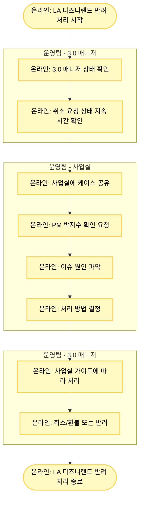

# LA 디즈니랜드 반려 처리

## 기본 정보

- **확인 수단**: 이메일
- **소통 수단**: 이메일, 사업실
- **3.0 매니저 페이지 상태**: 취소 요청
- **주요 반려 사유**: 기타 이슈 발생

## 프로세스 플로우차트



## 상세 처리 방법

### 1단계: 상태 확인

**3.0 매니저 페이지 확인**
- 예약 상태: "취소 요청"
- 취소 요청 상태 지속 시간 확인

**정상 케이스**
- 취소 가능: 취소 요청 API 호출 즉시 자동 취소/환불 처리 연동
- 취소 불가: 자동으로 "예약 확정"으로 상태 변경 + 여행자에게 취소 불가 알림톡 발송

**이슈 케이스**
- "취소 요청" 상태에만 머물러 있음 (장시간 지속)
- 자동 처리가 되지 않고 Pending 상태 유지

### 2단계: 사업실 확인 요청

**이슈 상황**
- 취소 요청 상태가 **24시간 이상** 지속
- 자동 연동이 작동하지 않음

**확인 요청**
1. **사업실**에 케이스 공유
2. **PM 박지수**에게 확인 요청
3. 시스템 이슈 원인 파악

**보고 내용**
```
예약 번호: TNA-YYYYMMDD-XXXXXXXX
공급사: LA 디즈니랜드
이슈: 취소 요청 상태 장기간 유지
취소 요청 시간: [YYYY-MM-DD HH:MM]
현재 경과 시간: [XX시간]
```

### 3단계: 이슈 원인 파악

**알려진 이슈**
- 특정 시간대 구매 건의 경우:
  - 디즈니 측에서는 자동 환불 처리됨
  - 마리트로는 연동되지 않음
  - "취소 요청" 상태에 머물러 있게 됨

**원인**
- API 연동 타이밍 이슈
- 특정 시간대 또는 특정 상품에서 발생
- 시스템 간 동기화 실패

### 4단계: 처리 방법 결정

**사업실/PM 가이드에 따라 처리**

#### Case 1: 공급사에서 환불 완료된 경우
- 디즈니 측 확인 결과 환불 완료
- 3.0 매니저에서 수동으로 취소/환불 처리
- 제품팀에 케이스 제보 (시스템 개선용)

#### Case 2: 공급사에서 환불 거절된 경우
- 디즈니 측 확인 결과 취소 불가
- 3.0 매니저에서 반려 처리
- 여행자에게 취소 불가 안내

#### Case 3: 수동 재시도
- 시스템 이슈로 판단되는 경우
- 개발팀에서 API 재호출
- 정상 처리 확인 후 완료

## LA 디즈니랜드 자동 처리 로직

### 정상 작동 시나리오

**취소 가능한 경우**
```
여행자 취소 요청 
  → 3.0 매니저 "취소 요청" 상태 
    → 취소 요청 API 호출 
      → 디즈니 시스템 즉시 처리 
        → 3.0 매니저 "예약 취소" 상태로 자동 변경 
          → 자동 환불 처리 완료
```

**취소 불가능한 경우**
```
여행자 취소 요청 
  → 3.0 매니저 "취소 요청" 상태 
    → 취소 요청 API 호출 
      → 디즈니 시스템 취소 거절 
        → 3.0 매니저 "예약 확정"으로 상태 복원 
          → 여행자에게 취소 불가 알림톡 자동 발송
```

### 이슈 시나리오

```
여행자 취소 요청 
  → 3.0 매니저 "취소 요청" 상태 
    → 취소 요청 API 호출 
      → 디즈니 시스템 처리 완료 (환불 or 거절) 
        → ❌ 3.0으로 응답 연동 실패 
          → "취소 요청" 상태에 머물러 있음 
            → ✅ 수동 확인 및 처리 필요
```

## 주의사항

⚠️ **24시간 기준**
- "취소 요청" 상태가 24시간 이상 지속되면 이슈로 판단
- 즉시 사업실/PM에게 보고

⚠️ **수동 처리 주의**
- 반드시 디즈니 측 실제 상태를 확인한 후 처리
- 추측으로 임의 처리 금지
- 사업실 가이드 없이 독단 처리 금지

⚠️ **제품팀 제보**
- 수동 처리한 모든 케이스는 제품팀에 제보
- 시스템 개선을 위한 데이터로 활용

⚠️ **특정 시간대 구매 건 주의**
- 알려진 이슈: 특정 시간대 구매 건에서 연동 실패 발생
- 해당 패턴 발견 시 사업실에 추가 정보 제공

## 사업실 문의 템플릿

### 이메일 문의 템플릿

```
제목: [긴급] LA 디즈니랜드 취소 요청 상태 장기 유지 - TNA-YYYYMMDD-XXXXXXXX

안녕하세요,

LA 디즈니랜드 예약 건이 취소 요청 상태에 장시간 머물러 있어 확인 요청드립니다.

[예약 정보]
- 예약 번호: TNA-YYYYMMDD-XXXXXXXX
- 공급사: LA 디즈니랜드
- 상품명: [상품명]
- 구매 일시: YYYY-MM-DD HH:MM
- 방문 예정일: YYYY-MM-DD

[이슈 내용]
- 취소 요청 시간: YYYY-MM-DD HH:MM
- 경과 시간: XX시간
- 현재 상태: 취소 요청 (변화 없음)

[조치 요청]
1. 디즈니 시스템 실제 상태 확인
2. 환불 완료 여부 확인
3. 처리 가이드 요청

감사합니다.
```

### 슬랙 문의 템플릿

```
@PM박지수 @사업실

LA 디즈니랜드 취소 요청 이슈 확인 요청드립니다.

예약 번호: TNA-YYYYMMDD-XXXXXXXX
취소 요청 시간: YYYY-MM-DD HH:MM (XX시간 경과)
현재 상태: 취소 요청 (장시간 유지)

처리 가이드 부탁드립니다.
```

## 트러블슈팅

### 문제 1: 사업실 응답이 지연됨

**해결 방법**
1. 슬랙으로 재요청 (이메일보다 빠름)
2. 긴급한 경우 전화 문의
3. 반려 시트에 "사업실 확인 중" 기재

### 문제 2: 디즈니 측 상태를 알 수 없음

**해결 방법**
1. 사업실을 통해 디즈니 시스템 확인 요청
2. 직접 확인 권한이 없으므로 반드시 사업실 경유
3. 확인 완료 전까지 대기

### 문제 3: 비슷한 이슈가 반복 발생

**해결 방법**
1. 패턴 분석 (시간대, 상품, 가격대 등)
2. 사업실에 패턴 정보 제공
3. 제품팀에 근본 원인 개선 요청

## 제품팀 제보 템플릿

```
제목: [LA 디즈니랜드] 취소 요청 상태 장기 유지 케이스 제보

안녕하세요,

LA 디즈니랜드 취소 연동 실패 케이스를 제보합니다.

[예약 정보]
- 예약 번호: TNA-YYYYMMDD-XXXXXXXX
- 구매 일시: YYYY-MM-DD HH:MM
- 취소 요청: YYYY-MM-DD HH:MM
- 경과 시간: XX시간

[이슈 내용]
- 디즈니 시스템: 환불 완료 (또는 거절)
- 3.0 시스템: 취소 요청 상태 유지 (연동 실패)

[처리 내용]
- 수동으로 3.0 매니저 취소/환불 처리 완료

[요청 사항]
시스템 개선을 위한 검토 부탁드립니다.

감사합니다.
```

## 관련 링크

- [반려 처리 시트](https://docs.google.com/spreadsheets/d/16c0vj5gC7gkYyi8bU_qfdBwqQxmqfMwe1wiGGCC78zw/edit#gid=0)
- [공급사 어드민 계정 정보](https://docs.google.com/spreadsheets/d/1aRMZdr7tLbCqptVe8f5XRGUViRoUriXoPIgrBbNzlCI/edit?pli=1&gid=802671048#gid=802671048)

## 참고 사항

**LA 디즈니랜드 특징**
- 자동 연동 구조로 설계됨
- 정상 작동 시 수동 개입 불필요
- 이슈 발생 시에만 수동 처리
- 사업실/PM 협업 필수 공급사
