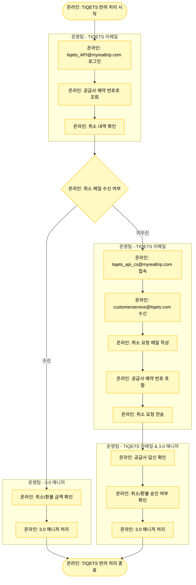

# TIQETS 반려 처리

## 기본 정보

- **확인 수단**: 이메일
- **소통 수단**: 이메일
- **3.0 매니저 페이지 상태**: 취소 요청
- **주요 반려 사유**: 유효기간 확인 필요

## 프로세스 플로우차트



## 상세 처리 방법

### 1단계: TIQETS 이메일 확인

**이메일 계정 로그인**
- TIQETS 취소 내역 수신 메일: **tiqets_API@myrealtrip.com**

**예약 조회**
- 공급사 예약 번호로 메일 검색
- TIQETS 발 취소 메일이 있는지 확인

**취소 메일 확인**
- 제목: "Booking Cancelled", "Cancellation Confirmation" 등
- 취소 날짜 및 환불 금액 확인

### 2단계: 취소 메일 수신 시 (경로 A) - 직접 처리

**메일 내용 확인**
```
예시:
Subject: Booking Cancelled - [예약번호]

Your booking [예약번호] has been cancelled.

Booking Reference: XXXXX
Cancellation Date: 2025-01-15
Refund Amount: €50.00

The refund will be processed within 7-10 business days.
```

**3.0 매니저 처리**
1. 환불 금액 확인 (통화 확인 필수)
2. 환율 환산 (EUR, USD 등 → KRW)
3. 3.0 매니저에서 취소/환불 처리

**환율 환산 예시**
```
메일 환불 금액: €50
당일 환율: 1 EUR = 1,450원
환불 금액 원화: €50 × 1,450 = 72,500원
```

### 3단계: 취소 메일 미수신 시 (경로 B) - 취소 요청

#### Step 1: 취소 요청 메일 작성

**발신 이메일**
- 계정: **tiqets_api_cs@myrealtrip.com**

**수신 이메일**
- TIQETS 고객 서비스: **customerservice@tiqets.com**

**메일 제목 형식**
```
[MYREALTRIP] Cancellation Request - [공급사 예약 번호]
```

**메일 본문 템플릿**
```
Subject: [MYREALTRIP] Cancellation Request - [공급사 예약 번호]

Dear Tiqets Team,

We would like to request a cancellation for the following booking:

Booking Reference: [공급사 예약 번호]
Partner Booking ID: TNA-YYYYMMDD-XXXXXXXX
Product Name: [상품명]
Visit Date: [방문 예정일]
Booking Date: [예약일]

Reason: Customer requested cancellation before visit date.

Could you please:
1. Confirm the cancellation
2. Provide the refund amount
3. Confirm the refund processing timeline

Thank you for your assistance.

Best regards,
Myrealtrip Operations Team
```

#### Step 2: 공급사 답신 확인

**확인 사항**
1. 취소 승인 여부
2. 환불 금액
3. 환불 처리 일정

**답신 예시**
```
Dear Partner,

Your cancellation request has been approved.

Booking Reference: XXXXX
Cancellation Status: Approved
Refund Amount: €50.00
Refund Timeline: 7-10 business days

Thank you.
Tiqets Team
```

#### Step 3: 3.0 매니저 처리

**답신 확인 후 처리**
- 취소 승인되면: 환불 금액 확인 후 3.0 매니저 처리
- 취소 거절되면: 반려 처리 및 여행자 안내

## TIQETS 처리 경로 요약

| 상황 | 처리 방법 |
|------|----------|
| **취소 메일 수신됨** | 직접 3.0 매니저 처리 |
| **취소 메일 미수신** | TIQETS에 취소 요청 → 답신 확인 후 처리 |

## 주의사항

⚠️ **유효기간 확인 필수**
- TIQETS는 유효기간 내 미사용 시에만 환불 가능
- 취소 요청 전 반드시 방문 예정일과 유효기간 확인
- 유효기간 경과 시 취소 불가

⚠️ **환율 확인**
- TIQETS는 EUR(유로) 표시가 대부분
- 간혹 USD, GBP 등 다른 통화도 있음
- 통화 단위를 반드시 확인하고 환산

⚠️ **응답 시간**
- TIQETS 답신은 보통 24-48시간 소요
- 주말/공휴일 제외
- 3-4일 응답 없으면 재요청 필요

⚠️ **두 개 이메일 계정 구분**
1. **tiqets_API@myrealtrip.com**: 
   - TIQETS 발 취소 메일 수신용
   - 취소 내역 확인용
   
2. **tiqets_api_cs@myrealtrip.com**: 
   - TIQETS로 취소 요청 발신용
   - 양방향 소통용

## 취소 불가 케이스

### Case 1: 유효기간 경과

**메일 답신 예시**
```
Your booking has expired and cannot be cancelled.
Visit Date: 2025-01-10
Current Date: 2025-01-20
```

**처리 방법**
- 3.0 매니저 반려 처리
- 여행자에게 유효기간 경과로 취소 불가 안내

**여행자 안내 템플릿**
```
안녕하세요, 마이리얼트립입니다.
예약하신 상품의 유효기간이 경과하여 
취소 및 환불이 불가합니다.
방문 예정일: 2025-01-10
예약번호: TNA-YYYYMMDD-XXXXXXXX
```

### Case 2: 이미 사용됨

**메일 답신 예시**
```
This ticket has already been used and cannot be refunded.
```

**처리 방법**
- 3.0 매니저 반려 처리
- 여행 완료 처리
- 여행자에게 기사용 안내

## 환율 환산 예시

### 예시 1: EUR 환불

```
메일 환불 금액: €45
당일 환율: 1 EUR = 1,460원
환불 금액 원화: €45 × 1,460 = 65,700원

3.0 판매 금액: 65,700원
처리: 전액 환불
```

### 예시 2: USD 환불

```
메일 환불 금액: $60
당일 환율: 1 USD = 1,320원
환불 금액 원화: $60 × 1,320 = 79,200원

3.0 판매 금액: 79,200원
처리: 전액 환불
```

### 예시 3: GBP 환불

```
메일 환불 금액: £40
당일 환율: 1 GBP = 1,680원
환불 금액 원화: £40 × 1,680 = 67,200원

3.0 판매 금액: 67,200원
처리: 전액 환불
```

## 트러블슈팅

### 문제 1: 공급사 답신이 없음 (3일 이상)

**해결 방법**
1. 같은 이메일 스레드에서 재요청 (Re:로 답장)
2. "Gentle reminder" 형식으로 재전송
3. 여전히 응답 없으면 사업실에 에스컬레이션

**재요청 메일 템플릿**
```
Subject: Re: [MYREALTRIP] Cancellation Request - [예약번호]

Dear Tiqets Team,

This is a gentle reminder for the cancellation request below.

Could you please provide an update on the status?

Thank you.
```

### 문제 2: 취소 거절됨

**해결 방법**
1. 거절 사유 확인
2. 사유가 타당하면: 반려 + 여행자 안내
3. 사유가 부당하면: 사업실에 에스컬레이션

### 문제 3: 환불 금액이 판매 금액과 다름

**해결 방법**
1. 취소/환불 규정에서 수수료 확인
2. 수수료가 명시되어 있으면 차감 금액 맞는지 확인
3. 불일치하면 TIQETS에 재확인 요청

## 관련 링크

- [TIQETS 취소 메일 확인 (tiqets_API@myrealtrip.com)](mailto:tiqets_API@myrealtrip.com)
- [TIQETS 취소 요청 발신 (tiqets_api_cs@myrealtrip.com)](mailto:tiqets_api_cs@myrealtrip.com)
- [TIQETS 고객 서비스](mailto:customerservice@tiqets.com)
- [반려 처리 시트](https://docs.google.com/spreadsheets/d/16c0vj5gC7gkYyi8bU_qfdBwqQxmqfMwe1wiGGCC78zw/edit#gid=0)
- [공급사 어드민 계정 정보](https://docs.google.com/spreadsheets/d/1aRMZdr7tLbCqptVe8f5XRGUViRoUriXoPIgrBbNzlCI/edit?pli=1&gid=802671048#gid=802671048)
