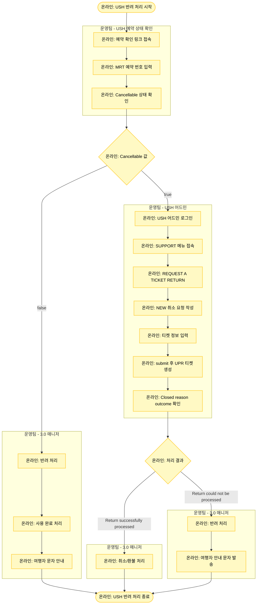

# USH (Universal Studio Hollywood) 반려 처리

## 기본 정보

- **확인 수단**: 예약 상태 확인 링크
- **소통 수단**: 어드민
- **3.0 매니저 페이지 상태**: 취소 요청
- **주요 반려 사유**: 시스템 연동 오류

## 프로세스 플로우차트



## 상세 처리 방법

### 1단계: USH 예약 상태 확인

**예약 확인 링크 접속**
- 기본 URL: `https://reservation-connector.myrealtrip.net/api/v1/inquiry/USH/[MRT 예약 번호]-HMYRLTRP`
- 예시: https://reservation-connector.myrealtrip.net/api/v1/inquiry/USH/TNA-20251215-00003166-HMYRLTRP

**MRT 예약 번호 입력**
- URL의 `[MRT 예약 번호]` 부분에 실제 예약 번호 입력
- 형식: TNA-YYYYMMDD-XXXXXXXX

**Cancellable 상태 확인**
- JSON 응답에서 `"Cancellable"` 필드 확인
- `true`: 취소 가능
- `false`: 취소 불가

**응답 예시**
```json
{
  "Cancellable": true,
  "BookingReference": "XXXXX",
  "Tickets": [
    {
      "TicketId": "12345",
      "VisualId": "V-123456",
      "PLU": "PLU-789",
      "Status": "Active"
    }
  ]
}
```

### 2단계: Cancellable = false (취소 불가)

**의미**
- 이미 사용 완료됨
- 취소 불가 기간에 해당함
- 환불 불가 상태

**처리 방법**
1. 3.0 매니저에서 반려 처리
2. 사용 완료 처리
3. 여행자에게 기사용 또는 취소 불가 문자 안내

**여행자 안내 템플릿**
```
안녕하세요, 마이리얼트립입니다.
예약하신 티켓은 이미 사용되었거나 
취소 불가 기간에 해당하여 취소 및 환불이 불가합니다.
예약번호: TNA-YYYYMMDD-XXXXXXXX
```

### 3단계: Cancellable = true (취소 가능) - 어드민 처리

#### Step 1: USH 어드민 로그인
- USH 어드민: https://www.universalpartnercommunity.com/s/login/?language=en_US

#### Step 2: SUPPORT 메뉴 접속
- 메뉴에서 **SUPPORT** 선택

#### Step 3: REQUEST A TICKET RETURN
- **REQUEST A TICKET RETURN** 선택

#### Step 4: NEW 취소 요청 작성
- **NEW** 버튼 클릭하여 새로운 취소 요청 생성

#### Step 5: 티켓 정보 입력

**필수 입력 항목**
```
Destination: Universal Studio Hollywood
Customer number: 29018
Method of payment: prepaid
Total # of tickets returned: [취소 원하는 티켓 매수]
```

**Reason for void / return request**
- 공급사 예약 번호 입력
- 예약 상태 조회 시 확인한 각 티켓의 Visual ID와 PLU 번호 기재

**작성 예시**
```
Booking Reference: XXXXX
Tickets to cancel:
- Ticket 1: Visual ID: V-123456, PLU: PLU-789
- Ticket 2: Visual ID: V-123457, PLU: PLU-790

Reason: Customer requested cancellation
```

#### Step 6: Submit 후 UPR 티켓 생성
- **submit** 버튼 클릭
- 리스트 최상단에 **UPR**로 시작하는 티켓 번호 생성됨
- 예: UPR-2025-00123

#### Step 7: 처리 결과 팔로업
- 생성된 UPR 티켓 번호로 상태 확인
- **Closed reason outcome** 필드에서 최종 결과 확인

### 4단계: 처리 결과에 따른 조치

#### 결과 1: Return successfully processed (성공)

**Closed reason outcome 표시**
```
Status: Closed
Closed reason outcome: Return successfully processed
```

**처리 방법**
- 환불 성공 확인
- 3.0 매니저에서 취소/환불 처리

#### 결과 2: Return(s) could not be processed (실패)

**Closed reason outcome 표시**
```
Status: Closed
Closed reason outcome: Return(s) could not be processed
Reason: Ticket already used / Non-refundable
```

**처리 방법**
1. 3.0 매니저에서 반려 처리
2. 여행자에게 취소 불가 안내 문자 발송

**여행자 안내 템플릿**
```
안녕하세요, 마이리얼트립입니다.
공급사 확인 결과, 해당 티켓은 취소 및 환불이 불가합니다.
사유: [공급사 안내 사유]
예약번호: TNA-YYYYMMDD-XXXXXXXX
```

## USH 처리 흐름 요약

| Cancellable | 처리 방법 |
|-------------|----------|
| **false** | 즉시 반려 + 사용 완료 + 문자 안내 |
| **true** | 어드민 취소 요청 → 결과 확인 → 성공 시 환불 / 실패 시 반려 |

| UPR 결과 | 처리 방법 |
|---------|----------|
| **Return successfully processed** | 3.0 매니저 취소/환불 |
| **Return could not be processed** | 반려 + 여행자 안내 |

## 주의사항

⚠️ **예약 상태 확인 링크 필수**
- USH 어드민 작업 전에 반드시 예약 상태 확인 링크에서 Cancellable = true인지 확인
- false인 경우 어드민 작업 불필요 (어차피 취소 불가)

⚠️ **Visual ID와 PLU 번호 정확히 입력**
- 예약 상태 조회 응답에서 Visual ID와 PLU 번호를 정확히 복사하여 입력
- 잘못 입력하면 취소 요청이 거절될 수 있음

⚠️ **Customer number 고정**
- USH 취소 요청 시 Customer number는 항상 **29018**
- 절대 변경하지 말 것

⚠️ **UPR 티켓 팔로업**
- UPR 티켓 생성 후 보통 24-48시간 내 처리
- 3일 이상 Closed 상태가 되지 않으면 어드민에서 재확인 필요

⚠️ **Method of payment**
- 항상 **prepaid** 선택
- 다른 옵션 선택 시 처리가 지연될 수 있음

## 예약 상태 조회 응답 예시

### 예시 1: 취소 가능

```json
{
  "Cancellable": true,
  "BookingReference": "ABC123",
  "BookingDate": "2025-01-15",
  "VisitDate": "2025-02-01",
  "Status": "Confirmed",
  "Tickets": [
    {
      "TicketId": "12345",
      "VisualId": "V-123456",
      "PLU": "PLU-789",
      "Status": "Active",
      "TicketType": "1-Day General Admission"
    }
  ]
}
```

### 예시 2: 취소 불가

```json
{
  "Cancellable": false,
  "BookingReference": "ABC123",
  "Status": "Used",
  "UsedDate": "2025-01-20",
  "Tickets": [
    {
      "TicketId": "12345",
      "VisualId": "V-123456",
      "PLU": "PLU-789",
      "Status": "Used"
    }
  ]
}
```

## 트러블슈팅

### 문제 1: 예약 상태 링크 접속 오류

**해결 방법**
1. URL 형식 확인 (HMYRLTRP 접미사 확인)
2. MRT 예약 번호 정확히 입력했는지 확인
3. 브라우저 캐시 삭제 후 재시도

### 문제 2: UPR 티켓이 생성되지 않음

**해결 방법**
1. 필수 항목이 모두 입력되었는지 확인
2. Customer number가 29018인지 확인
3. 페이지 새로고침 후 리스트 재확인

### 문제 3: UPR 티켓이 3일 이상 Pending 상태

**해결 방법**
1. 어드민에서 해당 UPR 티켓 클릭하여 상세 확인
2. 필요 시 UPR 티켓에 코멘트 추가하여 재요청
3. 여전히 처리 안 되면 사업실에 에스컬레이션

### 문제 4: Visual ID와 PLU 번호를 찾을 수 없음

**해결 방법**
1. 예약 상태 조회 응답 전체를 복사하여 저장
2. JSON 파서 도구로 정리하여 확인 (예: jsonformatter.org)
3. Tickets 배열 안의 각 항목에서 Visual ID와 PLU 찾기

## 관련 링크

- [USH 예약 상태 확인](https://reservation-connector.myrealtrip.net/api/v1/inquiry/USH/)
- [USH 어드민](https://www.universalpartnercommunity.com/s/login/?language=en_US)
- [반려 처리 시트](https://docs.google.com/spreadsheets/d/16c0vj5gC7gkYyi8bU_qfdBwqQxmqfMwe1wiGGCC78zw/edit#gid=0)
- [공급사 어드민 계정 정보](https://docs.google.com/spreadsheets/d/1aRMZdr7tLbCqptVe8f5XRGUViRoUriXoPIgrBbNzlCI/edit?pli=1&gid=802671048#gid=802671048)
