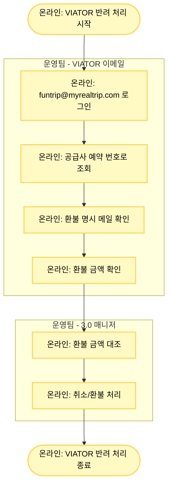

# VIATOR 반려 처리

## 기본 정보

- **확인 수단**: 이메일
- **소통 수단**: 이메일
- **3.0 매니저 페이지 상태**: 취소 요청
- **주요 반려 사유**: 시스템 연동 오류

## 프로세스 플로우차트



## 상세 처리 방법

### 1단계: VIATOR 이메일 확인

**이메일 계정 로그인**
- VIATOR 이메일 계정: **funtrip@myrealtrip.com**

**예약 조회**
- 공급사 예약 번호로 메일 검색
- 취소/환불 관련 메일 찾기

**환불 메일 확인**
- 제목: "Cancellation Confirmation", "Refund Notice" 등
- 본문에서 환불 금액 명시 부분 확인

### 2단계: 환불 금액 확인

**메일에서 확인해야 할 정보**
1. **Booking Reference**: 공급사 예약 번호 일치 확인
2. **Cancellation Status**: Cancelled 또는 Refunded 확인
3. **Refund Amount**: 환불 금액 (USD 또는 현지 통화)
4. **Refund Date**: 환불 처리 날짜

**메일 예시**
```
Subject: Cancellation Confirmation - [예약번호]

Dear Partner,

Your booking [예약번호] has been successfully cancelled.

Booking Reference: XXXXX-XXXXX
Tour Name: [상품명]
Cancellation Date: 2025-01-15
Refund Amount: $150.00 USD

The refund will be processed to your original payment method.

Thank you.
Viator Team
```

### 3단계: 3.0 매니저 처리

**환불 금액 대조**
1. 3.0 매니저에서 판매 금액 확인
2. 메일의 환불 금액과 비교

**환율 환산 (USD인 경우)**
```
예시:
메일 환불 금액: $150
당일 환율: 1 USD = 1,300원
환불 금액 원화: $150 × 1,300 = 195,000원

3.0 판매 금액: 195,000원
→ 전액 환불
```

**3.0 매니저 취소/환불 처리**
- 환불 금액 확인 후 3.0 매니저에서 취소/환불 처리 진행
- 보통 전액 환불

## VIATOR 환불 메일 유형

### 유형 1: Cancellation Confirmation (취소 확인)

```
Subject: Cancellation Confirmation

Booking Reference: [예약번호]
Status: Cancelled
Refund Amount: $XXX.XX
```

**처리**
- 환불 금액 확인 후 3.0 매니저 처리

### 유형 2: Refund Processed (환불 완료)

```
Subject: Refund Processed

Booking: [예약번호]
Refund Status: Completed
Amount: $XXX.XX
Refund Method: Original Payment Method
```

**처리**
- 환불 완료 확인 후 3.0 매니저 처리

### 유형 3: Partial Refund (부분 환불)

```
Subject: Partial Refund Notice

Booking: [예약번호]
Original Amount: $200.00
Cancellation Fee: $50.00
Refund Amount: $150.00
```

**처리**
- 수수료 공제 확인 후 환불 금액만큼 3.0 매니저 처리

## 주의사항

⚠️ **환불 금액 통화 확인**
- VIATOR 메일은 USD 표시가 대부분
- 간혹 현지 통화(EUR, GBP 등)로 표시되는 경우도 있음
- 통화 단위를 반드시 확인하고 원화로 환산

⚠️ **수수료 공제 여부**
- 메일에 "Cancellation Fee", "Service Charge" 등 명시 확인
- 수수료가 명시된 경우 공제 후 금액으로 환불
- "Refund Amount"가 최종 환불 금액

⚠️ **메일 미수신 시 대응**
1. 공급사 예약 번호로 재검색
2. MRT 예약 번호로 검색
3. 날짜 범위 확대하여 검색 (±7일)
4. 스팸 메일함 확인
5. 메일이 정말 없으면 VIATOR에 이메일 문의

⚠️ **환율 기준**
- 환율 기준: 당일 환율 (환불 처리하는 날)
- 구글 환율 표 사용
- USD 외 통화는 해당 통화의 당일 환율 적용

## 메일 미수신 시 VIATOR 문의

**문의 이메일 주소**
- VIATOR 파트너 지원: partners@viator.com

**문의 메일 템플릿**
```
Subject: Refund Confirmation Request - Booking [예약번호]

Dear Viator Team,

We are writing to confirm the refund status for the following booking:

Booking Reference: [공급사 예약 번호]
Partner Booking ID: TNA-YYYYMMDD-XXXXXXXX
Tour Name: [상품명]
Booking Date: [예약일]

Could you please provide:
1. Cancellation confirmation
2. Refund amount
3. Refund processing date

We did not receive the cancellation confirmation email.

Thank you for your assistance.

Best regards,
Myrealtrip Operations Team
```

## 환율 환산 예시

### 예시 1: USD 전액 환불

```
메일 환불 금액: $180
당일 환율: 1 USD = 1,320원
환불 금액 원화: $180 × 1,320 = 237,600원

3.0 판매 금액: 237,600원
처리: 전액 환불
```

### 예시 2: USD 부분 환불 (수수료 공제)

```
메일 내용:
- Original Amount: $200
- Cancellation Fee: $30
- Refund Amount: $170

당일 환율: 1 USD = 1,300원
환불 금액 원화: $170 × 1,300 = 221,000원

3.0 판매 금액: 260,000원 (원래 $200 × 1,300)
처리: 221,000원 환불 (수수료 공제됨)
```

### 예시 3: EUR 환불

```
메일 환불 금액: €120
당일 환율: 1 EUR = 1,450원
환불 금액 원화: €120 × 1,450 = 174,000원

3.0 판매 금액: 174,000원
처리: 전액 환불
```

## 트러블슈팅

### 문제 1: 여러 건의 환불 메일이 검색됨

**해결 방법**
- 예약 번호로 정확히 일치하는 메일 찾기
- 날짜가 가장 최근인 메일 우선 확인
- "Final" 또는 "Confirmation" 키워드가 있는 메일 확인

### 문제 2: 환불 금액이 여러 개 표시됨

**해결 방법**
- "Refund Amount" 또는 "Final Refund" 항목 확인
- 수수료 차감 전/후 금액 구분
- 최종 환불 금액만 사용

### 문제 3: 통화가 USD가 아닌 경우

**해결 방법**
- 해당 통화의 당일 환율 확인 (구글 검색)
- 예: "EUR to KRW", "GBP to KRW"
- 환산 후 3.0 매니저 처리

## 관련 링크

- [VIATOR 이메일 (funtrip@myrealtrip.com)](mailto:funtrip@myrealtrip.com)
- [VIATOR 파트너 지원](mailto:partners@viator.com)
- [반려 처리 시트](https://docs.google.com/spreadsheets/d/16c0vj5gC7gkYyi8bU_qfdBwqQxmqfMwe1wiGGCC78zw/edit#gid=0)
- [공급사 어드민 계정 정보](https://docs.google.com/spreadsheets/d/1aRMZdr7tLbCqptVe8f5XRGUViRoUriXoPIgrBbNzlCI/edit?pli=1&gid=802671048#gid=802671048)
