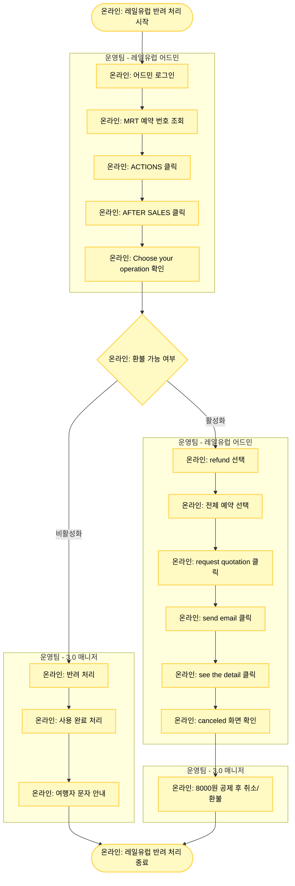

# 레일유럽 (Rail Europe) 반려 처리

## 기본 정보

- **확인 수단**: 어드민
- **소통 수단**: -
- **3.0 매니저 페이지 상태**: 취소 요청
- **주요 반려 사유**: 
  1. 수수료 공제 필요 예약건
  2. 취소 환불 자동 연동 불가

## 프로세스 플로우차트



## 상세 처리 방법

### 1단계: 레일유럽 어드민 로그인 및 조회

**어드민 로그인**
- 레일유럽 어드민: https://era.raileurope.com/sign-in

**예약 조회**
- MRT 예약 번호 그대로 입력하여 조회
- 예시: TNA-20251215-00003166

**세부 사항 확인**
1. 예약 목록에서 해당 예약 찾기
2. **ACTIONS** 버튼 클릭
3. **AFTER SALES** 클릭
4. **Choose your operation** 창 상태 확인

### 2단계: 환불 가능 여부 판단

#### Case 1: Choose your operation 창이 비활성화

**의미**
- 환불 불가 상태
- 이미 사용 완료되었거나 취소 불가 일정

**처리 방법**
1. 3.0 매니저에서 반려 처리
2. 사용 완료 처리
3. 여행자에게 취소 불가 문자 안내

**여행자 안내 템플릿**
```
안녕하세요, 마이리얼트립입니다.
예약하신 기차 티켓은 이미 사용되었거나 
취소 불가 기간에 해당하여 취소 및 환불이 불가합니다.
예약번호: [TNA-YYYYMMDD-XXXXXXXX]
```

#### Case 2: Choose your operation 창이 활성화

**의미**
- 환불 가능 상태
- 취소 진행 가능

**처리 방법** → Step 3 진행

### 3단계: 환불 진행 (활성화 시)

**Step 1: refund 선택**
- "Choose your operation" 드롭다운에서 **refund** 선택

**Step 2: 예약 선택**
- 전체 예약 선택 (체크박스 선택)

**Step 3: request quotation 클릭**
- "request quotation" 버튼 클릭하여 환불 요청

**Step 4: 이메일 및 상세 확인**
- 계속해서 하단의 **"send email"** 클릭
- **"see the detail"** 클릭
- **canceled 화면이 나올 때까지** 반복 클릭

**Step 5: Canceled 확인**
- 최종적으로 "canceled" 상태가 표시되면 환불 완료

### 4단계: 3.0 매니저 처리

**수수료 공제**
- 레일유럽은 **취소 시 8,000원 수수료 공제**가 규정
- 3.0 매니저에서 8,000원을 제외한 금액으로 환불 처리

**환불 금액 계산**
```
예시:
판매 금액: 150,000원
수수료: 8,000원
환불 금액: 142,000원
```

**여행자 안내**
```
안녕하세요, 마이리얼트립입니다.
취소 규정에 따라 수수료 8,000원을 공제한 
142,000원 환불 완료 드립니다.
```

## 레일유럽 어드민 화면 가이드

### 1. 예약 조회 화면
```
[예약 목록]
Order Number: TNA-20251215-00003166
Status: Confirmed
[ACTIONS 버튼]
```

### 2. AFTER SALES 화면
```
[SUPPORT]
> AFTER SALES
  - Choose your operation [드롭다운]
    □ 비활성화: 환불 불가
    ☑ 활성화: 환불 가능
```

### 3. Refund 진행 화면
```
Choose your operation: [refund ▼]
☑ [예약 선택]
[Request Quotation 버튼]
```

### 4. 최종 확인 화면
```
Status: CANCELED
Refund Amount: EUR XXX.XX
```

## 처리 상태 요약

| 어드민 상태 | 의미 | 처리 방법 |
|------------|------|----------|
| **Choose your operation 비활성화** | 환불 불가 | 반려 + 사용 완료 + 문자 안내 |
| **Choose your operation 활성화** | 환불 가능 | refund 진행 → 8,000원 공제 환불 |
| **Canceled 확인** | 환불 완료 | 3.0 매니저 8,000원 공제 환불 |

## 주의사항

⚠️ **MRT 예약 번호로 직접 조회**
- 레일유럽은 MRT 예약 번호를 그대로 사용합니다.
- 별도의 공급사 예약 번호 변환이 필요 없습니다.

⚠️ **Canceled 화면까지 확인 필수**
- "request quotation" 후 반드시 "canceled" 화면이 나올 때까지 진행해야 합니다.
- 중간에 멈추면 환불 요청이 완료되지 않을 수 있습니다.

⚠️ **수수료 8,000원 고정**
- 레일유럽 취소 수수료는 항상 **8,000원**입니다.
- 예약 금액이나 환율과 무관하게 고정 금액입니다.

⚠️ **환불 불가 케이스 주의**
- Choose your operation 창이 비활성화된 경우:
  - 이미 출발일이 지났거나
  - 취소 불가 기간에 해당하거나
  - 이미 사용된 티켓입니다.
- 반드시 여행자에게 명확한 안내가 필요합니다.

⚠️ **처리 시간**
- 어드민에서 "canceled" 확인까지 5-10분 정도 소요될 수 있습니다.
- 즉시 처리되지 않더라도 각 단계를 차근차근 진행하면 됩니다.

## 트러블슈팅

### 문제 1: Choose your operation 창이 로딩 중

**해결 방법**
- 페이지 새로고침 후 다시 시도
- 브라우저 캐시 삭제 후 재로그인

### 문제 2: request quotation 후 canceled가 안 나옴

**해결 방법**
- "send email" → "see the detail"을 반복 클릭
- 보통 2-3번 클릭하면 canceled 화면이 나타남

### 문제 3: 어드민 로그인 불가

**해결 방법**
- 계정 정보 시트에서 최신 로그인 정보 확인
- 필요 시 사업실에 계정 재발급 요청

## 관련 링크

- [레일유럽 어드민](https://era.raileurope.com/sign-in)
- [반려 처리 시트](https://docs.google.com/spreadsheets/d/16c0vj5gC7gkYyi8bU_qfdBwqQxmqfMwe1wiGGCC78zw/edit#gid=0)
- [공급사 어드민 계정 정보](https://docs.google.com/spreadsheets/d/1aRMZdr7tLbCqptVe8f5XRGUViRoUriXoPIgrBbNzlCI/edit?pli=1&gid=802671048#gid=802671048)
