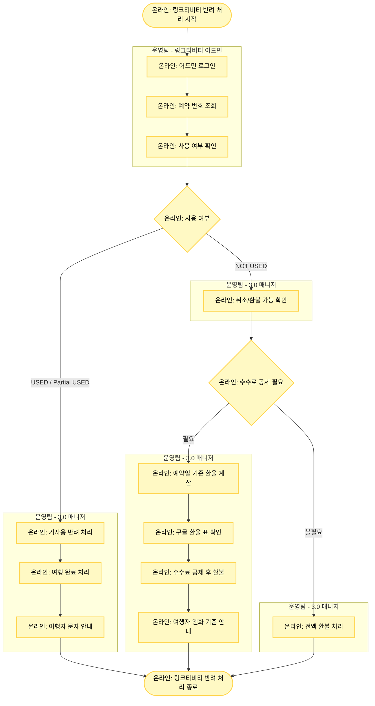

# 링크티비티 (Linktivity) 반려 처리

## 기본 정보

- **확인 수단**: 어드민
- **소통 수단**: 이메일
- **3.0 매니저 페이지 상태**: 취소 요청
- **주요 반려 사유**: 
  1. 미사용 시 환불 가능 규정
  2. 수수료 공제 필요 예약건

## 프로세스 플로우차트



## 상세 처리 방법

### 1단계: 링크티비티 어드민 확인

**어드민 로그인**
- 링크티비티 어드민에 로그인합니다.

**예약 조회**
- 공급사 예약 번호 또는 MRT 예약 번호로 조회

**사용 여부 및 상태 확인**
- 사용 여부: USED, NOT USED, Partial USED
- 예약 상태: Confirmed, Canceled by traveler

### 2단계: 사용 여부에 따른 처리

#### Case 1: USED (기사용) - 환불 불가

**어드민 표시**
```
Status: USED
Booking Status: Confirmed
```

**처리 방법**
1. 3.0 매니저에서 기사용으로 반려 처리
2. 여행 완료 처리
3. 여행자에게 기사용으로 환불 불가 문자 안내

**여행자 안내 템플릿**
```
안녕하세요, 마이리얼트립입니다.
예약하신 상품이 이미 사용 완료되어 취소 및 환불이 불가합니다.
예약번호: [TNA-YYYYMMDD-XXXXXXXX]
```

#### Case 2: Partial USED (부분 기사용) - 환불 불가

**어드민 표시**
```
Status: Partial USED
Booking Status: Confirmed
```

**처리 방법**
- Case 1과 동일 (부분 사용도 환불 불가)

#### Case 3: NOT USED + Canceled by traveler - 취소 가능

**어드민 표시**
```
Status: NOT USED
Booking Status: Canceled by traveler
```

**처리 방법**
- 취소/환불 가능
- 수수료 공제 여부 확인 필요 → Step 3 진행

#### Case 4: USED + Canceled by traveler - 취소 가능

**어드민 표시**
```
Status: USED
Booking Status: Canceled by traveler
```

**특이 사항**
- 상태는 USED이지만 "Canceled by traveler" 표시가 있으면 취소 가능
- 수수료 공제 여부 확인 필요 → Step 3 진행

#### Case 5: NOT USED + Confirmed - 취소 가능 (미사용)

**어드민 표시**
```
Status: NOT USED
Booking Status: Confirmed
```

**처리 방법**
- 미사용 상태이므로 취소 가능
- 수수료 공제 여부 확인 필요 → Step 3 진행

### 3단계: 수수료 공제 처리 (취소 가능 시)

#### 수수료 공제 필요 여부 확인

**3.0 매니저에서 취소/환불 규정 확인**
- 규정에 수수료 명시 여부 확인
- 예: "취소 시 220엔 수수료 공제 후 환불"

#### 수수료 공제 필요한 경우

**Step 1: 환율 계산**
- 기준: 여행자 예약일 기준
- 출처: 구글 환율 표 (Google 검색 "JPY to KRW")

**Step 2: 수수료 원화 환산**
```
예시:
- 규정 수수료: 220엔
- 예약일: 2025-01-15
- 당일 환율: 1엔 = 9.5원
- 공제 금액: 220엔 × 9.5원 = 2,090원
```

**Step 3: 3.0 매니저 환불 처리**
- 판매 금액에서 수수료 공제 금액을 제외하고 환불
- 예: 50,000원 판매 → 47,910원 환불

**Step 4: 여행자 안내**
- **중요**: 여행자에게는 엔화 기준으로 안내
- 원화 환산 금액은 안내하지 않음

**여행자 안내 템플릿**
```
안녕하세요, 마이리얼트립입니다.
여행자님의 취소 요청으로 수수료 220엔을 공제한 
전액 환불 완료 드립니다.
```

#### 수수료 공제 불필요한 경우

**처리 방법**
- 3.0 매니저에서 전액 환불 처리

## 링크티비티 상태 처리 요약

| 어드민 상태 | 예약 상태 | 처리 방법 |
|------------|----------|----------|
| **USED** | Confirmed | 반려 + 여행 완료 + 문자 안내 |
| **Partial USED** | Confirmed | 반려 + 여행 완료 + 문자 안내 |
| **NOT USED** | Canceled by traveler | 취소/환불 (수수료 확인) |
| **USED** | Canceled by traveler | 취소/환불 (수수료 확인) |
| **NOT USED** | Confirmed | 취소/환불 (수수료 확인) |

## 주의사항

⚠️ **USED 상태 주의**
- "USED" + "Canceled by traveler": 취소 가능
- "USED" + "Confirmed": 취소 불가
- 반드시 두 가지 상태를 모두 확인해야 합니다.

⚠️ **수수료 환율 계산**
- 환율 기준: 여행자 예약일 (결제일 아님)
- 환율 출처: 구글 환율 표 (일관성 유지)
- 3.0 매니저에는 원화로 입력하지만, 여행자에게는 엔화로 안내

⚠️ **여행자 안내 문구**
```
올바른 예: "수수료 220엔을 공제한 전액 환불"
잘못된 예: "수수료 2,090원을 공제한 환불"
```

⚠️ **여행 완료 처리**
- 기사용으로 반려 처리하는 경우 반드시 "여행 완료" 처리도 함께 진행해야 합니다.
- 여행 완료 처리를 하지 않으면 여행자가 리뷰 작성 등 후속 프로세스를 진행할 수 없습니다.

## 수수료 환율 계산 예시

### 예시 1: 220엔 수수료

```
예약일: 2025-01-15
당일 환율: 1엔 = 9.5원 (구글 환율 표)
수수료: 220엔 × 9.5원 = 2,090원

판매 금액: 50,000원
환불 금액: 50,000원 - 2,090원 = 47,910원

여행자 안내: "수수료 220엔을 공제한 전액 환불 완료 드립니다."
```

### 예시 2: 500엔 수수료

```
예약일: 2025-01-20
당일 환율: 1엔 = 9.3원 (구글 환율 표)
수수료: 500엔 × 9.3원 = 4,650원

판매 금액: 80,000원
환불 금액: 80,000원 - 4,650원 = 75,350원

여행자 안내: "수수료 500엔을 공제한 전액 환불 완료 드립니다."
```

## 관련 링크

- [링크티비티 어드민](https://admin.linktivity.com/) (실제 URL은 계정 정보 시트 참조)
- [구글 환율 검색](https://www.google.com/search?q=jpy+to+krw)
- [반려 처리 시트](https://docs.google.com/spreadsheets/d/16c0vj5gC7gkYyi8bU_qfdBwqQxmqfMwe1wiGGCC78zw/edit#gid=0)
- [공급사 어드민 계정 정보](https://docs.google.com/spreadsheets/d/1aRMZdr7tLbCqptVe8f5XRGUViRoUriXoPIgrBbNzlCI/edit?pli=1&gid=802671048#gid=802671048)
