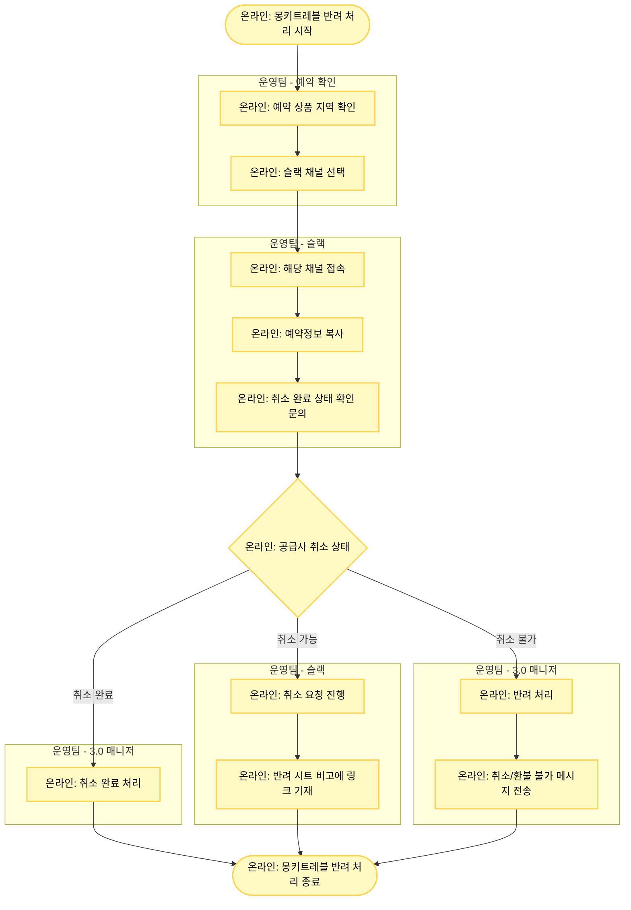

# 몽키트레블 (VN & TH) 반려 처리

## 기본 정보

- **확인 수단**: 슬랙
- **소통 수단**: 슬랙
- **3.0 매니저 페이지 상태**: 취소 요청 / 예약 취소
- **주요 반려 사유**: 기타 이슈 발생
- **담당 지역**: 베트남(VN), 괌, 태국(TH)

## 프로세스 플로우차트



## 상세 처리 방법

### 1단계: 지역 및 슬랙 채널 확인

**예약 상품 지역 확인**
- 베트남, 괌: **마이리얼트립x몽키트래블_베트남_괌** 채널
- 태국: **마이리얼트립x몽키트래블_태국** 채널

**슬랙 채널 링크**
- 베트남_괌: https://aicx-kr.slack.com/archives/C03NL1L6ZN6
- 태국: https://aicx-kr.slack.com/archives/C02NU2716FR

### 2단계: 3.0 매니저 상태 확인

**상태 1: 예약 취소**
- 3.0 매니저 페이지 상태: "예약 취소"
- 의미: 마리트에서는 취소/환불 처리되었으나 공급사 확인 필요
- 처리: 공급사 취소 완료 여부 확인

**상태 2: 취소 요청**
- 3.0 매니저 페이지 상태: "취소 요청"
- 의미: 취소 가능 여부를 공급사에 확인해야 함
- 처리: 취소 가능 여부 확인 → 가능 시 취소 요청

### 3단계: 슬랙 문의

#### 예약 취소 상태 - 취소 완료 확인

**문의 목적**
- 공급사에서 실제로 취소 완료되었는지 확인

**슬랙 메시지 작성**
1. 3.0 매니저에서 "예약정보 복사" 클릭
2. 슬랙 채널에 붙여넣기
3. 취소 완료 여부 확인 요청

**메시지 템플릿**
```
안녕하세요,

아래 예약 건이 취소 완료되었는지 확인 부탁드립니다.

[예약정보 붙여넣기]

예약 번호: TNA-YYYYMMDD-XXXXXXXX
상품명: [상품명]

공급사 취소 완료 여부를 확인해주세요.
```

**공급사 응답**
- 취소 완료: 3.0 매니저에서 "취소 완료" 처리
- 취소 미완료: 취소 요청 진행

#### 취소 요청 상태 - 취소 가능 여부 확인

**문의 목적**
- 취소 가능한 상품인지 확인

**슬랙 메시지 작성**
```
안녕하세요,

아래 예약 건의 취소 가능 여부를 확인 부탁드립니다.

[예약정보 붙여넣기]

예약 번호: TNA-YYYYMMDD-XXXXXXXX
상품명: [상품명]
방문 예정일: YYYY-MM-DD

취소 가능한지 확인해주세요.
```

### 4단계: 공급사 응답에 따른 처리

#### Case 1: 취소 완료

**공급사 응답**
```
네, 해당 예약은 취소 완료되었습니다.
환불 금액: XXX,XXX원
```

**처리 방법**
- 3.0 매니저에서 "취소 완료" 처리

#### Case 2: 취소 가능 - 취소 요청 진행

**공급사 응답**
```
네, 취소 가능합니다.
취소 진행해드리겠습니다.
```

**처리 방법**
1. 슬랙에 취소 요청
2. 슬랙 메시지 링크를 복사하여 반려 시트 "비고"란에 기재
   - 이후 팔로업을 위함
3. 공급사 취소 완료 응답 대기
4. 취소 완료 응답 수신 후 3.0 매니저 처리

**반려 시트 비고란 작성 예시**
```
슬랙 취소 요청: https://aicx-kr.slack.com/archives/C03NL1L6ZN6/p1234567890123456
요청일: 2025-01-21
```

#### Case 3: 취소 불가

**공급사 응답**
```
죄송합니다. 해당 예약은 취소 불가 상품입니다.
사유: [기사용 / 취소 불가 기간 / 환불 불가 규정]
```

**처리 방법**
1. 3.0 매니저에서 반려 처리
2. 여행자에게 취소/환불 불가 메시지 전송

**여행자 안내 템플릿**
```
안녕하세요, 마이리얼트립입니다.
공급사 확인 결과, 해당 예약은 취소 및 환불이 불가합니다.
사유: [공급사 안내 사유]
예약번호: TNA-YYYYMMDD-XXXXXXXX
```

## 몽키트레블 처리 흐름 요약

| 3.0 상태 | 공급사 응답 | 처리 방법 |
|---------|-----------|----------|
| **예약 취소** | 취소 완료 | 취소 완료 처리 |
| **취소 요청** | 취소 가능 | 취소 요청 → 슬랙 링크 기재 → 완료 후 처리 |
| **취소 요청** | 취소 불가 | 반려 + 여행자 메시지 |

## 주의사항

⚠️ **지역별 채널 구분**
- 베트남, 괌: **마이리얼트립x몽키트래블_베트남_괌**
- 태국: **마이리얼트립x몽키트래블_태국**
- 잘못된 채널에 문의하면 응답이 지연됩니다.

⚠️ **예약정보 복사 기능 활용**
- 3.0 매니저의 "예약정보 복사" 버튼을 활용하면 필요한 정보가 자동으로 포맷됨
- 수동으로 작성하는 것보다 정확하고 빠름

⚠️ **슬랙 링크 반드시 기재**
- 취소 요청한 경우 반드시 슬랙 메시지 링크를 반려 시트에 기재
- 팔로업 시 이전 대화를 쉽게 찾을 수 있음

⚠️ **응답 시간**
- 슬랙 응답은 보통 업무 시간 기준 1-2시간 내
- 베트남/태국 시차 고려 (한국보다 2시간 늦음)
- 늦은 오후 문의는 다음날 응답 가능

⚠️ **취소 불가 사유 명확히 전달**
- 여행자 안내 시 공급사가 안내한 사유를 정확히 전달
- 애매한 표현보다 명확한 사유 전달이 중요

## 슬랙 메시지 링크 복사 방법

**Step 1: 메시지 전송**
- 슬랙 채널에 취소 요청 메시지 전송

**Step 2: 링크 복사**
1. 전송한 메시지에 마우스 오버
2. 오른쪽 상단 "..." (더보기) 아이콘 클릭
3. "Copy link" 또는"링크 복사" 선택

**Step 3: 반려 시트 기재**
- 반려 시트의 "비고"란에 복사한 링크 붙여넣기

**링크 형식 예시**
```
https://aicx-kr.slack.com/archives/C03NL1L6ZN6/p1705820400123456
```

## 예약정보 복사 예시

**3.0 매니저에서 복사한 내용**
```
예약 번호: TNA-20250121-00001234
상품명: [베트남] 하롱베이 당일 투어
여행자명: 홍길동
여행자 연락처: 010-1234-5678
예약일: 2025-01-15 14:30
방문 예정일: 2025-02-01
인원: 성인 2명
판매 금액: 180,000원
```

## 트러블슈팅

### 문제 1: 슬랙 응답이 없음 (4시간 이상)

**해결 방법**
1. 같은 스레드에 재문의 (Re:)
2. 시차 확인 (베트남/태국 영업 시간인지)
3. 여전히 응답 없으면 사업실에 에스컬레이션

**재문의 메시지**
```
안녕하세요,

위 문의 건에 대한 확인 부탁드립니다.
급한 케이스라 빠른 응답 부탁드립니다.
```

### 문제 2: 공급사 응답이 애매함

**해결 방법**
1. 명확한 재질문
2. Yes/No로 답변 가능하도록 구체적으로 질문
3. 필요 시 사업실에 문의

**재질문 예시**
```
확인 감사합니다.

명확한 처리를 위해 다시 확인 부탁드립니다:
1. 취소 가능한가요? (예/아니오)
2. 취소 가능하다면 언제까지 완료 가능한가요?
3. 환불 금액은 얼마인가요?
```

### 문제 3: 채널을 잘못 선택함

**해결 방법**
1. 올바른 채널로 이동하여 재문의
2. 잘못된 채널의 메시지는 삭제 (혼란 방지)
3. 반려 시트에는 올바른 채널의 링크 기재

## 관련 링크

- [몽키트레블_베트남_괌 슬랙](https://aicx-kr.slack.com/archives/C03NL1L6ZN6)
- [몽키트레블_태국 슬랙](https://aicx-kr.slack.com/archives/C02NU2716FR)
- [반려 처리 시트](https://docs.google.com/spreadsheets/d/16c0vj5gC7gkYyi8bU_qfdBwqQxmqfMwe1wiGGCC78zw/edit#gid=0)

## 참고 사항

**몽키트레블 특징**
- 슬랙으로만 소통 가능 (이메일, 어드민 없음)
- 베트남, 괌, 태국 지역 담당
- 지역별로 채널이 분리되어 있음
- 보통 빠른 응답 (1-2시간 내)
- 시차 고려 필요 (한국 -2시간)
