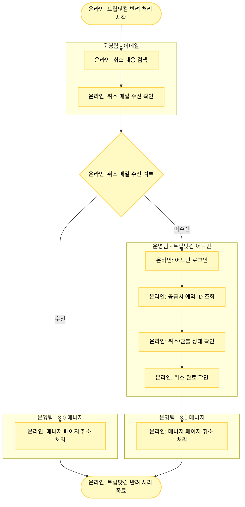

# 트립닷컴 (Trip.com) 반려 처리

## 기본 정보

- **확인 수단**: 이메일
- **소통 수단**: 이메일
- **3.0 매니저 페이지 상태**: 취소 요청
- **주요 반려 사유**: 취소 환불 연동 실패

## 프로세스 플로우차트



## 상세 처리 방법

### 1단계: 이메일 확인

**이메일 계정 로그인**
- 트립닷컴 취소 관련 이메일 계정에 로그인합니다.

**취소 내용 검색**
- 공급사 예약 번호 또는 MRT 예약 번호로 취소 내용을 검색합니다.

**취소 메일 수신 확인**
- 취소 메일이 수신되어 있는지 확인합니다.

### 2단계: 취소 메일 수신 시 (경로 A)

**3.0 매니저 페이지 처리**
- 취소 메일이 수신되어 있으면 즉시 3.0 매니저 페이지에서 취소 처리를 진행합니다.

### 3단계: 취소 메일 미수신 시 (경로 B) - 어드민 확인

**어드민 로그인**
- 트립닷컴 어드민: https://piaovip.ctrip.com/ttddist/
- CNY Automatic Top up 계정으로 진입

**예약 조회**
- 투어 / 입장권 예약 메뉴 접속
- 공급사 예약 번호로 검색

**취소/환불 상태 확인**
- 취소 완료 여부 확인
- 환불 금액 확인

**3.0 매니저 처리**
- 어드민에서 취소 완료를 확인한 후 3.0 매니저에서 취소 처리를 진행합니다.

## 예시 화면

### 이메일 취소 확인 예시
```
제목: Order Cancellation Notice
내용: Your order [예약번호] has been cancelled...
```

### 어드민 확인 예시
- 예약 번호 검색 → 상태: "취소 완료"
- 환불 금액 확인 → CNY 금액 표시

## 주의사항

⚠️ **이메일과 어드민 둘 다 확인 필수**
- 이메일만 확인하면 누락될 수 있으므로, 이메일 미수신 시 반드시 어드민에서도 확인합니다.

⚠️ **취소 완료 확인 후 처리**
- 공급사에서 취소가 완료된 것을 확인한 후에만 3.0 매니저에서 처리합니다.

⚠️ **환불 금액 확인**
- 어드민에서 확인한 환불 금액과 3.0 매니저의 판매 금액이 일치하는지 확인합니다.

## 관련 링크

- [트립닷컴 어드민](https://piaovip.ctrip.com/ttddist/)
- [반려 처리 시트](https://docs.google.com/spreadsheets/d/16c0vj5gC7gkYyi8bU_qfdBwqQxmqfMwe1wiGGCC78zw/edit#gid=0)
- [공급사 어드민 계정 정보](https://docs.google.com/spreadsheets/d/1aRMZdr7tLbCqptVe8f5XRGUViRoUriXoPIgrBbNzlCI/edit?pli=1&gid=802671048#gid=802671048)
