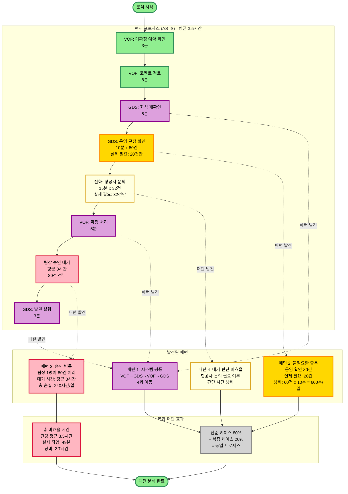

# 발권 프로세스 분석

## 분석 개요

- **분석 대상**: 항공권 예약 확정 및 발권
- **분석 목적**: 패턴 발견, 병목 식별
- **분석 일자**: 2026-01-08

## 현상 요약

운영팀이 하루 80건의 예약 확정 및 발권을 처리하는 과정에서:
- VOF와 GDS 시스템을 반복적으로 왔다갔다 함
- 불필요한 확인 작업이 다수 발생
- 팀장 승인 대기로 평균 3시간 지연
- 단순 케이스와 복잡한 케이스의 구분 없이 동일한 프로세스 적용

## 패턴 분석 다이어그램



## 발견된 패턴

### 패턴 1: 시스템 핑퐁 (Ping-Pong)
- **유형**: 핑퐁 패턴
- **발생 지점**: VOF(1,2) → GDS(3,4) → VOF(6) → GDS(8)
- **발생 빈도**: 건당 4회 시스템 전환
- **영향**: 시스템 전환 시간 낭비, 집중력 저하, 데이터 재확인 필요
- **근본 원인**: 프로세스가 시스템 중심이 아닌 작업 순서 중심으로 설계됨

### 패턴 2: 불필요한 중복 작업 (Redundancy)
- **유형**: 중복 작업 패턴
- **발생 지점**: 운임 규정 확인 (단계 4)
- **발생 빈도**: 80건 전체 확인, 실제 필요는 20건(25%)
- **영향**: 60건 x 10분 = 600분/일 낭비 (10시간/일)
- **근본 원인**: 표준 운임과 특수 운임 구분 없이 일괄 확인

### 패턴 3: 승인 병목 (Bottleneck)
- **유형**: 병목 패턴
- **발생 지점**: 팀장 승인 (단계 7)
- **발생 빈도**: 80건 전부 팀장 1명이 승인
- **영향**: 건당 평균 3시간 대기 = 총 240시간/일 손실
- **근본 원인**: 
  - 단일 승인자 구조 (팀장 1명)
  - 단순/복잡 케이스 구분 없이 동일한 승인 프로세스
  - 승인 대기 큐 적체

### 패턴 4: 대기 판단 비효율 (Waiting)
- **유형**: 대기/판단 지연 패턴
- **발생 지점**: 항공사 문의 (단계 5)
- **발생 빈도**: 80건 중 32건(40%)만 실제 필요
- **영향**: 필요 여부 판단 시간 + 불필요한 문의 시도
- **근본 원인**: 항공사 문의가 필요한 조건이 명확하지 않음

## 패턴 간 관계

### 복합 효과 1: 프로세스 미분류
- **패턴 1 (핑퐁)** + **패턴 2 (중복)** + **패턴 4 (판단 지연)**
- → 단순 케이스(80%)와 복잡 케이스(20%)를 구분하지 않음
- → 모든 케이스가 동일한 긴 프로세스를 거침
- → 단순한 것도 복잡하게 처리

### 복합 효과 2: 시간 증폭
- **패턴 3 (승인 병목)** 단독
- → 실제 작업 49분에 대기 3시간 추가
- → 총 소요 시간의 78%가 대기 시간

### 근본 원인 계층
```
표면 증상: 발권이 느림 (평균 3.5시간)
    ↑
중간 패턴: 시스템 핑퐁 + 중복 작업 + 승인 병목
    ↑
근본 원인: 
  1. 프로세스 설계가 시스템 구조를 고려하지 않음
  2. 케이스 복잡도에 따른 분류 체계 없음
  3. 승인 권한 집중화 (팀장 1명)
```

## 정량적 분석

### 현재 상태
- **총 건수**: 80건/일
- **건당 평균 시간**: 약 3.5시간
- **실제 작업 시간**: 49분 (22%)
- **대기 시간**: 평균 3시간 (78%)
- **일일 총 낭비 시간**: 약 216시간

### 패턴별 영향도
1. **패턴 3 (승인 병목)**: 240시간/일 손실 (최우선 개선 대상)
2. **패턴 2 (중복 작업)**: 10시간/일 손실
3. **패턴 1 (핑퐁)**: 정량화 어려움, 집중력 저하
4. **패턴 4 (판단 지연)**: 중간 규모 영향

## 다음 단계 (사람이 결정)

### 우선순위 제안
- [ ] **최우선**: 패턴 3 (승인 병목) - 영향도 가장 큼
- [ ] **높음**: 패턴 2 (중복 작업) - 즉시 개선 가능
- [ ] **중간**: 패턴 4 (판단 지연) - 명확한 기준 수립 필요
- [ ] **장기**: 패턴 1 (핑퐁) - 시스템 통합 또는 프로세스 재설계 필요

### 개선 방향 힌트 (조직 상황에 따라 판단 필요)
- **패턴 3 대응**: 승인자 복수화? 자동 승인 조건 설정? 권한 위임?
- **패턴 2 대응**: 표준 운임 목록 작성? 자동 판단 로직?
- **패턴 4 대응**: 항공사 문의 필요 조건 체크리스트?
- **패턴 1 대응**: 시스템별 배치 작업? 통합 대시보드?

### 추가 검토 필요 사항
- [ ] 승인자를 늘릴 수 있는가?
- [ ] 단순 케이스 자동 승인이 가능한가?
- [ ] 표준 운임 DB를 구축할 수 있는가?
- [ ] 시스템 통합 또는 API 연동이 가능한가?

---

**다음 작업**: 위 패턴 중 개선하고 싶은 부분을 선택하시면, TO-BE 다이어그램을 추가로 작성해드릴 수 있습니다.
