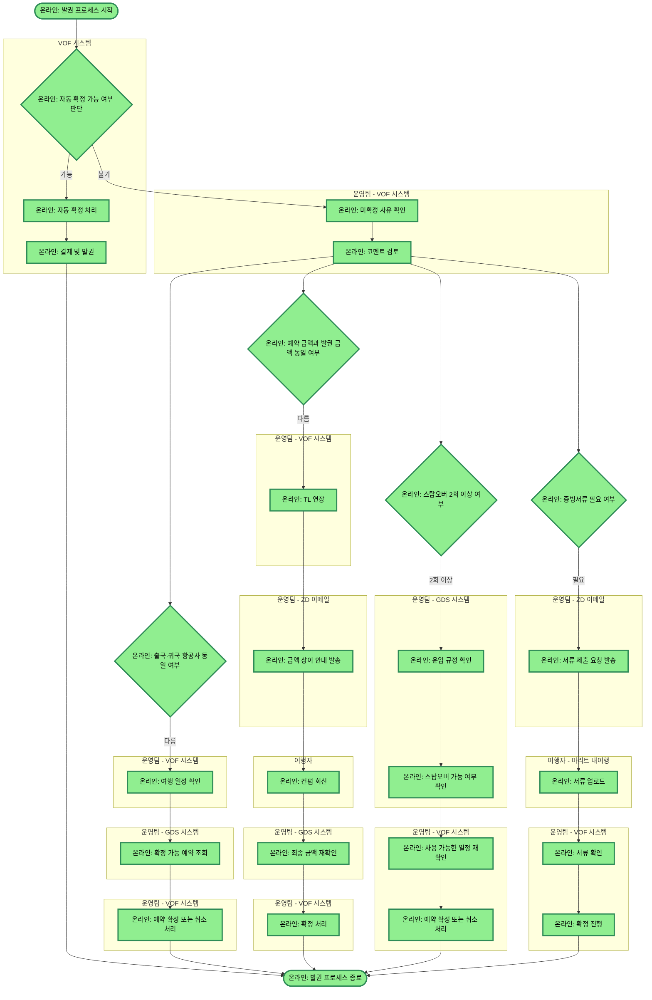

# 발권_프로세스_타임

## 프로세스 개요

이 프로세스는 VOF 시스템에서 항공권 예약의 자동/수동 확정 및 발권까지의 전체 흐름을 나타냅니다. 자동 확정이 불가한 경우 운영팀이 미확정 사유를 확인하고, 항공사 일치 여부, 금액 확인, 스탑오버 횟수, 증빙서류 제출 등을 단계별로 처리하여 최종 발권을 완료합니다.

## 프로세스 플로우차트

## 프로세스 상세 설명

### 1단계: 자동 확정 판단
- VOF 시스템이 예약 건에 대해 자동 확정 가능 여부를 판단합니다
- 자동 확정 가능 시: VOF가 자동으로 확정 → 결제 → 발권 → 프로세스 종료
- 자동 확정 불가 시: 운영팀의 수동 처리로 이동

### 2단계: 미확정 사유 확인
- 운영팀이 VOF에서 미확정 사유를 확인하고 코멘트를 검토합니다

### 3단계: 병렬 케이스 확인
코멘트 검토 후 다음 4가지 케이스를 병렬로 확인합니다:

#### 케이스 1: 항공사 일치 여부 확인
- 출국 항공사와 귀국 항공사가 다른 경우:
  - VOF에서 여행 일정 확인
  - GDS에서 확정 가능한 예약인지 조회
  - 예약 확정 또는 취소 처리

#### 케이스 2: 금액 일치 여부 확인
- 예약 금액과 발권 금액이 다른 경우:
  - VOF에서 TL(Time Limit) 연장
  - ZD 이메일로 여행자에게 금액 상이 안내 발송
  - 여행자의 컨펌 회신 대기
  - GDS에서 최종 금액 재확인
  - VOF에서 확정 진행

#### 케이스 3: 스탑오버 확인
- 스탑오버가 2회 이상인 경우:
  - GDS에서 운임 규정 확인
  - 스탑오버 가능 여부 확인
  - 필요 시 VOF에서 사용 가능한 일정 재확인
  - 조건 충족 시 확정 또는 취소 처리

#### 케이스 4: 증빙서류 확인
- 증빙서류 제출이 필요한 경우:
  - ZD 이메일로 여행자에게 서류 제출 요청
  - 여행자가 마리트 내여행에 서류 업로드
  - 운영팀이 VOF에서 서류 확인 후 확정 진행

### 4단계: 프로세스 종료
- 모든 단계가 정상적으로 완료되면 발권 프로세스가 종료됩니다

