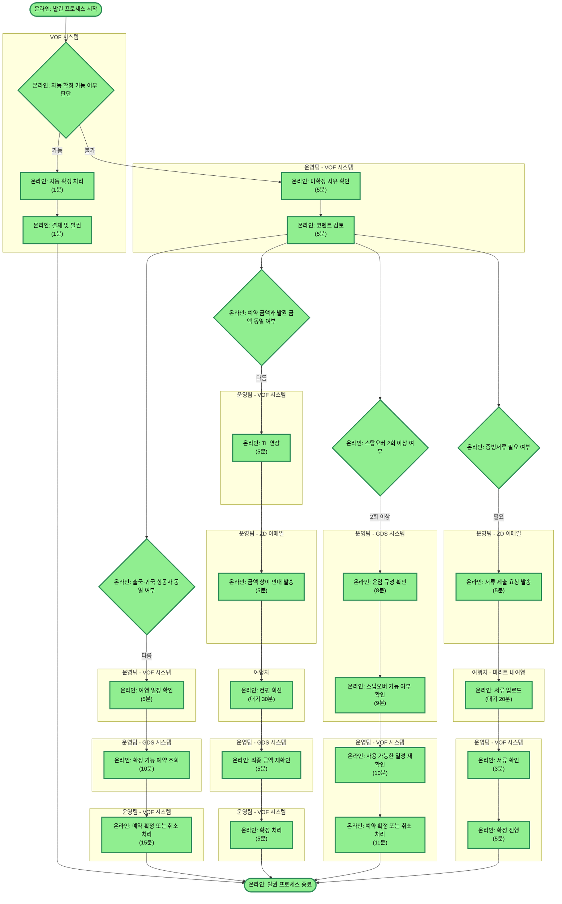

# 발권_프로세스_타임 (시간 메트릭)

## ⏱️ 프로세스 시간 분석

| 지표 | AS-IS | TO-BE 목표 | 개선 목표 |
|------|-------|-----------|----------|
| 전체 평균 처리 시간 | 60분 | TBD | TBD |
| 자동 확정 평균 시간 | 2분 | 2분 | - |
| 수동 처리 평균 시간 | 70분 | TBD | TBD |

**참고**: TO-BE 목표는 개선 후 업데이트하세요.

## 프로세스 개요

이 프로세스는 VOF 시스템에서 항공권 예약의 자동/수동 확정 및 발권까지의 전체 흐름을 나타냅니다. 자동 확정이 불가한 경우 운영팀이 미확정 사유를 확인하고, 항공사 일치 여부, 금액 확인, 스탑오버 횟수, 증빙서류 제출 등을 단계별로 처리하여 최종 발권을 완료합니다.

## 프로세스 플로우차트 (처리 시간 포함)



## 경로별 총 처리 시간

### 자동 확정 경로 ✅ (가장 빠름)
```
총 시간: 2분
- 자동 확정 처리: 1분
- 결제 및 발권: 1분
```

### 케이스 1: 항공사 상이
```
총 시간: 40분 (공통 10분 + 케이스 30분)
- 미확정 사유 확인: 5분
- 코멘트 검토: 5분
- 여행 일정 확인: 5분
- 확정 가능 예약 조회: 10분
- 예약 확정/취소 처리: 15분
```

**개선 포인트**:
- 확정 가능 예약 조회 (10분) - 자동화 검토
- 예약 확정/취소 처리 (15분) - 프로세스 간소화

### 케이스 2: 금액 상이 ⚠️ (대기 시간 포함)
```
총 시간: 65분 (공통 10분 + 케이스 55분)
- 미확정 사유 확인: 5분
- 코멘트 검토: 5분
- TL 연장: 5분
- 금액 상이 안내 발송: 5분
- 고객 응답 대기: 30분 ⚠️ (병목)
- 최종 금액 재확인: 5분
- 확정 처리: 5분
```

**개선 포인트**:
- TL 연장 (5분) - 자동화 가능
- 금액 안내 발송 (5분) - 템플릿 자동 발송
- **고객 응답 대기 (30분)** - 알림 강화 필요

### 케이스 3: 스탑오버 2회 이상
```
총 시간: 48분 (공통 10분 + 케이스 38분)
- 미확정 사유 확인: 5분
- 코멘트 검토: 5분
- 운임 규정 확인: 8분
- 스탑오버 가능 여부 확인: 9분
- 사용 가능한 일정 재확인: 10분
- 예약 확정/취소 처리: 11분
```

**개선 포인트**:
- 운임 규정 확인 (8분) - 규정 DB화
- 스탑오버 가능 여부 확인 (9분) - 자동 검증
- 사용 가능한 일정 재확인 (10분) - 자동 조회

### 케이스 4: 증빙서류 필요 ⚠️ (대기 시간 포함)
```
총 시간: 48분 (공통 10분 + 케이스 38분)
- 미확정 사유 확인: 5분
- 코멘트 검토: 5분
- 서류 제출 요청 발송: 5분
- 고객 업로드 대기: 20분 ⚠️ (병목)
- 서류 확인: 3분
- 확정 진행: 5분
```

**개선 포인트**:
- 서류 제출 요청 발송 (5분) - 자동 발송
- **고객 업로드 대기 (20분)** - 알림 강화
- 서류 확인 (3분) - AI 검증 도입 검토

## 노드별 처리 시간 상세

### 자동 확정 경로
| 노드명 | 평균 시간 | 개선 목표 | 개선 방법 |
|--------|----------|----------|----------|
| 자동 확정 처리 | 1분 | - | 이미 자동화됨 |
| 결제 및 발권 | 1분 | - | 이미 자동화됨 |

### 수동 처리 공통 경로
| 노드명 | 평균 시간 | 개선 목표 | 개선 방법 |
|--------|----------|----------|----------|
| 미확정 사유 확인 | 5분 | 3분 | 템플릿화 |
| 코멘트 검토 | 5분 | 3분 | AI 분석 |

### 케이스 1: 항공사 상이
| 노드명 | 평균 시간 | 개선 목표 | 개선 방법 |
|--------|----------|----------|----------|
| 여행 일정 확인 | 5분 | 3분 | 자동 조회 |
| 확정 가능 예약 조회 | 10분 | 5분 | API 자동화 |
| 예약 확정/취소 처리 | 15분 | 10분 | 프로세스 간소화 |

### 케이스 2: 금액 상이
| 노드명 | 평균 시간 | 개선 목표 | 개선 방법 |
|--------|----------|----------|----------|
| TL 연장 | 5분 | 30초 | **자동화 필수** |
| 금액 상이 안내 발송 | 5분 | 1분 | **템플릿 자동 발송** |
| 고객 응답 대기 | 30분 | 15분 | **알림 강화** |
| 최종 금액 재확인 | 5분 | 2분 | 자동 검증 |
| 확정 처리 | 5분 | 3분 | 간소화 |

### 케이스 3: 스탑오버 2회 이상
| 노드명 | 평균 시간 | 개선 목표 | 개선 방법 |
|--------|----------|----------|----------|
| 운임 규정 확인 | 8분 | 3분 | 규정 DB화 |
| 스탑오버 가능 여부 확인 | 9분 | 3분 | 자동 검증 |
| 사용 가능한 일정 재확인 | 10분 | 5분 | 자동 조회 |
| 예약 확정/취소 처리 | 11분 | 8분 | 간소화 |

### 케이스 4: 증빙서류 필요
| 노드명 | 평균 시간 | 개선 목표 | 개선 방법 |
|--------|----------|----------|----------|
| 서류 제출 요청 발송 | 5분 | 1분 | 자동 발송 |
| 고객 업로드 대기 | 20분 | 10분 | **알림 강화** |
| 서류 확인 | 3분 | 1분 | AI 검증 |
| 확정 진행 | 5분 | 3분 | 간소화 |

## 🎯 시간 기반 개선 우선순위

| 순위 | 구간 | 현재 시간 | 비고 | 우선순위 |
|-----|------|----------|------|---------|
| 1 | 고객 응답 대기 | 30분 | 금액 상이 케이스 병목 | ⭐⭐⭐ |
| 2 | 고객 업로드 대기 | 20분 | 증빙서류 케이스 병목 | ⭐⭐⭐ |
| 3 | 예약 확정/취소 처리 | 15분 | 항공사 상이 케이스 | ⭐⭐ |
| 4 | 예약 확정/취소 처리 | 11분 | 스탑오버 케이스 | ⭐⭐ |
| 5 | 확정 가능 예약 조회 | 10분 | 자동화 검토 필요 | ⭐⭐ |

**자동 식별 기준**:
- 처리 시간 10분 이상: 높은 우선순위
- 대기 시간 20분 이상: 최우선 개선 대상

## 💡 주요 인사이트

### 병목 구간 Top 3
1. **고객 응답 대기 (30분)** - 금액 상이 케이스의 주요 병목, 알림 강화 필요
2. **고객 업로드 대기 (20분)** - 증빙서류 케이스의 주요 병목, 알림 및 안내 개선
3. **예약 확정/취소 처리 (15분)** - 항공사 상이 케이스, 프로세스 간소화 필요

### 전체 프로세스 분석
- **자동 확정률 향상이 최우선**: 현재 수동 처리 시 평균 40~65분 소요
- **대기 시간이 전체의 30~50% 차지**: 고객 의존성 높음
- **자동화 가능 작업 많음**: TL 연장, 이메일 발송, 규정 확인 등

### 경로별 비교
- 가장 빠른 경로: **자동 확정 (2분)** ✅
- 가장 느린 경로: **금액 상이 (65분)** ⚠️
- 평균 처리 시간: **50분** (대기 시간 포함)

### 개선 제안

#### 1. 즉시 개선 가능 (Quick Win)
- **TL 연장 자동화**: 5분 → 30초 (-90%)
- **이메일 템플릿 자동 발송**: 5분 → 1분 (-80%)
- **서류 제출 요청 자동 발송**: 5분 → 1분 (-80%)

#### 2. 단기 개선 (1~3개월)
- **고객 알림 강화**: 
  - 응답 대기 30분 → 15분 (-50%)
  - 업로드 대기 20분 → 10분 (-50%)
- **규정 DB화**: 운임 규정 확인 8분 → 3분 (-62%)
- **자동 조회 시스템**: 예약 조회 10분 → 5분 (-50%)

#### 3. 중장기 개선 (3~6개월)
- **자동 확정률 향상**: 더 많은 케이스 자동화
- **AI 서류 검증**: 서류 확인 3분 → 1분 (-67%)
- **프로세스 재설계**: 복잡한 확정/취소 프로세스 간소화

## 📊 데이터 수집 정보

- **측정 일자**: 2024-12-30
- **측정 방법**: 수작업 타이머 측정
- **데이터 상태**: AS-IS (현재 상태)
- **대기 시간**: 사용자 제공 추정값

**참고**: 
- 이 메트릭은 현재(AS-IS) 프로세스의 측정값입니다
- 개선 후 동일한 방법으로 재측정하여 TO-BE 데이터를 수집하세요
- 향후 확장 가능: 통과율, 비용, 에러율 등

---

## 다음 단계

### 1. 개선 작업 진행
- 우선순위에 따라 개선 작업 실행
- Quick Win 항목부터 시작 권장

### 2. TO-BE 측정
- 개선 후 동일한 방법으로 재측정
- 동일한 측정 시트 사용

### 3. 비교 분석
- AS-IS vs TO-BE 비교
- 개선 효과 정량화
- 추가 개선 포인트 도출

