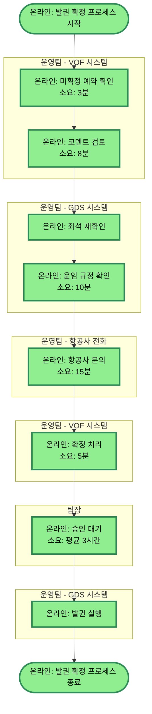

# 발권 확정 프로세스 Adaptive

## 프로세스 개요

- **업무**: 항공권 예약 확정 및 발권
- **담당**: 운영팀
- **빈도**: 80건/일

## 프로세스 플로우차트

## 프로세스 상세 설명

### 1. 초기 검토 단계 (VOF 시스템)
- **미확정 예약 확인**: 운영팀이 VOF 시스템에서 미확정 예약 리스트를 확인합니다 (소요: 3분)
- **코멘트 검토**: 코멘트를 읽고 미확정 사유를 파악합니다 (소요: 8분)

### 2. 예약 검증 단계 (GDS 시스템)
- **좌석 재확인**: 항공사 좌석 상태를 확인합니다 (시간 미측정)
- **운임 규정 확인**: 운임 규정을 조회합니다 (소요: 10분)

### 3. 항공사 문의 단계
- **항공사 문의**: 필요시 항공사 고객센터에 전화 문의합니다 (소요: 15분)

### 4. 확정 처리 단계 (VOF 시스템)
- **VOF 확정 처리**: VOF 시스템에 확정 정보를 입력합니다 (소요: 5분)

### 5. 승인 단계 (팀장)
- **팀장 승인**: 팀장이 확정 내역을 검토하고 승인합니다 (소요: 평균 3시간)

### 6. 발권 실행 단계 (GDS 시스템)
- **발권 실행**: GDS 시스템에서 최종 발권을 처리합니다 (시간 미측정)

## 시간 분석

| 단계 | 소요 시간 | 비고 |
|------|-----------|------|
| 미확정 예약 확인 | 3분 | VOF 시스템 |
| 코멘트 검토 | 8분 | VOF 시스템 |
| 좌석 재확인 | (미측정) | GDS 시스템 |
| 운임 규정 확인 | 10분 | GDS 시스템 |
| 항공사 문의 | 15분 | 전화 |
| VOF 확정 처리 | 5분 | VOF 시스템 |
| 팀장 승인 | 평균 3시간 | 병목 구간 |
| 발권 실행 | (미측정) | GDS 시스템 |

**총 측정된 시간**: 약 3시간 41분
**실제 작업 시간**: 41분
**대기 시간**: 평균 3시간 (팀장 승인)

## 특이사항

### Adaptive 기능 적용
- **시간 측정됨**: 6개 단계 (노드에 시간 표시)
- **시간 미측정**: 2개 단계 (좌석 재확인, 발권 실행 - 시간 표시 생략)
- **유연한 표현**: 시간 정보가 있는 것과 없는 것을 자연스럽게 혼합

### 시스템 전환 패턴
1. VOF → GDS → 전화 → VOF → 팀장 → GDS
2. 중간에 다른 시스템이 끼어있어 같은 시스템도 별도 subgraph로 분리됨
