# 스테이넷_직계약_호텔_VCC

## 프로세스 개요

VCC(Virtual Credit Card) 직계약 호텔 예약 및 결제 프로세스

## 프로세스 플로우차트

```mermaid
flowchart LR
    %% 시작 노드
    Start([스테이넷 직계약 호텔 VCC 프로세스 - 시작]):::online

    %% 예약시트 정보 기재
    subgraph Reservation_Sheet["구글 시트 - 예약시트"]
        direction LR
        A1[온라인: 예약시트 접근]:::online
        A2[온라인: 마리트 예약번호 기재]:::online
        A3[온라인: 자동 입력 정보 확인]:::online
        A4[온라인: 인원수 수기 기재]:::online
    end

    %% 요금 정보 기재
    subgraph Rate_Info["구글 시트 - 요금 정보"]
        direction LR
        B1[온라인: 요금표 확인]:::online
        B2[온라인: 1박 금액 기재]:::online
        B3[온라인: 인원 추가 요금 기재]:::online
        B4[온라인: 조식 추가 요금 기재]:::online
        B5[온라인: 총 결제 금액 자동 계산]:::online
    end

    %% 정산 금액 대조
    subgraph Settlement_Check["구글 시트 - 정산 확인"]
        direction LR
        C1[온라인: 여행자 결제 금액 확인]:::online
        C2[온라인: 총 결제 금액 비교]:::online
        C3[온라인: 환율 적용 공급가 계산]:::online
    end

    %% 조건 분기: 특이사항 호텔 여부
    Cond1{온라인: 특이사항 호텔 여부}:::online

    %% 룸차트 확인 (특정 호텔)
    subgraph Room_Chart["룸차트 - 객실 현황"]
        direction LR
        D1[온라인: 룸차트 접근]:::online
        D2[온라인: 객실 가능 여부 확인]:::online
    end

    %% 조건 분기: 객실 가능 여부
    Cond2{온라인: 객실 가능 여부}:::online

    %% 객실 마감 처리
    subgraph Cancel_Process["예약 관리 - 취소 처리"]
        direction LR
        E1[온라인: 예약 취소 처리]:::online
        E2[온라인: 예약마감 상태값 변경]:::online
    end

    %% 부킹시트 작성
    subgraph Booking_Sheet["구글 시트 - 부킹시트"]
        direction LR
        F1[온라인: 부킹시트 접근]:::online
        F2[온라인: 예약 정보 입력]:::online
        F3[온라인: 호텔 시트에 예약번호 입력]:::online
    end

    %% 조건 분기: USD/VND 환율 변환 필요 여부
    Cond3{온라인: USD to VND 환율 변환 필요 여부}:::online

    %% 환율 변환 처리
    subgraph Currency_Convert["구글 시트 - 환율 변환"]
        direction LR
        G1[온라인: 호텔 메일에서 환율 정보 확인]:::online
        G2[온라인: 부킹시트 환율 정보 업데이트]:::online
        G3[온라인: USD 요금을 VND로 자동 변환]:::online
    end

    %% 부킹시트 발송
    subgraph Booking_Send["구글 시트 - 부킹시트 발송"]
        direction LR
        H1[온라인: 컨펌중 상태값 변경]:::online
        H2[오프라인: 호텔로 부킹시트 메일 자동 발송]:::offline
    end

    %% 호텔 회신 확인
    subgraph Hotel_Reply["Gmail - 호텔 회신"]
        direction LR
        I1[온라인: Gmail 접속]:::online
        I2[온라인: 호텔 컨펌 메일 확인]:::online
        I3[온라인: 컨펌번호 확인]:::online
    end

    %% VCC 생성
    subgraph VCC_Create["Mastercard 사이트 - VCC 생성"]
        direction LR
        J1[온라인: Mastercard 사이트 접속]:::online
        J2[온라인: Create Single Request 클릭]:::online
        J3[온라인: Purchase Template HOTEL 입력]:::online
        J4[온라인: Currency Code 선택]:::online
        J5[온라인: 총 결제 금액 입력]:::online
        J6[온라인: 체크아웃 날짜 입력]:::online
        J7[온라인: 대표 여행자 정보 입력]:::online
        J8[온라인: Submit 제출]:::online
        J9[온라인: 발행된 VCC 번호 확인]:::online
    end

    %% VCC 정보 기재
    subgraph VCC_Record["구글 시트 - VCC 정보 기재"]
        direction LR
        K1[온라인: 예약시트에 VCC 번호 기재]:::online
        K2[온라인: 유효기간 기재]:::online
        K3[온라인: CVC 번호 기재]:::online
    end

    %% 조건 분기: 예약/VCC 정보 따로 전송 필요 여부
    Cond4{온라인: 예약/VCC 정보 분리 전송 필요 여부}:::online

    %% 분리 전송 (멜리아 호텔)
    subgraph Separate_Send["Gmail - 분리 전송"]
        direction LR
        L1[온라인: 예약 정보 메일 작성]:::online
        L2[오프라인: 예약실 메일 발송]:::offline
        L3[온라인: VCC 정보 메일 작성]:::online
        L4[오프라인: 결제 담당 메일 발송]:::offline
    end

    %% 통합 전송
    subgraph Combined_Send["Gmail - 통합 전송"]
        direction LR
        M1[온라인: 예약/VCC 정보 통합 메일 작성]:::online
        M2[오프라인: 호텔 예약실 메일 발송]:::offline
    end

    %% 바우처 처리
    subgraph Voucher_Process["바우처 - 여행자 전달"]
        direction LR
        N1[온라인: Gmail에서 예약번호 검색]:::online
        N2[온라인: 바우처 PDF 다운로드]:::online
        N3[온라인: 컨펌번호 기재]:::online
        N4[온라인: 금액 노출 부분 크롭]:::online
        N5[온라인: 샌드버드로 바우처 전달]:::online
    end

    %% 상태값 변경
    subgraph Status_Update["구글 시트 - 상태 관리"]
        direction LR
        O1[온라인: VCC중 상태값 변경]:::online
    end

    %% 조건 분기: VCC 실결제 승인 여부
    Cond5{온라인: VCC 실결제 승인 여부}:::online

    %% 실결제 승인 완료
    subgraph Complete_Status["구글 시트 - 완료 처리"]
        direction LR
        P1[온라인: 완료 상태값 변경]:::online
    end

    %% 종료 노드
    End([스테이넷 직계약 호텔 VCC 프로세스 - 종료]):::online

    %% 연결 흐름
    Start --> A1
    A1 --> A2
    A2 --> A3
    A3 --> A4
    A4 --> B1
    B1 --> B2
    B2 --> B3
    B3 --> B4
    B4 --> B5
    B5 --> C1
    C1 --> C2
    C2 --> C3
    C3 --> Cond1

    %% 특이사항 호텔 분기
    Cond1 -->|룸차트 확인 필요| D1
    Cond1 -->|일반 호텔| F1
    D1 --> D2
    D2 --> Cond2

    %% 객실 가능 여부 분기
    Cond2 -->|객실 마감| E1
    Cond2 -->|객실 가능| F1
    E1 --> E2
    E2 --> End

    %% 부킹시트 작성
    F1 --> F2
    F2 --> F3
    F3 --> Cond3

    %% 환율 변환 분기
    Cond3 -->|필요| G1
    Cond3 -->|불필요| H1
    G1 --> G2
    G2 --> G3
    G3 --> H1

    %% 부킹시트 발송 및 회신 확인
    H1 --> H2
    H2 --> I1
    I1 --> I2
    I2 --> I3
    I3 --> J1

    %% VCC 생성
    J1 --> J2
    J2 --> J3
    J3 --> J4
    J4 --> J5
    J5 --> J6
    J6 --> J7
    J7 --> J8
    J8 --> J9
    J9 --> K1
    K1 --> K2
    K2 --> K3
    K3 --> Cond4

    %% 전송 방식 분기
    Cond4 -->|분리 전송| L1
    Cond4 -->|통합 전송| M1
    L1 --> L2
    L2 --> L3
    L3 --> L4
    L4 --> N1
    M1 --> M2
    M2 --> N1

    %% 바우처 전달 및 완료
    N1 --> N2
    N2 --> N3
    N3 --> N4
    N4 --> N5
    N5 --> O1
    O1 --> Cond5

    %% 실결제 승인 분기
    Cond5 -->|승인 완료| P1
    Cond5 -->|승인 대기| O1
    P1 --> End

    %% 스타일 정의
    classDef online fill:#FFFFFF,stroke:#333333,stroke-width:3px,color:#000
    classDef offline fill:#FFB6C1,stroke:#FF69B4,stroke-width:3px,color:#000
```

## 프로세스 상세 설명

### 1. 예약시트 정보 기재
- 마리트 예약번호 기재 시 자동 입력 항목 확인
- 인원수는 수기로 직접 기재

### 2. 요금 정보 기재
- 1박 금액: 1박 요금 기본 금액
- 1박 인원 추가 요금: 기준인원 초과 시 추가 비용
- 1박 조식 추가 요금: 조식 추가 시 별도 기재
- 총 결제 금액: 수식으로 자동 계산

### 3. 정산 금액 대조
- 여행자 결제 금액과 총 결제 금액 비교
- 계산: 총 결제금액(USD) × 결제시점 환율 × 박수 = 공급가(KRW)

### 4. 특이사항 호텔 처리
- **룸차트 확인 필요 호텔**: 객실 가능 여부 사전 확인
- **USD → VND 환율 변환 필요 호텔**: 매일 제공되는 환율로 자동 변환
- **예약/VCC 정보 분리 전송 호텔**: 멜리아 호텔 등 별도 메일 주소로 전송

### 5. VCC 생성
- Mastercard 사이트에서 Create Single Request
- Purchase Template: HOTEL (고정값)
- Currency Code: USD 또는 DONG 선택
- Minimum/Maximum Transaction Amount: 총 결제 금액
- End Date: 체크아웃 날짜
- Cumulative Limit: 총 결제 금액
- Maximum Number of Transactions: 3 (고정값)
- Supplier: glovalhotels (고정값)
- Guest name, 예약번호, 체크인 날짜 입력

### 6. VCC 정보 기재
- Virtual Card Number: 발행된 카드 번호
- Expiry Date: 유효기간 (매달 변경)
- CVC: 발행된 고유번호

### 7. 바우처 전달
- Gmail에서 예약번호로 검색
- PDF 다운로드 후 컨펌번호 기재
- 금액 노출 방지를 위해 상단 크롭
- 샌드버드로 여행자에게 전달

### 8. 상태값 관리
- **컨펌중**: 호텔 예약실에 부킹시트 전달한 상태
- **VCC중**: 컨펌번호 받고 VCC 실결제 승인 대기 상태
- **완료**: VCC 실결제 승인 완료 상태
- **취소**: 여행자 취소 또는 호텔 마감으로 취소된 건
- **예약마감**: 호텔 객실 없어 취소된 건

## VCC 직계약 호텔 리스트
총 51개 호텔 (크라운 플라자 괌/사이판, 웨스틴 리조트, 하얏트 센트릭 와이키키, 롯데 호텔 괌, 힐튼 괌 리조트 등)

## 특이사항 호텔별 처리 방법

### 룸차트 확인 필요
- 객실 가능 여부 사전 확인 후 예약 진행
- Stop sell 정보 주기적 업데이트

### USD → VND 환율 변환 필요
- 매일 오전 11-12시 사이 환율 메일 수신
- 부킹시트에 환율 적용 시 자동 계산

### 객실 현황 체크 필요
- 정식 시트 발송 전 객실 문의 템플릿 먼저 발송
- 예약건 관리시트 '컨펌중' 변경 시 자동 메일 발송

### 예약/VCC 정보 분리 전송
- 멜리아 호텔: res.mvpdn@melia.com (예약 정보), 5768@meliapayments.com (VCC 정보)
- 부킹시트에서 각각 버튼 클릭하여 전송

### 소통 및 회신 관련
- 대부분 호텔: 회신까지 최대 2일
- 일부 호텔: 회신까지 최대 6일 (시차 고려)
- 힐튼 괌: 메일 전송 시 CC 3개 필수

## 사용 시스템
- 구글 시트 (예약시트, 부킹시트, 예약건 관리시트)
- Gmail (global.hotels@myrealtrip.com)
- Mastercard VCC 사이트
- 샌드버드 (바우처 전달)
- 3.0 매니저 (환율 확인)
