# 스테이넷_직계약_호텔_공통

## 프로세스 개요

여행자 문의부터 예약 확정까지의 전체 업무 프로세스

## 프로세스 플로우차트

```mermaid
flowchart LR
    %% 시작 노드
    Start([스테이넷 직계약 호텔 공통 프로세스 - 시작]):::online

    %% 여행자 문의 확인 - 파트너 계정
    subgraph Partner_Message["파트너 계정 - 고객문의 관리"]
        direction LR
        A1[온라인: 파트너 계정 접근]:::online
        A2[온라인: 고객문의 관리 메시지 확인]:::online
        A3[온라인: 고정핀 설정 또는 컬럼값 조회]:::online
    end

    %% 예약 확인 - 파트너 계정
    subgraph Partner_Reservation["파트너 계정 - 예약 관리"]
        direction LR
        B1[온라인: 파트너 계정 접근]:::online
        B2[온라인: 예약 숙소 메뉴 이동]:::online
        B3[온라인: 예약 상태 컬럼 설정 및 조회]:::online
    end

    %% 부킹시트 제작 - 구글 시트
    subgraph Booking_Sheet["구글 시트 - 부킹시트"]
        direction LR
        C1[온라인: 부킹시트 접근]:::online
        C2[온라인: 호텔 시트에 예약번호 입력]:::online
        C3[온라인: 예약건 관리시트에서 정보 자동 입력]:::online
    end

    %% 조건 분기: 여행자 요청사항 확인
    Cond1{온라인: 여행자 요청사항 존재 여부}:::online

    %% 여행자 요청사항 처리
    subgraph Booking_Note["구글 시트 - 부킹시트"]
        direction LR
        D1[온라인: NOTE에 요청사항 기재]:::online
    end

    %% 부킹시트 발송
    subgraph Booking_Send["구글 시트 - 부킹시트"]
        direction LR
        E1[온라인: PDF로 저장 클릭]:::online
        E2[오프라인: 호텔로 메일 자동 발송]:::offline
    end

    %% 호텔 회신 확인 - Gmail
    subgraph Gmail_Check["Gmail - global.hotels"]
        direction LR
        F1[온라인: Gmail 접속]:::online
        F2[온라인: 호텔 라벨 클릭]:::online
        F3[온라인: 호텔 회신 확인]:::online
        F4[온라인: 컨펌번호 확인]:::online
    end

    %% 예약 확정 - 파트너 계정
    subgraph Partner_Confirm["파트너 계정 - 예약 관리"]
        direction LR
        G1[온라인: 파트너 페이지 접근]:::online
        G2[온라인: 예약 확정 클릭]:::online
    end

    %% 컨펌번호 기재 - 예약건 관리시트
    subgraph Management_Sheet["구글 시트 - 예약건 관리시트"]
        direction LR
        H1[온라인: 예약건 관리시트 접근]:::online
        H2[온라인: 컨펌번호 기재]:::online
    end

    %% 여행자 전달 - Gmail
    subgraph Gmail_Send["Gmail - 여행자 전달"]
        direction LR
        I1[온라인: Gmail에서 예약번호 검색]:::online
        I2[온라인: PDF 다운로드]:::online
        I3[온라인: 컨펌번호 기재]:::online
        I4[온라인: 여행자에게 전달]:::online
    end

    %% 조건 분기: VCC 처리 필요 여부
    Cond2{온라인: VCC 조회 또는 수정 필요 여부}:::online

    %% VCC 조회 - Mastercard 사이트
    subgraph VCC_View["Mastercard 사이트 - VCC 조회"]
        direction LR
        J1[온라인: Mastercard 사이트 접속]:::online
        J2[온라인: Purchase Requests 메뉴]:::online
        J3[온라인: View Requests 클릭]:::online
        J4[온라인: Full card number 입력]:::online
        J5[온라인: Search로 조회]:::online
    end

    %% VCC 수정 - Mastercard 사이트
    subgraph VCC_Edit["Mastercard 사이트 - VCC 수정"]
        direction LR
        K1[온라인: 연필 아이콘 클릭]:::online
        K2[온라인: 금액 수정]:::online
        K3[온라인: Submit 제출]:::online
    end

    %% 종료 노드
    End([스테이넷 직계약 호텔 공통 프로세스 - 종료]):::online

    %% 연결 흐름
    Start --> A1
    A1 --> A2
    A2 --> A3
    A3 --> B1
    B1 --> B2
    B2 --> B3
    B3 --> C1
    C1 --> C2
    C2 --> C3
    C3 --> Cond1

    %% 여행자 요청사항 분기
    Cond1 -->|존재| D1
    Cond1 -->|없음| E1
    D1 --> E1

    %% 부킹시트 발송 후 호텔 회신 확인
    E1 --> E2
    E2 --> F1
    F1 --> F2
    F2 --> F3
    F3 --> F4
    F4 --> G1

    %% 예약 확정 및 컨펌번호 처리
    G1 --> G2
    G2 --> H1
    H1 --> H2
    H2 --> I1
    I1 --> I2
    I2 --> I3
    I3 --> I4
    I4 --> Cond2

    %% VCC 처리 분기
    Cond2 -->|필요| J1
    J1 --> J2
    J2 --> J3
    J3 --> J4
    J4 --> J5
    J5 --> K1
    K1 --> K2
    K2 --> K3
    K3 --> End
    Cond2 -->|불필요| End

    %% 스타일 정의
    classDef online fill:#FFFFFF,stroke:#333333,stroke-width:3px,color:#000
    classDef offline fill:#FFB6C1,stroke:#FF69B4,stroke-width:3px,color:#000
```

## 프로세스 상세 설명

### 1. 여행자 문의 확인하기
- 파트너 계정 접근하여 고객문의 관리 메시지 확인
- 고정핀으로 상단 고정 가능 (최대 50개)
- 전체 예약 상태 등 컬럼값으로 조회 가능

### 2. 예약 확인하기
- 파트너 계정에서 예약 → 숙소 메뉴 접근
- 예약 상태 컬럼 설정하여 조회

### 3. 부킹시트 제작
- 부킹시트에서 호텔 시트 선택
- 예약번호 입력 시 예약건 관리시트에서 정보 자동 입력
- 여행자 요청사항이 있으면 NOTE에 기재
- "PDF로 저장" 클릭하면 호텔로 메일 자동 발송

### 4. 예약 확정하기
- Gmail (global.hotels@myrealtrip.com) 접속
- 호텔 라벨에서 호텔 회신 및 컨펌번호 확인
- 파트너 페이지에서 "예약 확정" 클릭
- 예약건 관리시트에 컨펌번호 기재
- Gmail에서 예약번호 검색 → PDF 다운로드 → 컨펌번호 기재 후 여행자 전달

### 5. VCC 조회 및 수정하기 (필요 시)
- Mastercard 사이트 접속
- Purchase Requests → View Requests
- Full card number로 검색
- 연필 아이콘 클릭하여 금액 수정 후 Submit

## 사용 시스템
- 파트너 계정
- 구글 시트 (부킹시트, 예약건 관리시트)
- Gmail (global.hotels@myrealtrip.com)
- Mastercard VCC 사이트
