# 해외 연동 신규 상품 등록 (2.0) 프로세스

## 프로세스 개요

해외 연동 신규 상품을 2.0 시스템에 등록하는 전체 프로세스입니다.

## 프로세스 플로우차트

```mermaid
flowchart TD
    %% 시작 노드
    Start([온라인: 해외 연동 신규 상품 등록 시작]):::online

    %% 등록 기준 확인
    subgraph Criteria["운영팀 - 등록 기준 확인"]
        direction TB
        A1[온라인: 캘린더 3개월 이상 오픈 확인]:::online
        A2[온라인: 영어 or 한국어 지원 확인]:::online
        A3[온라인: 즉시 확정 상품 여부 확인]:::online
    end

    %% 조건 분기
    Cond1{온라인: 등록 기준 충족 여부}:::online

    %% 1단계: 생텀 - 공급사 상품 가져오기
    subgraph Sanctum["운영팀 - 생텀(Sanctum)"]
        direction TB
        B1[온라인: 공급사 선택]:::online
        B2[온라인: 공급사에서 상품 가져오기 클릭]:::online
        B3[온라인: 공급사 원본 ID 입력]:::online
        B4[온라인: Offer ID 생성]:::online
        B5[온라인: 선택 적용 또는 전체 적용]:::online
    end

    %% 2단계: 2.0 매니저 - 도시 선택 및 정보 수정
    subgraph Manager1["운영팀 - 2.0 매니저"]
        direction TB
        C1[온라인: Offer ID로 페이지 접속]:::online
        C2[온라인: 도시 선택 및 대표 도시 설정]:::online
        C3[온라인: 표준 카테고리 선택]:::online
        C4[온라인: 노출 카테고리 선택]:::online
        C5[온라인: 예약 가능 시간 0 설정]:::online
        C6[온라인: 예약 패스 체크]:::online
        C7[온라인: 취소환불 가능 여부 설정]:::online
        C8[온라인: 유효기간 설정]:::online
        C9[온라인: 적용 버튼 클릭]:::online
    end

    %% 3단계: 어드민 - 공지사항 등록
    subgraph Admin1["운영팀 - 2.0 어드민"]
        direction TB
        D1[온라인: 부가 정보 수정 클릭]:::online
        D2[온라인: 공지 사항 등록]:::online
        D3[온라인: 기본정보 수정 클릭]:::online
    end

    %% 4단계: 기본 정보 등록 1
    subgraph Admin2["운영팀 - 2.0 어드민"]
        direction TB
        E1[온라인: 상품 이름 작성]:::online
        E2[온라인: 한 줄 요약 작성]:::online
        E3[온라인: 여행 소개 작성]:::online
        E4[온라인: 매력 포인트 3가지 기재]:::online
        E5[온라인: 옵션 안내 작성]:::online
        E6[온라인: 만나는 시간 정보 작성]:::online
    end

    %% 5단계: 기본 정보 등록 2
    subgraph Admin3["운영팀 - 2.0 어드민"]
        direction TB
        F1[온라인: 이동 수단 선택]:::online
        F2[온라인: 소요 시간 설정]:::online
        F3[온라인: 여행 규모 설정]:::online
    end

    %% 6단계: 기본 정보 등록 3
    subgraph Admin4["운영팀 - 2.0 어드민"]
        direction TB
        G1[온라인: 포함 사항 입력]:::online
        G2[온라인: 불포함 사항 입력]:::online
        G3[온라인: 사용 방법 작성]:::online
        G4[온라인: 티켓 유형 명시]:::online
    end

    %% 7단계: 기본 정보 등록 4
    subgraph Admin5["운영팀 - 2.0 어드민"]
        direction TB
        H1[온라인: 태그 리스트 설정]:::online
        H2[온라인: 만나는 장소 구글맵 검색]:::online
        H3[온라인: 위도 경도 정보 입력]:::online
        H4[온라인: 바우처 체크박스 설정]:::online
        H5[온라인: 호텔 픽업 체크박스 설정]:::online
    end

    %% 8단계: 취소환불 규정
    subgraph Admin6["운영팀 - 2.0 어드민"]
        direction TB
        I1[온라인: 공급사 취소환불 규정 확인]:::online
        I2[온라인: 자동 환불 템플릿 설정]:::online
        I3[온라인: 취소환불 기준일 +1일 설정]:::online
        I4[온라인: 노출 가격 통화 확인]:::online
    end

    %% 9단계: 여행 사진
    subgraph Admin7["운영팀 - 2.0 어드민"]
        direction TB
        J1[온라인: 여행 사진 4장 이상 업로드]:::online
        J2[온라인: 글자 없는 이미지 확인]:::online
        J3[온라인: Position 순서 지정]:::online
    end

    %% 10단계: 커미션 및 구글폼
    subgraph Partner["운영팀 - 파트너 페이지"]
        direction TB
        K1[온라인: 파트너 정보수정 클릭]:::online
        K2[온라인: 투어티켓 상품 클릭]:::online
        K3[온라인: 커미션 기입 및 저장]:::online
    end

    subgraph GoogleForm["운영팀 - 구글 폼"]
        direction TB
        K4[온라인: 카테고리별 구글 폼 작성]:::online
        K5[온라인: 속성 필터 정보 입력]:::online
    end

    %% 11단계: 판매 시작
    subgraph Final["운영팀 - 2.0 매니저"]
        direction TB
        L1[온라인: 최종 검수 확인]:::online
        L2[온라인: 취소환불 규정 재확인]:::online
        L3[온라인: 판매시작 버튼 클릭]:::online
    end

    %% 최종 테스트
    subgraph Test["운영팀 - 여행자 페이지"]
        direction TB
        M1[온라인: 실제 노출 확인]:::online
        M2[온라인: 결제 테스트 진행]:::online
    end

    %% 종료 노드
    End([온라인: 상품 등록 완료]):::online
    Reject([온라인: 등록 기준 미충족]):::online

    %% 연결 흐름
    Start --> A1 --> A2 --> A3 --> Cond1
    Cond1 -->|충족| B1
    Cond1 -->|미충족| Reject

    B1 --> B2 --> B3 --> B4 --> B5
    B5 --> C1 --> C2 --> C3 --> C4 --> C5 --> C6 --> C7 --> C8 --> C9
    C9 --> D1 --> D2 --> D3
    D3 --> E1 --> E2 --> E3 --> E4 --> E5 --> E6
    E6 --> F1 --> F2 --> F3
    F3 --> G1 --> G2 --> G3 --> G4
    G4 --> H1 --> H2 --> H3 --> H4 --> H5
    H5 --> I1 --> I2 --> I3 --> I4
    I4 --> J1 --> J2 --> J3
    J3 --> K1 --> K2 --> K3
    K3 --> K4 --> K5
    K5 --> L1 --> L2 --> L3
    L3 --> M1 --> M2 --> End

    %% 스타일 정의
    classDef online fill:#FFF9C4,stroke:#FFD54F,stroke-width:2px,color:#000
```

## 주요 단계 요약

### 1. 등록 기준 확인
- 캘린더 3개월 이상 오픈
- 영어 or 한국어 지원
- 즉시 확정 상품 우선

### 2. 생텀에서 상품 가져오기
- 공급사 선택
- 원본 ID 입력
- Offer ID 생성
- 선택/전체 적용

### 3-9. 2.0 매니저 및 어드민 작업
- 도시 및 카테고리 설정
- 기본 정보 입력
- 사진 업로드
- 취소환불 규정 설정

### 10. 커미션 및 속성 필터
- 커미션 율 설정
- 구글 폼 작성

### 11. 판매 시작
- 최종 검수
- 판매시작 버튼
- 테스트 진행

## 참고 자료

- [2.0 상품 등록 매뉴얼 (V2)](https://docs.google.com/presentation/d/1czhDT8hFfZsgfPPjsWyj9dxaLm3dZrIRtufQkEUolmg/edit?slide=id.g127afeea6f6_0_288#slide=id.g127afeea6f6_0_288)
- [상품관리 교육자료](https://docs.google.com/presentation/d/1o1OaWjbPQN3ks51SxGQ12KDFtYprDPLsDFyv5hRR8rg/edit?slide=id.g2c8a6d7a29c_1_74#slide=id.g2c8a6d7a29c_1_74)
- [해외연동 상품 검수 템플릿](https://docs.google.com/spreadsheets/d/1WE4yB_-9s0ZKDSB0-4EYkhuoeV97AnUJNzgj8WOmhAE/edit?gid=1004454496#gid=1004454496)
- [표준 카테고리 기준 표](https://docs.google.com/spreadsheets/d/1e048A8pk1SrXAkj4N-58Oe_9vQc1gYZoOr-aXo-gmrs/edit?pli=1&gid=2054470221#gid=2054470221)
- [도시별 노출 카테고리 기준 표](https://docs.google.com/spreadsheets/d/1FjqymMxV8VPM5EWvUX9HkQZuFVkt-Ecz66vT9YJfxec/edit?gid=301657446#gid=301657446)
- [커미션 정책](https://docs.google.com/spreadsheets/d/1WE4yB_-9s0ZKDSB0-4EYkhuoeV97AnUJNzgj8WOmhAE/edit?gid=174453439#gid=174453439)
